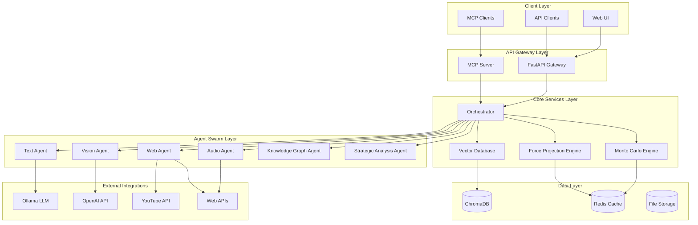
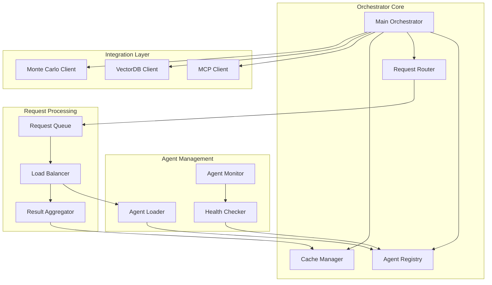
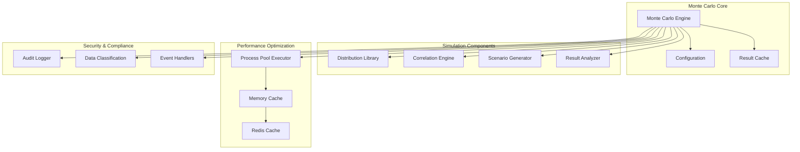
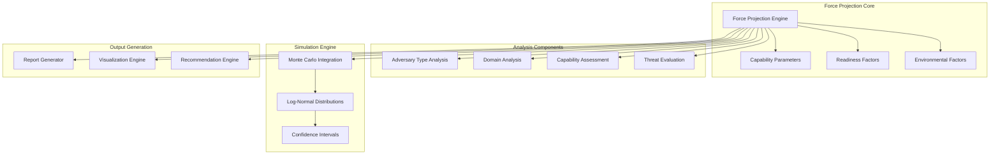
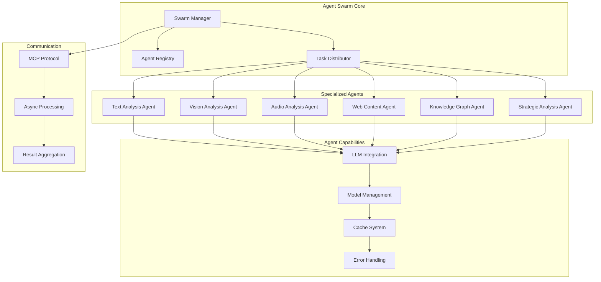
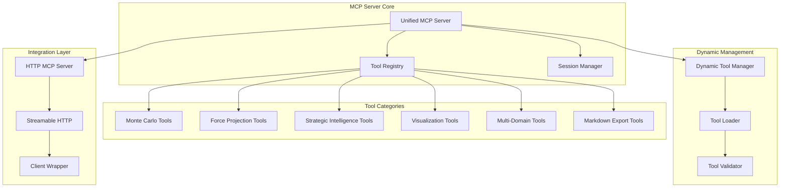
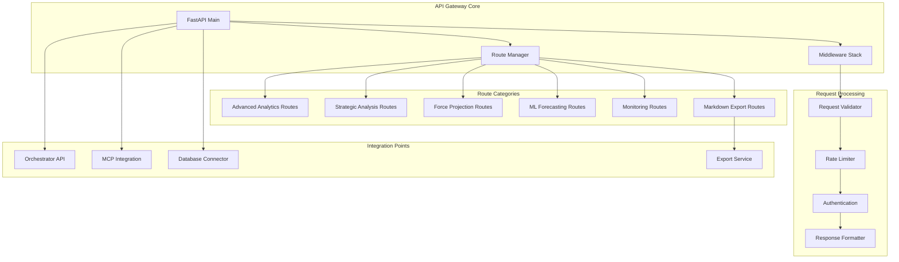
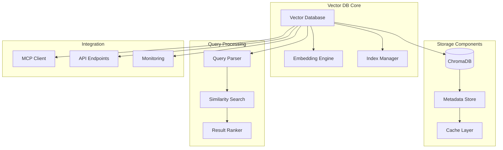

# DIA3 - Distributed Intelligence Analysis System

A comprehensive, multi-modal intelligence analysis platform that combines advanced AI agents, Monte Carlo simulations, and strategic assessment capabilities for defense, intelligence, and business applications.

## 🏗️ System Architecture

DIA3 is built on a modular, microservices-based architecture with the following core components:

### High-Level Architecture Overview



## 📋 Core Modules

### 1. Orchestrator Module

The central coordination hub that manages the agent swarm and routes requests.



### 2. Monte Carlo Engine

Advanced simulation engine for probabilistic analysis and forecasting.



### 3. Force Projection Engine

Military capability assessment and strategic threat evaluation system.



### 4. Agent Swarm System

Multi-modal AI agents for different types of content analysis.



### 5. MCP Server System

Model Context Protocol server for external tool integration.



### 6. API Gateway System

FastAPI-based REST API for external integrations.



### 7. Vector Database System

ChromaDB-based vector storage and retrieval system.



## 🚀 Quick Start

### Prerequisites

- Python 3.13+
- UV package manager
- Redis (optional, for caching)
- Ollama (for local LLM inference)
- Mermaid CLI (for diagram rendering in markdown export)

### Installation

```bash
# Clone the repository
git clone https://github.com/goagiq/DIA3.git
cd DIA3

# Create virtual environment
uv venv --python 3.13

# Activate environment
source .venv/Scripts/activate  # Windows: .venv\Scripts\activate

# Install dependencies
uv sync

# Install Mermaid CLI for diagram rendering (optional)
npm install -g @mermaid-js/mermaid-cli

# Set up environment variables
cp .env.example .env
# Edit .env with your configuration
```

### Running the System

**Quick Start:**
```bash
# Start the complete system
python main.py
```

**Individual Components:**
```bash
# Start API server only
python -m src.api.main

# Start MCP server only
python -m src.mcp_servers.unified_mcp_server

# Start strategic intelligence system
python start_strategic_intelligence_system.py
```

### API Endpoints

The system exposes REST APIs at `http://localhost:8000`:

- `POST /analyze` - Multi-modal content analysis
- `POST /strategic-analysis` - Strategic assessment
- `POST /force-projection` - Military capability analysis
- `POST /monte-carlo` - Monte Carlo simulations
- `GET /health` - System health check

#### Markdown Export API

Export markdown content to PDF and Word documents:

- `POST /api/v1/markdown-export/export` - Export markdown content to PDF/Word
- `POST /api/v1/markdown-export/export-file` - Export markdown file to PDF/Word
- `GET /api/v1/markdown-export/download/{filename}` - Download exported files
- `GET /api/v1/markdown-export/files` - List exported files
- `DELETE /api/v1/markdown-export/files/{filename}` - Delete exported files
- `GET /api/v1/markdown-export/health` - Export service health check

### MCP Tools

Available MCP tools for external integration:

- `monte_carlo_simulation` - Run Monte Carlo simulations
- `force_projection_analysis` - Analyze military capabilities
- `strategic_intelligence_forecast` - Strategic forecasting
- `multi_domain_analysis` - Multi-domain Monte Carlo analysis
- `visualization_generator` - Generate analysis visualizations

#### Markdown Export MCP Tools

Export markdown content to various formats:

- `markdown_export_to_pdf` - Export markdown content to PDF
- `markdown_export_to_word` - Export markdown content to Word document
- `markdown_export_batch` - Batch export multiple markdown files
- `markdown_export_list_files` - List exported files
- `markdown_export_get_file_info` - Get file information
- `markdown_export_delete_file` - Delete exported files
- `markdown_export_cleanup` - Clean up exported files

## 📊 Key Features

### Multi-Modal Analysis
- **Text Analysis**: Document processing, sentiment analysis, entity extraction
- **Vision Analysis**: Image and video content analysis
- **Audio Analysis**: Speech recognition and audio content analysis
- **Web Content**: Web scraping and content extraction

### Advanced Analytics
- **Monte Carlo Simulations**: Probabilistic modeling and forecasting
- **Force Projection**: Military capability assessment
- **Strategic Intelligence**: Threat evaluation and forecasting
- **Multi-Domain Analysis**: Cross-domain correlation analysis
- **Markdown Export**: Convert markdown content to PDF and Word documents with embedded images, tables, and Mermaid diagrams

### Scalability & Performance
- **Agent Swarm**: Parallel processing with multiple specialized agents
- **Caching**: Multi-level caching (Redis, memory, disk)
- **Async Processing**: Non-blocking operations
- **Load Balancing**: Intelligent request distribution

### Integration Capabilities
- **MCP Protocol**: Model Context Protocol for tool integration
- **REST APIs**: Comprehensive REST API endpoints
- **WebSocket Support**: Real-time communication
- **External APIs**: YouTube, OpenAI, and other service integrations
- **Document Export**: PDF and Word document generation with professional formatting

## 🛠️ Development

### Project Structure

```
DIA3/
├── src/
│   ├── agents/           # AI agent implementations
│   ├── api/             # FastAPI routes and endpoints
│   ├── core/            # Core engine implementations
│   │   └── export/      # Markdown export service
│   ├── mcp_servers/     # MCP server implementations
│   └── config/          # Configuration management
├── tests/               # Test suites
├── docs/                # Documentation
│   └── white_papers/    # Whitepapers and exported documents
├── examples/            # Usage examples
├── scripts/             # Utility scripts
└── Results/             # Analysis results and reports
```

### Testing

```bash
# Run all tests
uv run pytest

# Run specific test categories
uv run pytest tests/performance/
uv run pytest tests/integration/
uv run pytest tests/mcp/
```

### Code Quality

```bash
# Format code
uv run black src/ tests/

# Type checking
uv run mypy src/

# Linting
uv run flake8 src/
```

## 📈 Performance Monitoring

The system includes comprehensive monitoring capabilities:

- **Health Checks**: System and component health monitoring
- **Performance Metrics**: Response times, throughput, resource usage
- **Error Tracking**: Comprehensive error logging and analysis
- **Audit Logging**: Security and compliance audit trails

## 🔒 Security & Compliance

- **Data Classification**: Support for classified data handling
- **Audit Logging**: Comprehensive audit trails
- **Access Control**: Role-based access control
- **Encryption**: Data encryption in transit and at rest

## 🤝 Contributing

1. Fork the repository
2. Create a feature branch
3. Make your changes
4. Add tests for new functionality
5. Submit a pull request

## 📄 License

This project is licensed under the MIT License - see the LICENSE file for details.

## 📚 Documentation

Additional documentation is available in the `docs/` directory:

- `docs/MARKDOWN_EXPORT_GUIDE.md` - Comprehensive guide for markdown export functionality
- `docs/white_papers/` - Whitepapers and exported documents
- `docs/guides/` - Implementation and usage guides
- `docs/plans/` - Development and integration plans

## 🆘 Support

For support and questions:

- Create an issue on GitHub
- Check the documentation in the `docs/` directory
- Review the examples in the `examples/` directory

---

**DIA3** - Distributed Intelligence Analysis System  
*Advanced AI-powered intelligence analysis for defense, intelligence, and business applications*
