# DIA3 - Distributed Intelligence Analysis System

A comprehensive, multi-modal intelligence analysis platform that combines advanced AI agents, Monte Carlo simulations, strategic assessment capabilities, and **enhanced report generation** for defense, intelligence, and business applications.

## 🎨 **NEW: Enhanced Report System with Leadership Templates & Interactive Tooltips**

DIA3 now includes a **comprehensive enhanced report generation system** with beautiful original styling, advanced analytics, interactive tooltips, **leadership templates**, and multiple integration options:

### ✨ Enhanced Report Features

- **🎨 Beautiful Original Styling**: Gradient headers, professional tables, interactive charts
- **📊 Sentiment Analysis**: Multi-modal sentiment assessment with regional analysis
- **🔮 Advanced Forecasting**: Ensemble LSTM models with 94% accuracy
- **📈 Predictive Analytics**: Feature importance ranking and scenario analysis
- **🎯 Monte Carlo Simulation**: 20,000 iterations for confidence intervals
- **⚡ Stress Testing**: Worst/average/best case scenario analysis
- **🔗 Knowledge Graphs**: Entity relationship mapping and analysis
- **📱 Interactive Visualizations**: Chart.js with drill-down capabilities
- **💡 Interactive Tooltips**: Click-to-explain functionality for complex metrics and values
- **👔 Leadership Templates**: Condensed executive-friendly reports with optimized layouts
- **📋 Template System**: Automated template selection and generation
- **🎯 Chart Optimization**: Fixed chart cutoff issues and responsive design

### 🚀 Integration Options

1. **API Endpoints** (`/api/v1/enhanced-reports/`)
   - `POST /generate` - Standard enhanced report
   - `POST /generate-beautiful` - Beautiful styling with advanced analytics
   - `POST /generate-with-tooltips` - Enhanced report with interactive tooltips
   - `POST /generate-leadership` - Leadership template with executive format
   - `GET /health` - Service health check
   - `GET /capabilities` - Available features
   - `GET /reports` - List generated reports

2. **MCP Tools** (Multi-Component Protocol)
   - `generate_enhanced_report` - Comprehensive report generation
   - `generate_beautiful_enhanced_report` - Beautiful styling with analytics
   - `generate_enhanced_report_with_tooltips` - Enhanced report with interactive tooltips
   - `generate_enhanced_report_template` - Template-based report generation
   - `get_enhanced_report_template` - Retrieve available templates

3. **Direct Generation**
   - Python API for standalone use
   - Customizable components and styling
   - Interactive tooltip system integration
   - Template system with automated selection
   - Leadership template for executive reports

### 📊 Performance Metrics

- **Generation Time**: ~2.2 seconds average
- **HTML Content Size**: ~36KB per report
- **Processing Components**: 9+ analysis components
- **Model Accuracy**: 94% for forecasting
- **Monte Carlo Iterations**: 20,000 per simulation

### 🎯 Usage Examples

```bash
# Generate beautiful enhanced report via API
curl -X POST "http://localhost:8003/api/v1/enhanced-reports/generate-beautiful" \
  -H "Content-Type: application/json" \
  -d '{
    "query": "Pakistan Submarine Acquisition Analysis: Strategic Impact on Conventional Deterrence Capabilities",
    "include_sentiment_analysis": true,
    "include_forecasting": true,
    "include_predictive_analytics": true,
    "beautiful_styling": true,
    "interactive_charts": true
  }'
```

```bash
# Generate enhanced report with interactive tooltips via API
curl -X POST "http://localhost:8003/api/v1/enhanced-reports/generate-with-tooltips" \
  -H "Content-Type: application/json" \
  -d '{
    "query": "Pakistan Submarine Acquisition Analysis: Strategic Impact on Conventional Deterrence Capabilities",
    "include_tooltips": true,
    "beautiful_styling": true
  }'
```

```python
# Generate via MCP tools
result = await mcp_client.call_tool("generate_beautiful_enhanced_report", {
    "query": "Strategic Analysis Query",
    "include_sentiment_analysis": True,
    "include_forecasting": True,
    "include_predictive_analytics": True
})
```

```python
# Generate with tooltips via MCP tools
result = await mcp_client.call_tool("generate_enhanced_report_with_tooltips", {
    "query": "Strategic Analysis Query",
    "include_tooltips": True,
    "beautiful_styling": True
})
```

```python
# Direct generation with tooltips
from src.core.enhanced_report_with_tooltips import EnhancedReportWithTooltips

generator = EnhancedReportWithTooltips()
result = generator.generate_enhanced_report(
    query="Strategic Analysis Query",
    include_tooltips=True,
    beautiful_styling=True
)
print(f"Report saved to: {result['file_path']}")
```

```python
# Generate leadership template report
from src.core.enhanced_report_template_generator import EnhancedReportTemplateGenerator

generator = EnhancedReportTemplateGenerator()
result = await generator.generate_enhanced_report_template(
    topic="Pakistan Submarine Analysis Leadership Report",
    analysis_data={"analysis": "comprehensive data"},
    output_dir="Results",
    template_type="leadership"
)
print(f"Leadership report generated: {result['success']}")
```

### 🎨 **NEW: Generic Template System with MCP Integration**

DIA3 now includes a **generic template system** that allows you to generate enhanced reports for any topic using both leadership and enhanced report templates through MCP tools:

#### ✅ **Generic Template Features**

- **🎯 Topic Agnostic**: Works with any topic (Boeing 737, Cybersecurity, Business Analysis, etc.)
- **📋 Two Template Types**: Leadership template for executive briefings, Enhanced template for detailed analysis
- **🔧 MCP Integration**: Fully integrated with MCP tools for seamless workflow
- **📊 Interactive Visualizations**: Chart.js charts with tooltips and source tracking
- **🎨 Professional Styling**: Beautiful, responsive design with modern UI
- **📈 Source Tracking**: Interactive tooltips showing "DIA3 - [functionality]" attribution

#### 🚀 **Generic Template Usage**

```python
# Generate enhanced report for any topic via MCP
result = await mcp_client.call_tool("generate_enhanced_report", {
    "topic": "Cybersecurity Threats Analysis",
    "report_data": {
        "title": "Cybersecurity Threats Analysis",
        "subtitle": "Comprehensive Security Assessment",
        "topic_icon": "🔒",
        "executive_summary": {
            "key_findings": "Critical vulnerabilities identified",
            "recommendations": ["Implement zero-trust", "Update security protocols"],
            "risk_assessment": "High risk level"
        },
        "current_analysis": {
            "situation_overview": "Current threat landscape analysis",
            "stakeholder_impact": "Impact on various stakeholders",
            "market_conditions": "Current security market conditions"
        },
        # ... other sections
    }
})
```

```python
# Generate leadership report for any topic via MCP
result = await mcp_client.call_tool("generate_enhanced_leadership_report", {
    "topic": "Boeing 737 Safety Analysis",
    "topic_data": {
        "title": "Boeing 737 Safety Analysis",
        "subtitle": "Executive Leadership Briefing",
        "topic_icon": "✈️",
        "key_finding": "Safety improvements needed",
        "metrics": ["Safety Score: 85%", "Risk Level: Medium"],
        "strategic_analysis": {
            "deterrence_factors": ["Regulatory compliance", "Safety protocols"],
            "sentiment_analysis": "Positive stakeholder sentiment",
            "regional_implications": "Global aviation impact"
        },
        # ... other sections
    }
})
```

#### 🧪 **Testing the Generic Templates**

```bash
# Test enhanced report template integration
.venv/Scripts/python.exe Test/test_enhanced_report_mcp_integration.py

# Test leadership template integration
.venv/Scripts/python.exe Test/test_mcp_client_communication_final.py
```

#### 📊 **Template Comparison**

| Feature | Enhanced Report Template | Leadership Template |
|---------|-------------------------|-------------------|
| **Template Type** | Generic (Any Topic) | Generic (Any Topic) |
| **Chart Types** | Line charts, Bar charts | Radar, Line, Bar, Doughnut, Scatter |
| **Sections** | 8 comprehensive sections | 8 leadership-focused sections |
| **MCP Integration** | ✅ Fully integrated | ✅ Fully integrated |
| **Interactive Features** | ✅ Comprehensive | ✅ Comprehensive |
| **Source Tracking** | ✅ DIA3 attribution | ✅ DIA3 attribution |
| **Use Case** | Detailed analysis | Executive briefings |

---

## 👔 Leadership Template System

The DIA3 enhanced report system includes a **leadership template system** that provides condensed, executive-friendly reports with optimized layouts and professional styling.

### 🎯 Leadership Template Features

- **Executive Format**: Condensed layout optimized for leadership review
- **Chart Optimization**: Fixed chart cutoff issues with responsive design
- **Interactive Visualizations**: All charts include interactive tooltips and hover effects
- **Professional Styling**: Clean, modern design with executive-friendly typography
- **Template System**: Automated template selection based on content type
- **Source Tracking**: Interactive tooltips showing data sources and confidence levels

### 📋 Template System Architecture


### 🎨 Leadership Template Components


### 🔧 Template Configuration

The template system uses a centralized configuration management system:

```python
from src.core.template_config import TemplateConfig

# Check available templates
config = TemplateConfig()
available_templates = config.list_available_templates()
print(f"Available templates: {available_templates}")

# Check if template exists
if config.template_exists("leadership"):
    print("Leadership template is available")

# Get template content
content = config.get_template_content("leadership")
```

### 📊 Template Performance

- **Generation Time**: ~1.8 seconds average for leadership templates
- **Chart Rendering**: Optimized for no cutoff issues
- **Responsive Design**: Works on all device sizes
- **Interactive Elements**: 100% tooltip coverage
- **Source Tracking**: Complete data source attribution

---

## 💡 Interactive Tooltip System

The DIA3 enhanced report system includes an **interactive tooltip system** that provides detailed explanations for complex metrics and numerical values through click-triggered modal popups.

### 🎯 Tooltip Features

- **Click-to-Explain**: Click on any numerical value or header to get detailed explanations
- **Modal Popups**: Professional modal dialogs with comprehensive information
- **Multiple Categories**: Support for Feature Importance, Capability Forecasts, Confidence Intervals, and Monte Carlo values
- **Responsive Design**: Works on desktop and mobile devices
- **Accessibility**: Keyboard navigation and screen reader support

### 🔧 Tooltip Categories

```mermaid
graph TB
    subgraph "Tooltip Categories"
        FeatureImportance[Feature Importance Analysis]
        CapabilityForecast[Strategic Capability Forecasts]
        ConfidenceInterval[Confidence Intervals]
        MonteCarlo[Monte Carlo Simulation Results]
    end
    
    subgraph "Interactive Elements"
        FeatureScores[Feature Scores<br/>0.95, 0.88, etc.]
        TableValues[Table Values<br/>0.40, 0.55, 0.75, 0.90]
        ConfidenceValues[Confidence Values<br/>±0.08, ±0.06, etc.]
        MetricValues[Metric Values<br/>20,000 iterations, etc.]
    end
    
    subgraph "Modal Content"
        DetailedExplanation[Detailed Explanations]
        ScaleInterpretation[Scale Interpretation]
        CalculationMethod[Calculation Methods]
        PracticalSignificance[Practical Significance]
    end
    
    FeatureScores --> FeatureImportance
    TableValues --> CapabilityForecast
    ConfidenceValues --> ConfidenceInterval
    MetricValues --> MonteCarlo
    
    FeatureImportance --> DetailedExplanation
    CapabilityForecast --> ScaleInterpretation
    ConfidenceInterval --> CalculationMethod
    MonteCarlo --> PracticalSignificance
```



### 🎨 Tooltip Implementation


### 📊 Tooltip Data Structure

```mermaid
graph TD
    subgraph "Tooltip Data Object"
        TooltipData[Tooltip Data]
        
        subgraph "Feature Importance"
            FIScale[Scale: 0.0-1.0]
            FIInterpretation[Interpretation Levels]
            FICalculation[Calculation Method]
        end
        
        subgraph "Capability Forecast"
            CFScale[Scale: 0.0-1.0]
            CFTimeHorizon[Time Horizon]
            CFProgression[Progression Analysis]
        end
        
        subgraph "Confidence Intervals"
            CIScale[±Values]
            CIConfidence[Confidence Levels]
            CIRange[Range Interpretation]
        end
        
        subgraph "Monte Carlo"
            MCIterations[Iterations]
            MCProbability[Probability Values]
            MCProcess[Simulation Process]
        end
    end
    
    TooltipData --> FIScale
    TooltipData --> CFScale
    TooltipData --> CIScale
    TooltipData --> MCIterations
    
    FIScale --> FIInterpretation
    FIInterpretation --> FICalculation
    
    CFScale --> CFTimeHorizon
    CFTimeHorizon --> CFProgression
    
    CIScale --> CIConfidence
    CIConfidence --> CIRange
    
    MCIterations --> MCProbability
    MCProbability --> MCProcess
```



### 🧪 Testing and Integration

The tooltip system includes comprehensive testing:

- **Unit Tests**: Individual component testing
- **Integration Tests**: MCP tool and API integration testing
- **HTML Validation**: Tooltip element presence and functionality
- **User Experience Tests**: Click behavior and modal display

```bash
# Run tooltip integration tests
python Test/test_enhanced_report_tooltip_integration.py
python Test/test_mcp_tooltip_integration.py
```

---

## 🏗️ System Architecture

DIA3 is built on a modular, microservices-based architecture with the following core components:

### High-Level Architecture Overview


## 📋 Core Modules

### 1. Orchestrator Module

The central coordination hub that manages the agent swarm and routes requests.


### 2. Monte Carlo Engine

Advanced simulation engine for probabilistic analysis and forecasting.


### 3. Force Projection Engine

Military capability assessment and strategic threat evaluation system.


### 4. Agent Swarm System

Multi-modal AI agents for different types of content analysis.


### 5. MCP Server System

Model Context Protocol server for external tool integration.


### 6. API Gateway System

FastAPI-based REST API for external integrations.


### 7. Vector Database System

ChromaDB-based vector storage and retrieval system.


### 8. Data.gov Integration System

Comprehensive integration with Data.gov APIs for economic, trade, and environmental data analysis.


### 9. Knowledge Graph System

Advanced knowledge graph construction, analysis, and querying system with GraphRAG-inspired architecture.


### Knowledge Graph Architecture Components


## 🚀 Quick Start

### Prerequisites

- Python 3.13+
- UV package manager
- Redis (optional, for caching)
- Ollama (for local LLM inference)
- Mermaid CLI (for diagram rendering in markdown export)

### Installation

```bash
# Clone the repository
git clone https://github.com/goagiq/DIA3.git
cd DIA3

# Create virtual environment
uv venv --python 3.13

# Activate environment
source .venv/Scripts/activate  # Windows: .venv\Scripts\activate

# Install dependencies
uv sync

# Install Mermaid CLI for diagram rendering (optional)
npm install -g @mermaid-js/mermaid-cli

# Set up environment variables
cp .env.example .env
# Edit .env with your configuration
```

### Running the System

**🚀 Recommended Quick Start (Simplified Server):**
```bash
# Start the simplified combined server with essential MCP tools (13 tools only)
python scripts/start_combined_server.py
```

This starts a **minimal MCP server** on port 8000 with only the essential tools:
- Enhanced report generation with interactive tooltips
- Content processing and analysis
- Sentiment analysis and entity extraction
- Knowledge graph and business intelligence
- Data visualization and semantic search
- Advanced forecasting and recommendations
- Agent swarm management

**Full System (All Features):**
```bash
# Start the complete system with all MCP tools
python main.py
```

**Individual Components:**
```bash
# Start API server only
python -m src.api.main

# Start MCP server only
python -m src.mcp_servers.unified_mcp_server

# Start strategic intelligence system
python start_strategic_intelligence_system.py
```

### 🚀 **Server Access Points**

#### **Simplified Server (Recommended)**
When using `python scripts/start_combined_server.py`:

- **🌐 Combined Server**: http://localhost:8000
- **🔧 MCP Endpoint**: http://localhost:8000/mcp
- **📡 MCP Stream Endpoint**: http://localhost:8000/mcp/stream
- **❤️ Health Check**: http://localhost:8000/health
- **📊 Enhanced Reports**: http://localhost:8000/api/v1/enhanced-reports/generate

#### **Full System**
When using `python main.py`:

- **🌐 Combined Server**: http://localhost:8000
- **🔧 MCP Endpoint**: http://localhost:8000/mcp
- **📡 MCP Stream Endpoint**: http://localhost:8000/mcp/stream
- **❤️ Health Check**: http://localhost:8000/health

### API Endpoints

The system exposes REST APIs at `http://localhost:8000`:

- `POST /analyze` - Multi-modal content analysis
- `POST /strategic-analysis` - Strategic assessment
- `POST /force-projection` - Military capability analysis
- `POST /monte-carlo` - Monte Carlo simulations
- `GET /health` - System health check

#### Data.gov API Endpoints

Comprehensive Data.gov integration for economic, trade, and environmental analysis:

- `POST /api/datagov/trade-analysis` - Analyze trade data with forecasting
- `POST /api/datagov/economic-forecast` - Generate economic forecasts
- `POST /api/datagov/environmental-analysis` - Analyze environmental data
- `POST /api/datagov/natural-language-query` - Process natural language queries
- `GET /api/datagov/trade-data/{country}` - Get trade data for specific country
- `GET /api/datagov/economic-forecast/{country}` - Get economic forecast for country
- `GET /api/datagov/environmental-data/{country}` - Get environmental data for country
- `GET /api/datagov/health` - Data.gov service health check

#### Knowledge Graph API Endpoints

Advanced knowledge graph search and analysis endpoints:

- `POST /search/knowledge-graph` - Search knowledge graph with queries
- `POST /search/combined` - Combined semantic and knowledge graph search
- `GET /search/statistics` - Get search statistics and index information
- `POST /api/knowledge-graph/search` - Advanced knowledge graph search

#### Enhanced Report API

Comprehensive enhanced report generation with beautiful styling, advanced analytics, interactive tooltips, and leadership templates:

- `POST /api/v1/enhanced-reports/generate` - Generate standard enhanced report
- `POST /api/v1/enhanced-reports/generate-beautiful` - Generate beautiful enhanced report with styling
- `POST /api/v1/enhanced-reports/generate-with-tooltips` - Generate enhanced report with interactive tooltips
- `POST /api/v1/enhanced-reports/generate-leadership` - Generate leadership template with executive format
- `GET /api/v1/enhanced-reports/health` - Enhanced report service health check
- `GET /api/v1/enhanced-reports/capabilities` - Get available capabilities and features
- `GET /api/v1/enhanced-reports/reports` - List all generated reports
- `GET /api/v1/enhanced-reports/reports/{report_id}` - Get specific report by ID
- `DELETE /api/v1/enhanced-reports/reports/{report_id}` - Delete specific report

#### Markdown Export API

Export markdown content to PDF and Word documents:

- `POST /api/v1/markdown-export/export` - Export markdown content to PDF/Word
- `POST /api/v1/markdown-export/export-file` - Export markdown file to PDF/Word
- `GET /api/v1/markdown-export/download/{filename}` - Download exported files
- `GET /api/v1/markdown-export/files` - List exported files
- `DELETE /api/v1/markdown-export/files/{filename}` - Delete exported files
- `GET /api/v1/markdown-export/health` - Export service health check

### MCP Tools

Available MCP tools for external integration:

#### 🚀 **Simplified Server MCP Tools (13 Essential Tools)**

When using `python scripts/start_combined_server.py`, the following essential MCP tools are available:

- `generate_enhanced_report` - **NEW**: Generate enhanced reports for any topic with interactive visualizations
- `generate_enhanced_leadership_report` - **NEW**: Generate leadership reports for any topic with executive format
- `process_content` - Enhanced unified content processing with bulk import and Open Library support
- `sentiment_analysis` - Sentiment analysis with multilingual support
- `entity_extraction` - Entity extraction and relationship mapping
- `knowledge_graph` - Knowledge graph creation and management
- `business_intelligence` - Business intelligence analysis
- `data_visualization` - Data visualization generation
- `semantic_search` - Semantic search across all content
- `advanced_forecasting` - Advanced multivariate forecasting
- `generate_recommendations` - Generate AI-powered recommendations
- `get_agent_status` - Get status of all agents
- `start_agent_swarm` - Start agent swarm
- `stop_agent_swarm` - Stop agent swarm

#### Enhanced Report MCP Tools

Comprehensive enhanced report generation with beautiful styling, advanced analytics, interactive tooltips, and leadership templates:

- `generate_enhanced_report` - **NEW**: Generate enhanced reports for any topic with interactive visualizations and source tracking
- `generate_enhanced_leadership_report` - **NEW**: Generate leadership reports for any topic with executive format
- `generate_beautiful_enhanced_report` - Generate beautiful enhanced report with original styling
- `generate_enhanced_report_with_tooltips` - Generate enhanced report with interactive tooltips
- `generate_enhanced_report_template` - Generate template-based reports (enhanced/leadership)
- `get_enhanced_report_template` - Retrieve available templates and configurations
- `run_monte_carlo_simulation` - Run Monte Carlo simulation for risk assessment
- `run_stress_testing` - Run stress testing scenarios for worst/average/best cases
- `generate_knowledge_graph` - Generate knowledge graph analysis with relationships
- `generate_visualizations` - Generate interactive visualizations with drill-down
- `detect_anomalies` - Detect anomalies in data using statistical and ML methods
- `analyze_patterns` - Analyze patterns in data using temporal, spatial, and behavioral analysis
- `assess_risks` - Assess risks and create risk assessment matrix
- `create_geopolitical_map` - Create geopolitical mapping and analysis
- `generate_strategic_analysis` - Generate comprehensive strategic analysis
- `generate_risk_assessment` - Generate comprehensive risk assessment with matrices
- `generate_executive_summary` - Generate AI-driven executive summary

#### Data.gov MCP Tools

Comprehensive Data.gov integration tools:

- `datagov_package_search` - Search for datasets on Data.gov
- `datagov_package_show` - Get details for specific datasets
- `datagov_group_list` - List groups on Data.gov
- `datagov_tag_list` - List tags on Data.gov
- `datagov_trade_analysis` - Analyze trade data with forecasting
- `datagov_economic_forecast` - Generate economic forecasts
- `datagov_environmental_analysis` - Analyze environmental data
- `datagov_natural_language_query` - Process natural language queries

#### Knowledge Graph MCP Tools

Advanced knowledge graph construction and analysis tools:

- `generate_knowledge_graph` - Generate knowledge graph from content
- `query_knowledge_graph` - Query knowledge graph with natural language
- `analyze_graph_communities` - Analyze community structures in graph
- `find_entity_paths` - Find paths between entities in graph
- `get_entity_context` - Get context and relationships for entities
- `generate_graph_report` - Generate comprehensive graph analysis reports

#### Markdown Export MCP Tools

Export markdown content to various formats:

- `markdown_export_to_pdf` - Export markdown content to PDF
- `markdown_export_to_word` - Export markdown content to Word document
- `markdown_export_batch` - Batch export multiple markdown files
- `markdown_export_list_files` - List exported files
- `markdown_export_get_file_info` - Get file information
- `markdown_export_delete_file` - Delete exported files
- `markdown_export_cleanup` - Clean up exported files

## 📊 Key Features

### Multi-Modal Analysis
- **Text Analysis**: Document processing, sentiment analysis, entity extraction
- **Vision Analysis**: Image and video content analysis
- **Audio Analysis**: Speech recognition and audio content analysis
- **Web Content**: Web scraping and content extraction

### Advanced Analytics
- **Monte Carlo Simulations**: Probabilistic modeling and forecasting
- **Force Projection**: Military capability assessment
- **Strategic Intelligence**: Threat evaluation and forecasting
- **Multi-Domain Analysis**: Cross-domain correlation analysis
- **Data.gov Integration**: Comprehensive economic, trade, and environmental data analysis
- **Knowledge Graph Analysis**: GraphRAG-inspired entity extraction, relationship mapping, and graph analysis
- **Markdown Export**: Convert markdown content to PDF and Word documents with embedded images, tables, and Mermaid diagrams
- **Enhanced Report Generation**: Beautiful styling with sentiment analysis, forecasting, predictive analytics, interactive visualizations, and interactive tooltips

### Data.gov Integration Capabilities
- **Trade Analysis**: Multi-country trade flow analysis with forecasting
- **Economic Forecasting**: GDP, inflation, employment, and economic indicator predictions
- **Environmental Analysis**: Environmental policy and performance correlation analysis
- **Natural Language Queries**: Process complex queries against Data.gov datasets
- **Scenario-Based Forecasting**: Comprehensive scenario analysis for trade wars, economic crises, and policy changes
- **Seasonal Pattern Analysis**: Identify and predict seasonal patterns in trade and economic data
- **Supply Chain Analysis**: Vulnerability assessment and resilience modeling
- **Currency Risk Analysis**: Financial risk assessment and hedging strategies

### Knowledge Graph Capabilities
- **Entity Extraction**: Advanced extraction of 9 entity types (PERSON, ORGANIZATION, LOCATION, EVENT, CONCEPT, OBJECT, TECHNOLOGY, METHOD, PROCESS)
- **Relationship Mapping**: 13 relationship types with semantic analysis and pattern matching
- **Graph Analysis**: Community detection, path finding, centrality analysis, and graph metrics
- **Multi-Domain Support**: Language-based domain separation and cross-domain relationships
- **Visualization**: Interactive HTML, PNG exports, and comprehensive graph reports
- **Query Processing**: Natural language queries with semantic search integration
- **Multi-Modal Input**: Support for text, PDF, audio, video, web, and social media content
- **Enhanced Chinese Support**: Specialized Chinese entity extraction and validation

### Scalability & Performance
- **Agent Swarm**: Parallel processing with multiple specialized agents
- **Caching**: Multi-level caching (Redis, memory, disk)
- **Async Processing**: Non-blocking operations
- **Load Balancing**: Intelligent request distribution

### Integration Capabilities
- **MCP Protocol**: Model Context Protocol for tool integration
- **REST APIs**: Comprehensive REST API endpoints
- **WebSocket Support**: Real-time communication
- **External APIs**: YouTube, OpenAI, Data.gov, and other service integrations
- **Document Export**: PDF and Word document generation with professional formatting

## 🛠️ Development

### Project Structure

```
DIA3/
├── src/
│   ├── agents/           # AI agent implementations
│   │   ├── knowledge_graph_agent.py  # Knowledge Graph Agent
│   │   ├── enhanced_knowledge_graph_agent.py  # Enhanced Knowledge Graph Agent
│   │   ├── multi_domain_knowledge_graph_agent.py  # Multi-Domain Knowledge Graph Agent
│   │   └── knowledge_graph_coordinator.py  # Knowledge Graph Coordinator
│   ├── api/             # FastAPI routes and endpoints
│   │   └── datagov_routes.py  # Data.gov API endpoints
│   ├── core/            # Core engine implementations
│   │   ├── datagov/     # Data.gov integration core
│   │   ├── export/      # Markdown export service
│   │   └── improved_knowledge_graph_utility.py  # Knowledge Graph utilities
│   ├── mcp_servers/     # MCP server implementations
│   │   └── datagov_mcp_server.py  # Data.gov MCP server
│   └── config/          # Configuration management
│       └── datagov_config.py  # Data.gov configuration
├── tests/               # Test suites
├── docs/                # Documentation
│   ├── architecture/    # System architecture docs
│   │   └── datagov_forecasting_scenarios.md  # Data.gov scenarios
│   └── white_papers/    # Whitepapers and exported documents
├── examples/            # Usage examples
├── scripts/             # Utility scripts
└── Results/             # Analysis results and reports
```

### Testing

```bash
# Run all tests
uv run pytest

# Run specific test categories
uv run pytest tests/performance/
uv run pytest tests/integration/
uv run pytest tests/mcp/
```

### 🧪 **Testing New Features**

#### **Enhanced Report Template Integration**
```bash
# Test enhanced report MCP integration
.venv/Scripts/python.exe Test/test_enhanced_report_mcp_integration.py

# Test leadership template MCP integration
.venv/Scripts/python.exe Test/test_mcp_client_communication_final.py

# Test enhanced report API integration
.venv/Scripts/python.exe Test/test_enhanced_report_integration.py

# Test enhanced report tooltip integration
.venv/Scripts/python.exe Test/test_enhanced_report_tooltip_integration.py
```

#### **Generic Template System**
```bash
# Test generic enhanced report template
.venv/Scripts/python.exe Test/test_enhanced_report_mcp_integration.py

# Test generic leadership template
.venv/Scripts/python.exe Test/test_mcp_client_communication_final.py
```

#### **Server Health Checks**
```bash
# Test simplified server health
curl http://localhost:8000/health

# Test MCP endpoint
curl -X POST http://localhost:8000/mcp \
  -H "Content-Type: application/json" \
  -d '{"method": "tools/list", "id": 1, "params": {}}'
```

### Code Quality

```bash
# Format code
uv run black src/ tests/

# Type checking
uv run mypy src/

# Linting
uv run flake8 src/
```

## 📈 Performance Monitoring

The system includes comprehensive monitoring capabilities:

- **Health Checks**: System and component health monitoring
- **Performance Metrics**: Response times, throughput, resource usage
- **Error Tracking**: Comprehensive error logging and analysis
- **Audit Logging**: Security and compliance audit trails

## 🔒 Security & Compliance

- **Data Classification**: Support for classified data handling
- **Audit Logging**: Comprehensive audit trails
- **Access Control**: Role-based access control
- **Encryption**: Data encryption in transit and at rest

## 🤝 Contributing

1. Fork the repository
2. Create a feature branch
3. Make your changes
4. Add tests for new functionality
5. Submit a pull request

## 📄 License

This project is licensed under the MIT License - see the LICENSE file for details.

## 📚 Documentation

Additional documentation is available in the `docs/` directory:

- `docs/MARKDOWN_EXPORT_GUIDE.md` - Comprehensive guide for markdown export functionality
- `docs/architecture/datagov_forecasting_scenarios.md` - Data.gov integration scenarios and usage guide
- `docs/guides/KNOWLEDGE_GRAPH_AGENT_GUIDE.md` - Knowledge Graph agent implementation and usage guide
- `docs/white_papers/` - Whitepapers and exported documents
- `docs/guides/` - Implementation and usage guides
- `docs/plans/` - Development and integration plans

## 🆘 Support

For support and questions:

- Create an issue on GitHub
- Check the documentation in the `docs/` directory
- Review the examples in the `examples/` directory

---

**DIA3** - Distributed Intelligence Analysis System  
*Advanced AI-powered intelligence analysis for defense, intelligence, and business applications*
