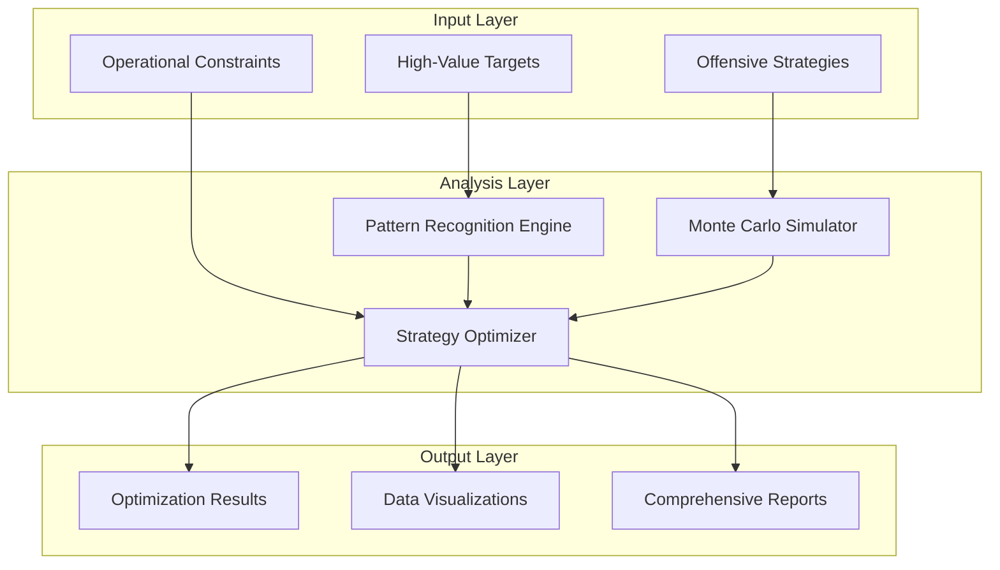

# Offensive Strategy Optimization System

A comprehensive system that combines **pattern recognition** and **Monte Carlo simulation** to identify optimal offensive strategies for eliminating high-value targets under time constraints.

## 🎯 Overview

This system provides advanced decision support for offensive operations by:

- **Pattern Recognition**: Analyzing historical data to identify temporal, behavioral, and environmental patterns
- **Monte Carlo Simulation**: Running thousands of simulations to evaluate strategy effectiveness
- **Multi-Objective Optimization**: Balancing success probability, risk, resource consumption, and time constraints
- **Real-time Adaptation**: Adjusting strategies based on current conditions and constraints

## 🏗️ System Architecture

### Core Components



### Key Features

1. **Target Classification**: 8 different target types (leadership, infrastructure, military assets, etc.)
2. **Strategy Types**: 8 offensive strategy categories (stealth infiltration, precision strike, cyber attack, etc.)
3. **Pattern Recognition**: Temporal, behavioral, and environmental pattern identification
4. **Monte Carlo Simulation**: 10,000+ iterations for statistical confidence
5. **Multi-Objective Optimization**: Success rate, risk, resources, and timing optimization
6. **Real-time Constraints**: Weather, intelligence quality, political restrictions
7. **Visualization**: Comprehensive charts and graphs for decision support

## 📊 Target Types

| Target Type | Description | Typical Value Score | Protection Level |
|-------------|-------------|-------------------|------------------|
| **Leadership** | Enemy commanders, political leaders | 90-100 | 85-95 |
| **Infrastructure** | Critical facilities, power plants | 70-85 | 60-80 |
| **Military Asset** | Weapons systems, vehicles | 75-90 | 70-85 |
| **Economic Target** | Financial centers, trade routes | 60-80 | 50-70 |
| **Intelligence Asset** | Communication centers, data facilities | 80-95 | 75-90 |
| **Cyber Target** | Digital infrastructure, networks | 70-85 | 60-80 |
| **Logistics Hub** | Supply depots, transportation nodes | 65-80 | 55-75 |
| **Command Control** | Command centers, coordination facilities | 85-95 | 80-90 |

## ⚔️ Strategy Types

| Strategy Type | Success Rate | Risk Level | Resource Usage | Time Required |
|---------------|--------------|------------|----------------|---------------|
| **Stealth Infiltration** | 70-80% | Medium | Low | 3-6 hours |
| **Precision Strike** | 80-90% | Low | Medium | 1-3 hours |
| **Cyber Attack** | 65-75% | Very Low | Low | 2-4 hours |
| **Direct Assault** | 60-70% | High | High | 2-5 hours |
| **Economic Sabotage** | 70-85% | Medium | Medium | 4-8 hours |
| **Psychological Operations** | 50-70% | Low | Low | 6-12 hours |
| **Combined Operations** | 85-95% | High | Very High | 4-10 hours |
| **Deception Operations** | 75-85% | Medium | Medium | 3-7 hours |

## 🔍 Pattern Recognition Capabilities

### Temporal Patterns
- **Peak Activity Hours**: Identifies optimal timing windows
- **Day-of-Week Patterns**: Recognizes weekly activity cycles
- **Seasonal Variations**: Accounts for seasonal factors

### Behavioral Patterns
- **Response Time Correlation**: Links threat levels to response times
- **Target Mobility Patterns**: Tracks target movement patterns
- **Protection Level Dynamics**: Monitors security posture changes

### Environmental Patterns
- **Weather Impact Analysis**: Correlates weather with success rates
- **Terrain Effects**: Accounts for geographical factors
- **Visibility Patterns**: Tracks atmospheric conditions

## 🎲 Monte Carlo Simulation

### Simulation Parameters
- **Iterations**: 10,000+ per strategy-target combination
- **Variables**: Success probability, execution time, resource consumption, risk factors
- **Confidence Intervals**: 95% confidence levels for all metrics
- **Statistical Analysis**: Mean, standard deviation, min/max values

### Environmental Factors
- **Weather Conditions**: Visibility, wind speed, precipitation
- **Intelligence Quality**: Information accuracy and completeness
- **Resource Availability**: Personnel, equipment, intelligence assets
- **Political Constraints**: Legal and policy restrictions

## 🚀 Quick Start

### Installation

```bash
# Clone the repository
git clone <repository-url>
cd DIA3

# Install dependencies
pip install -r requirements.txt

# Run the demo
python offensive_strategy_demo.py
```

### Basic Usage

```python
from src.core.offensive_strategy_optimizer import (
    OffensiveStrategyOptimizer,
    Target, Strategy, OperationalConstraints,
    TargetType, StrategyType, ThreatLevel
)

# Initialize optimizer
optimizer = OffensiveStrategyOptimizer()

# Create targets
targets = [
    Target(
        target_id="T001",
        name="Enemy Command Center",
        target_type=TargetType.COMMAND_CONTROL,
        threat_level=ThreatLevel.CRITICAL,
        location={"lat": 34.0522, "lon": -118.2437},
        value_score=95,
        protection_level=85,
        time_sensitivity=90,
        mobility=20,
        intelligence_quality=75,
        collateral_risk=60
    )
]

# Create strategies
strategies = [
    Strategy(
        strategy_id="S001",
        name="Stealth Infiltration",
        strategy_type=StrategyType.STEALTH_INFILTRATION,
        execution_time=4.0,
        success_probability=0.75,
        resource_requirements={"personnel": 8, "equipment": 15, "intelligence": 20},
        risk_level=60,
        detection_probability=0.3,
        collateral_damage=20,
        weather_dependency=0.4,
        night_operation_capability=0.9
    )
]

# Define constraints
constraints = OperationalConstraints(
    time_limit=12.0,
    available_resources={"personnel": 20, "equipment": 50, "intelligence": 40},
    weather_conditions={"visibility": 85, "wind_speed": 15, "precipitation": 0.1},
    intelligence_quality=75,
    political_restrictions=["minimize_civilian_casualties"],
    legal_constraints=["comply_with_international_law"],
    force_protection_requirements=80,
    stealth_requirements=70
)

# Run optimization
result = optimizer.optimize_strategy(targets, strategies, constraints)

# Display results
print(f"Optimal Strategy: {result.optimal_strategy.name}")
print(f"Expected Success Rate: {result.expected_success_rate:.2%}")
print(f"Total Risk: {result.risk_assessment['total_risk']:.1f}")

# Generate visualization
optimizer.generate_visualization(result)
```

## 📈 Advanced Features

### Sensitivity Analysis
The system can analyze how changes in key parameters affect outcomes:

```python
# Test different time constraints
time_constraints = [4.0, 8.0, 12.0, 16.0, 20.0]
for time_limit in time_constraints:
    constraints.time_limit = time_limit
    result = optimizer.optimize_strategy(targets, strategies, constraints)
    print(f"Time Limit: {time_limit}h - Success Rate: {result.expected_success_rate:.2%}")
```

### Pattern-Based Adjustments
The system automatically adjusts strategies based on identified patterns:

- **Temporal Adjustments**: Optimizes timing based on historical patterns
- **Weather Adjustments**: Modifies strategy effectiveness based on conditions
- **Intelligence Adjustments**: Accounts for information quality

### Multi-Target Optimization
The system can optimize strategies for multiple targets simultaneously:

```python
# Multiple targets with different priorities
targets = [
    Target(target_id="T001", name="Primary Target", value_score=100, ...),
    Target(target_id="T002", name="Secondary Target", value_score=80, ...),
    Target(target_id="T003", name="Tertiary Target", value_score=60, ...)
]

# System will prioritize and sequence operations
result = optimizer.optimize_strategy(targets, strategies, constraints)
```

## 📊 Output and Visualization

### Optimization Results
- **Optimal Strategy**: Best strategy for each target
- **Target Prioritization**: Ranked list of targets by priority
- **Execution Sequence**: Detailed timeline for operations
- **Success Rate**: Expected probability of success
- **Risk Assessment**: Total, detection, and collateral risk
- **Resource Allocation**: Required personnel, equipment, intelligence

### Visualizations
The system generates comprehensive visualizations:

1. **Success Rate vs Risk**: Scatter plot showing risk-reward trade-offs
2. **Execution Timeline**: Bar chart showing operation sequence and duration
3. **Resource Allocation**: Pie chart showing resource distribution
4. **Risk Assessment**: Bar chart showing different risk categories

### Reports
- **JSON Reports**: Machine-readable optimization results
- **Log Files**: Detailed execution logs
- **Statistical Analysis**: Confidence intervals and statistical measures

## 🔧 Configuration

### System Parameters
```python
# Monte Carlo simulation settings
num_iterations = 10000  # Number of simulation iterations
confidence_level = 0.95  # Statistical confidence level

# Pattern recognition settings
min_data_points = 10  # Minimum data points for pattern identification
correlation_threshold = 0.3  # Minimum correlation for pattern detection

# Optimization settings
success_weight = 0.6  # Weight for success rate in scoring
risk_weight = 0.4  # Weight for risk in scoring
```

### Custom Constraints
```python
constraints = OperationalConstraints(
    time_limit=12.0,  # Maximum operation time in hours
    available_resources={
        "personnel": 20,
        "equipment": 50,
        "intelligence": 40
    },
    weather_conditions={
        "visibility": 85,  # Percentage
        "wind_speed": 15,  # Knots
        "precipitation": 0.1  # Inches per hour
    },
    intelligence_quality=75,  # Percentage
    political_restrictions=["minimize_civilian_casualties"],
    legal_constraints=["comply_with_international_law"],
    force_protection_requirements=80,  # Percentage
    stealth_requirements=70  # Percentage
)
```

## 🧪 Testing and Validation

### Demo Scenarios
The system includes comprehensive demo scenarios:

1. **Basic Demo**: Standard optimization with sample data
2. **Time-Critical Operation**: 6-hour time constraint scenario
3. **High-Resource Operation**: 24-hour operation with abundant resources
4. **Stealth-Focused Operation**: Maximum stealth requirements
5. **Pattern Analysis Demo**: Historical data pattern recognition
6. **Monte Carlo Demo**: Detailed simulation analysis
7. **Sensitivity Analysis**: Parameter sensitivity testing

### Running Tests
```bash
# Run the complete demo
python offensive_strategy_demo.py

# Run specific components
python -c "
from src.core.offensive_strategy_optimizer import *
optimizer = OffensiveStrategyOptimizer()
# Test specific functionality
"
```

## 📚 API Reference

### Core Classes

#### `OffensiveStrategyOptimizer`
Main optimization engine that coordinates pattern recognition and Monte Carlo simulation.

**Methods:**
- `optimize_strategy(targets, strategies, constraints)`: Main optimization method
- `generate_visualization(result, output_path)`: Generate result visualizations

#### `PatternRecognitionEngine`
Identifies patterns in historical offensive operation data.

**Methods:**
- `identify_temporal_patterns(target_type)`: Find time-based patterns
- `identify_behavioral_patterns(target_type)`: Find behavioral patterns
- `identify_environmental_patterns()`: Find environmental patterns

#### `MonteCarloStrategySimulator`
Runs Monte Carlo simulations for strategy evaluation.

**Methods:**
- `simulate_strategy_execution(strategy, target, constraints, patterns)`: Run simulations

### Data Structures

#### `Target`
Represents a high-value target with all relevant characteristics.

#### `Strategy`
Represents an offensive strategy with success probabilities and resource requirements.

#### `OperationalConstraints`
Defines operational limitations and requirements.

#### `OptimizationResult`
Contains the complete optimization results and analysis.

## 🤝 Contributing

### Development Setup
```bash
# Clone repository
git clone <repository-url>
cd DIA3

# Create virtual environment
python -m venv venv
source venv/bin/activate  # On Windows: venv\Scripts\activate

# Install development dependencies
pip install -r requirements-dev.txt

# Run tests
pytest tests/
```

### Code Style
- Follow PEP 8 style guidelines
- Use type hints for all function parameters and return values
- Add comprehensive docstrings for all classes and methods
- Include unit tests for new functionality

## 📄 License

This project is licensed under the MIT License - see the LICENSE file for details.

## ⚠️ Disclaimer

This system is designed for educational and research purposes. Users are responsible for ensuring compliance with all applicable laws and regulations when using this system for real-world applications.

## 📞 Support

For questions, issues, or contributions:

1. Check the documentation and examples
2. Review existing issues on GitHub
3. Create a new issue with detailed information
4. Contact the development team

---

**Note**: This system represents a sophisticated approach to offensive strategy optimization, combining advanced pattern recognition with statistical simulation methods to provide decision support for complex operational planning scenarios.
