# Agentic AI Investment Analysis System Architecture

## System Overview

The Agentic AI Investment Analysis System provides comprehensive Monte Carlo simulation capabilities for assessing the strategic value of Agentic AI investment compared to alternative technology investments for DoD and IC applications.

## System Architecture Diagram

```mermaid
graph TB
    subgraph Input["Input Parameters"]
        A[Initial Investment Amount]
        B[Number of Simulations]
        C[Investment Categories]
        D[Strategic Factors]
    end

    subgraph Core["Core Analysis Engine"]
        E[Monte Carlo Simulation Engine]
        F[Risk-Return Analysis]
        G[Strategic Value Calculation]
        H[DoD/IC Impact Assessment]
    end

    subgraph Categories["Investment Categories"]
        I[Agentic AI Systems]
        J[Conventional AI/ML]
        K[Cybersecurity Systems]
        L[Quantum Computing]
        M[Space Technology]
        N[Biotechnology]
    end

    subgraph Factors["Strategic Factors"]
        O[Intelligence Advantage]
        P[Operational Efficiency]
        Q[Threat Detection]
        R[Decision Support]
        S[Cost Savings]
        T[Competitive Advantage]
    end

    subgraph Output["Analysis Outputs"]
        U[Investment Performance Comparison]
        V[Strategic Value Assessment]
        W[Risk-Return Analysis]
        X[DoD/IC Benefits Analysis]
        Y[Investment Recommendations]
        Z[Implementation Roadmap]
    end

    subgraph Visualization["Visualization Engine"]
        AA[Performance Charts]
        BB[Risk-Return Scatter Plots]
        CC[Strategic Factor Analysis]
        DD[DoD/IC Value Comparison]
    end

    A --> E
    B --> E
    C --> E
    D --> G
    E --> F
    E --> H
    F --> W
    G --> V
    H --> X
    I --> E
    J --> E
    K --> E
    L --> E
    M --> E
    N --> E
    O --> G
    P --> G
    Q --> G
    R --> G
    S --> G
    T --> G
    W --> AA
    W --> BB
    V --> CC
    X --> DD
    U --> Y
    V --> Y
    Y --> Z
```

## Component Details

### Core Analysis Engine

- **Monte Carlo Simulation Engine**: Performs 10,000+ simulations per investment category
- **Risk-Return Analysis**: Calculates volatility, VaR, and risk-adjusted returns
- **Strategic Value Calculation**: Applies weighted strategic factors to investment performance
- **DoD/IC Impact Assessment**: Evaluates specific benefits for defense and intelligence applications

### Investment Categories

- **Agentic AI Systems**: Base return 25.0%, Strategic multiplier 2.5x
- **Conventional AI/ML**: Base return 18.0%, Strategic multiplier 1.5x
- **Cybersecurity Systems**: Base return 20.0%, Strategic multiplier 1.8x
- **Quantum Computing**: Base return 15.0%, Strategic multiplier 2.0x
- **Space Technology**: Base return 22.0%, Strategic multiplier 2.2x
- **Biotechnology**: Base return 16.0%, Strategic multiplier 1.6x

### Strategic Factors

- **Intelligence Advantage**: Weight 25.0%, Agentic AI Impact 90.0%
- **Operational Efficiency**: Weight 20.0%, Agentic AI Impact 80.0%
- **Threat Detection**: Weight 20.0%, Agentic AI Impact 90.0%
- **Decision Support**: Weight 15.0%, Agentic AI Impact 85.0%
- **Cost Savings**: Weight 10.0%, Agentic AI Impact 70.0%
- **Competitive Advantage**: Weight 10.0%, Agentic AI Impact 90.0%

### Output Generation

- **JSON Results**: Machine-readable analysis data
- **Markdown Reports**: Human-readable comprehensive analysis
- **Visualizations**: Charts, graphs, and comparative analysis
- **System Architecture**: Component documentation and data flow

## Data Flow

1. **Input Processing**: Investment parameters and strategic factors are validated and prepared
2. **Simulation Execution**: Monte Carlo simulations generate return distributions for each category
3. **Strategic Analysis**: Strategic factors are applied to calculate comprehensive value scores
4. **Risk Assessment**: Risk metrics are calculated and compared across categories
5. **Benefit Analysis**: DoD and IC specific benefits are quantified and compared
6. **Recommendation Generation**: Optimal investment strategy and implementation plan are developed
7. **Output Generation**: Results are formatted and saved in multiple formats

## Integration Points

- **MCP Tools**: Integration with Monte Carlo simulation and business intelligence tools
- **API Endpoints**: RESTful interfaces for analysis execution and result retrieval
- **Data Sources**: Vector database and knowledge graph integration for strategic context
- **Visualization Tools**: Chart generation and interactive dashboard capabilities

## Performance Characteristics

- **Simulation Speed**: 10,000 simulations per category in <30 seconds
- **Accuracy**: 95% confidence intervals for all risk metrics
- **Scalability**: Supports multiple investment categories and strategic factors
- **Flexibility**: Configurable parameters for different analysis scenarios
