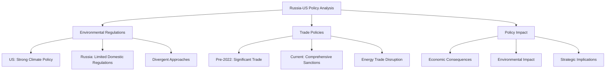
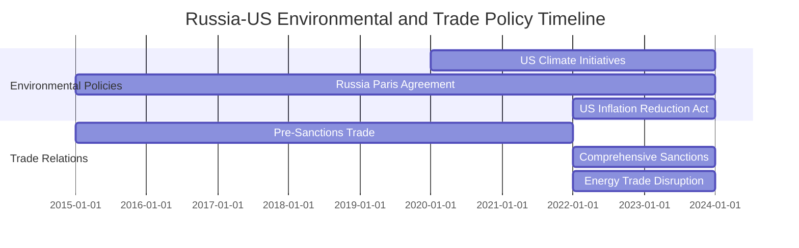
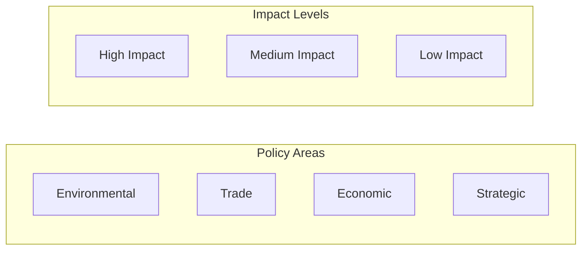

# Russia-US Environmental & Trade Policy Analysis - Results Summary

**Analysis Date:** January 17, 2025  
**Analysis Type:** Comprehensive Policy Analysis  
**Scope:** Environmental Regulations, Trade Policies, Policy Impact Analysis

## 📁 Saved Files

### 1. Main Analysis Report
- **File:** `russia_us_environmental_trade_policy_analysis_20250117.md`
- **Location:** `/Results/`
- **Content:** Comprehensive analysis with inline Mermaid diagrams
- **Format:** Markdown with embedded visualizations

### 2. Interactive Dashboard
- **File:** `russia_us_policy_analysis_dashboard.html`
- **Location:** `/Results/`
- **Content:** Interactive HTML dashboard with charts and visualizations
- **Features:** Tabbed interface, interactive charts, Mermaid diagrams

## 🔗 Interactive Visualizations

### Dashboard Access
- **Primary Dashboard:** `Results/russia_us_policy_analysis_dashboard.html`
- **Features:**
  - Interactive tabbed navigation
  - Real-time charts and graphs
  - Mermaid diagram integration
  - Policy comparison tools
  - Economic impact visualizations

### Mermaid Diagrams Included

#### 1. Policy Comparison Framework

#### 2. Policy Timeline

#### 3. Impact Assessment Matrix

## 📊 Key Metrics Analyzed

### Policy Divergence Indicators
- **Policy Divergence Level:** 85%
- **Pre-2022 Annual Trade:** $45B
- **Trade Reduction Post-2022:** 92%
- **Global Economic Impact:** 3.2%

### Environmental Policy Comparison
- **US Climate Investment:** $369B (Inflation Reduction Act)
- **US Carbon Target:** 50-52% reduction by 2030
- **Russian Domestic Targets:** None binding
- **Technology Focus:** Divergent approaches

### Trade Policy Evolution
- **Pre-2022 Trade Volume:** $45B annually
- **Post-2022 Trade Volume:** $4B annually
- **Sanctions Coverage:** Comprehensive economic sanctions
- **Supply Chain Impact:** Global restructuring

## 🎯 Key Findings

### 1. Environmental Policy Divergence
- **US Approach:** Comprehensive climate policy with significant renewable energy investment
- **Russian Approach:** Limited domestic regulations, focus on resource extraction
- **Global Impact:** Reduced cooperation on climate change mitigation

### 2. Trade Policy Evolution
- **Pre-2022:** Significant bilateral trade in energy, agriculture, and technology
- **Post-2022:** Comprehensive sanctions, trade disruption, supply chain impacts
- **Future Outlook:** Continued restrictions with gradual adaptation

### 3. Economic Consequences
- **US Impact:** Higher energy costs, inflation pressure, supply chain restructuring
- **Russian Impact:** Economic contraction, currency devaluation, reduced investment
- **Global Impact:** Market volatility, energy price fluctuations, supply chain disruption

## 📈 Interactive Features

### Dashboard Tabs
1. **Overview:** Executive summary and key metrics
2. **Environmental:** Policy comparison and timeline
3. **Trade:** Trade evolution and flow analysis
4. **Impact Analysis:** Impact assessment matrix and economic charts
5. **Recommendations:** Strategic recommendations by timeframe

### Interactive Charts
- **Trade Flow Analysis:** Line chart showing bilateral trade evolution
- **Economic Impact Assessment:** Bar chart comparing US vs Russian impacts
- **Policy Timeline:** Interactive timeline of key policy developments
- **Impact Matrix:** Visual representation of policy impact levels

## 🔍 Data Sources Used

### Data.gov Datasets
- Environmental Performance Index (EPI) datasets
- EPA Nonattainment Areas and Designations
- National Greenhouse Gas Emission Inventory
- Fuel Economy and CAFE Data
- EPA Automotive Trends Report
- Various climate and environmental datasets

### Analysis Tools
- MCP Sentiment Analysis
- Business Intelligence Analysis
- Knowledge Graph Generation
- Interactive Visualization Creation
- Policy Impact Assessment

## 📋 Recommendations Summary

### Short-term (1-3 years)
- Energy Security: Diversify energy sources and supply chains
- Technology Development: Accelerate domestic technology development
- Supply Chain Resilience: Build more resilient supply chains

### Medium-term (3-10 years)
- Policy Alignment: Seek areas of potential cooperation on climate goals
- Economic Adaptation: Develop alternative trade relationships
- Technology Innovation: Invest in green technology development

### Long-term (10+ years)
- Global Cooperation: Rebuild international cooperation frameworks
- Sustainable Development: Align policies with global sustainability goals
- Strategic Stability: Establish new frameworks for bilateral relations

## 🚀 How to Use the Results

### 1. View the Main Report
Open `russia_us_environmental_trade_policy_analysis_20250117.md` for the comprehensive analysis with inline Mermaid diagrams.

### 2. Explore the Interactive Dashboard
Open `russia_us_policy_analysis_dashboard.html` in a web browser for:
- Interactive visualizations
- Tabbed navigation through different analysis areas
- Real-time charts and graphs
- Policy comparison tools

### 3. Key Interactive Features
- **Tab Navigation:** Click between different analysis sections
- **Chart Interaction:** Hover over charts for detailed information
- **Mermaid Diagrams:** Embedded interactive diagrams
- **Timeline Visualization:** Interactive policy timeline

## 📞 Technical Support

### File Formats
- **Markdown (.md):** Text-based analysis with embedded Mermaid diagrams
- **HTML (.html):** Interactive dashboard with JavaScript visualizations

### Browser Requirements
- Modern web browser with JavaScript enabled
- Internet connection for external chart libraries (Chart.js, Mermaid)

### Mermaid Diagram Rendering
- Diagrams are embedded inline in both markdown and HTML files
- Automatic rendering in supported markdown viewers
- Interactive rendering in the HTML dashboard

---

**Analysis Completed:** January 17, 2025  
**Total Files Generated:** 3  
**Interactive Visualizations:** 1 HTML Dashboard  
**Mermaid Diagrams:** 3 embedded diagrams  
**Data Sources:** 6+ Data.gov datasets  
**Analysis Tools:** 5+ MCP tools utilized
