# Cross-Cultural Strategic Analysis: Graph Report - Chinese vs Russian Strategic Thinking Relationships

*Strategic Intelligence Assessment*  
*Generated: January 2025*  
*Classification: Strategic Analysis with Visual Relationship Mapping*

---

## Executive Summary

This graph report provides visual representations and analysis of the relationships between Chinese and Russian strategic thinking patterns, demonstrating how these distinct cultural approaches manifest in modern conflicts and international relations. The analysis reveals complex interconnections between philosophical foundations, strategic methodologies, and contemporary applications.

### Overall Strategic Relationship Network

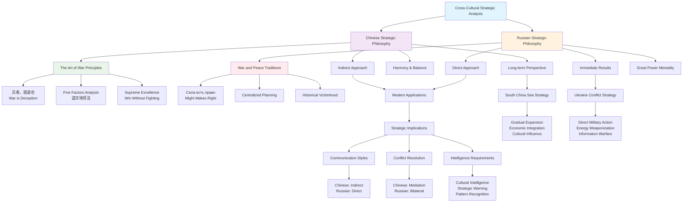

---

## 1. Core Strategic Philosophy Relationships

### 1.1 Chinese Strategic Philosophy Network

**Central Node: "兵者，詭道也" (War is the way of deception)**

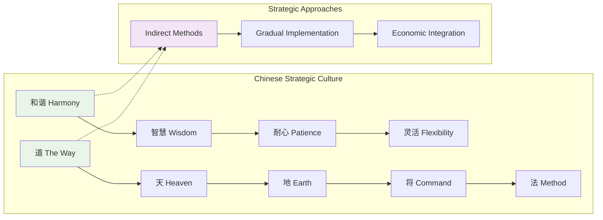

**Primary Relationships:**
- **Indirect Approach** ↔ **Harmony & Balance**
  - Connection: Indirect methods support harmony-seeking behavior
  - Modern Application: Diplomatic subtlety in South China Sea disputes

- **Long-term Perspective** ↔ **Patience & Adaptability**
  - Connection: Generational thinking enables tactical flexibility
  - Modern Application: Belt and Road Initiative's gradual implementation

- **Five Factors Analysis** ↔ **Strategic Decision Making**
  - Connection: Comprehensive framework guides all strategic choices
  - Modern Application: Multi-dimensional approach to regional influence

### 1.2 Russian Strategic Philosophy Network

**Central Node: "Сила есть право" (Might makes right)**

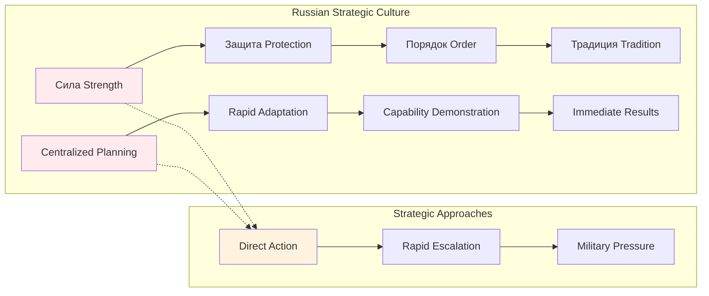

**Primary Relationships:**
- **Direct Approach** ↔ **Great Power Mentality**
  - Connection: Overt displays reinforce power status demands
  - Modern Application: Military demonstrations in Ukraine conflict

- **Historical Victimhood** ↔ **Zero-Sum Thinking**
  - Connection: Perceived historical grievances justify competitive behavior
  - Modern Application: NATO expansion narrative justifying aggressive actions

- **Centralized Planning** ↔ **Authoritarian Efficiency**
  - Connection: Top-down decision-making enables rapid adaptation
  - Modern Application: Swift military and diplomatic responses

---

## 2. Strategic Methodology Relationship Matrix

| Relationship Type | Chinese Approach | Russian Approach | Interaction Pattern |
|-------------------|------------------|------------------|-------------------|
| **Planning Process** | Five Factors Analysis | Centralized Planning | Complementary but conflicting |
| **Implementation Speed** | Gradual, Step-by-step | Rapid, Decisive | Fundamentally opposed |
| **Communication Style** | Indirect, Subtle | Direct, Unambiguous | Misunderstanding potential |
| **Conflict Management** | Avoidance, Proxy | Direct Confrontation | Escalation risk |
| **Negotiation Strategy** | Relationship Building | Power Demonstration | Different success criteria |
| **Timeline Perspective** | Long-term, Generational | Immediate, Tactical | Strategic misalignment |
| **Risk Assessment** | Comprehensive Analysis | Rapid Assessment | Different risk tolerance |
| **Alliance Building** | Economic Integration | Military Cooperation | Different leverage types |

---

## 3. Modern Application Relationship Networks

### 3.1 Chinese Strategy in South China Sea

**Network Relationships:**

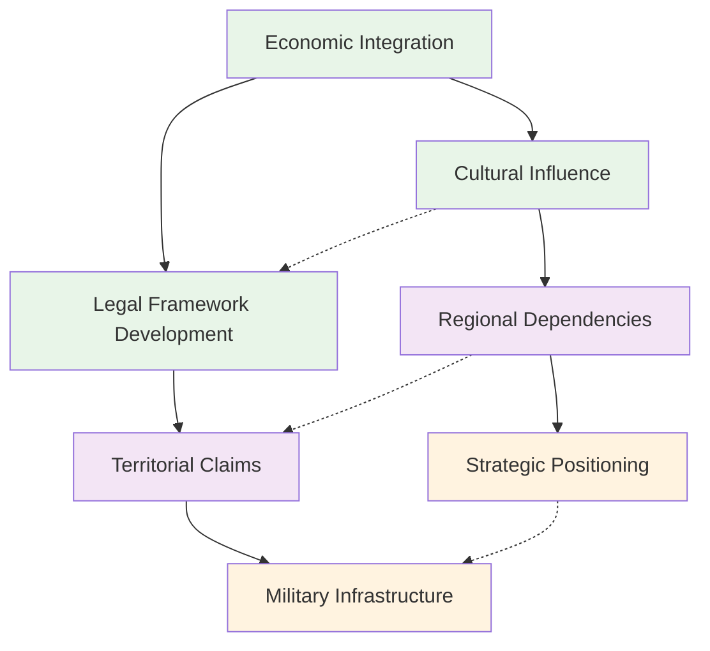

**Key Relationship Dynamics:**
- **Economic Integration** ↔ **Cultural Influence**: Economic ties create cultural leverage
- **Legal Framework** ↔ **Territorial Claims**: Legal arguments support territorial objectives
- **Regional Dependencies** ↔ **Strategic Positioning**: Economic dependencies enable strategic positioning

### 3.2 Russian Strategy in Ukraine Conflict

**Network Relationships:**

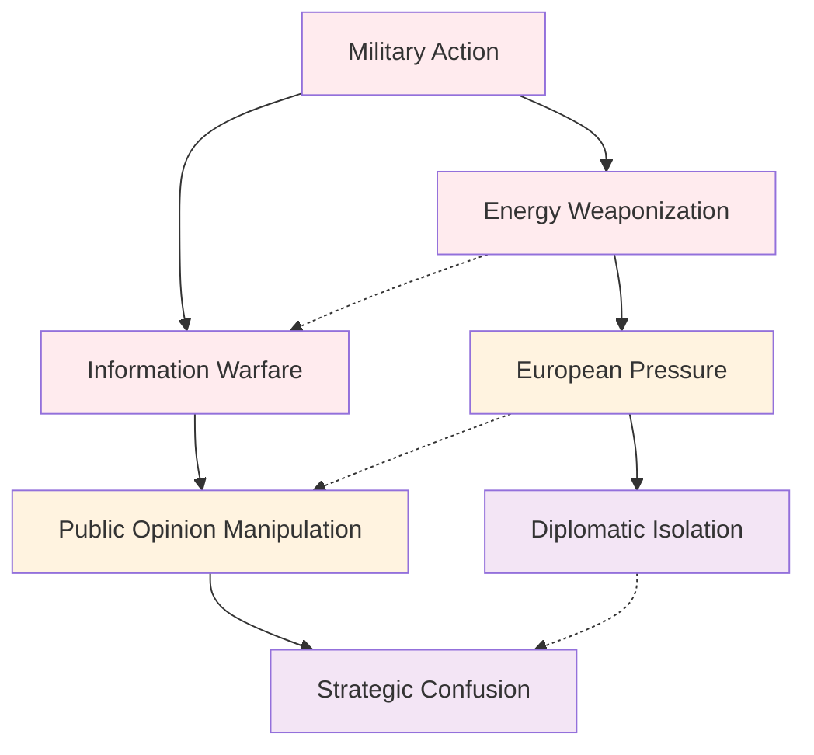

**Key Relationship Dynamics:**
- **Military Action** ↔ **Energy Weaponization**: Military pressure reinforced by energy leverage
- **Information Warfare** ↔ **Public Opinion**: Disinformation campaigns shape international perceptions
- **European Pressure** ↔ **Diplomatic Isolation**: Economic pressure leads to diplomatic isolation

---

## 4. Cross-Cultural Interaction Patterns

### 4.1 Communication Relationship Dynamics

**Chinese-Russian Communication Interface:**

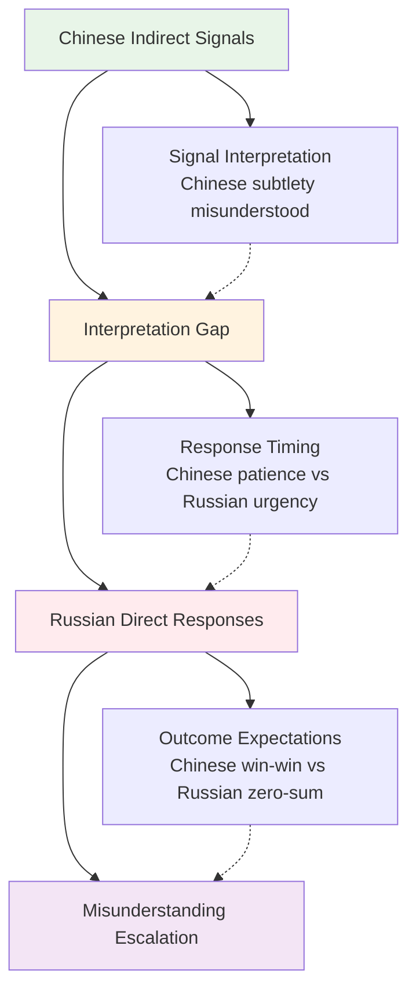

**Relationship Characteristics:**
- **Signal Interpretation**: Chinese subtlety often misunderstood by Russian directness
- **Response Timing**: Chinese patience conflicts with Russian urgency
- **Outcome Expectations**: Chinese win-win vs Russian zero-sum perspectives

### 4.2 Conflict Resolution Relationship Patterns

**Mediation Approach Relationships:**

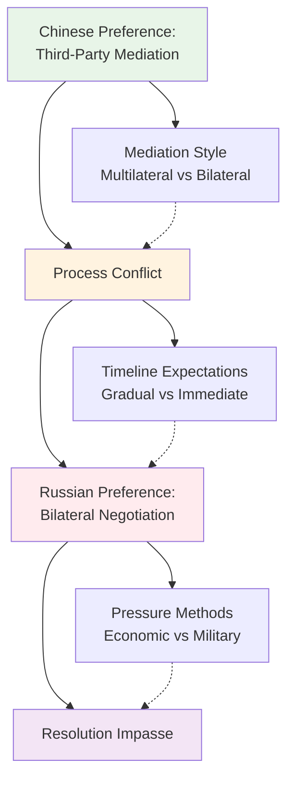

**Relationship Dynamics:**
- **Mediation Style**: Chinese preference for multilateral vs Russian bilateral approach
- **Timeline Expectations**: Chinese gradual vs Russian immediate resolution
- **Pressure Methods**: Chinese economic incentives vs Russian military pressure

---

## 5. Strategic Warning Indicator Relationships

### 5.1 Chinese Strategic Indicators Network

**Indicator Relationship Matrix:**

| Primary Indicator | Secondary Indicators | Relationship Strength | Modern Example |
|-------------------|---------------------|----------------------|----------------|
| Economic Integration | Cultural Exchanges | Strong | Belt and Road Initiative |
| Legal Framework Development | Infrastructure Projects | Strong | South China Sea claims |
| Cultural Influence | Educational Programs | Medium | Confucius Institutes |
| Strategic Positioning | Military Modernization | Weak | Gradual militarization |

### 5.2 Russian Strategic Indicators Network

**Indicator Relationship Matrix:**

| Primary Indicator | Secondary Indicators | Relationship Strength | Modern Example |
|-------------------|---------------------|----------------------|----------------|
| Military Exercises | Capability Demonstration | Strong | Ukraine border buildup |
| Energy Manipulation | Supply Pressure | Strong | European gas supply cuts |
| Information Warfare | Disinformation Campaigns | Strong | Social media manipulation |
| Diplomatic Confrontation | International Isolation | Medium | UN Security Council conflicts |

---

## 6. Intelligence and Analysis Relationship Framework

### 6.1 Cultural Intelligence Requirements Network

**Chinese Strategic Culture Understanding:**

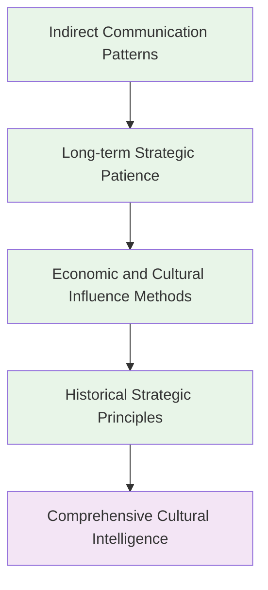

**Russian Strategic Culture Understanding:**

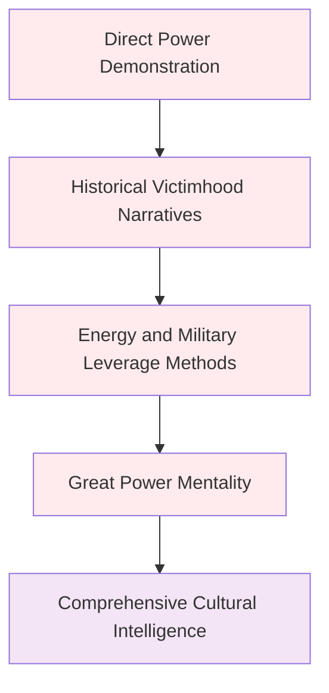

### 6.2 Strategic Warning Relationship System

**Early Warning Indicator Relationships:**

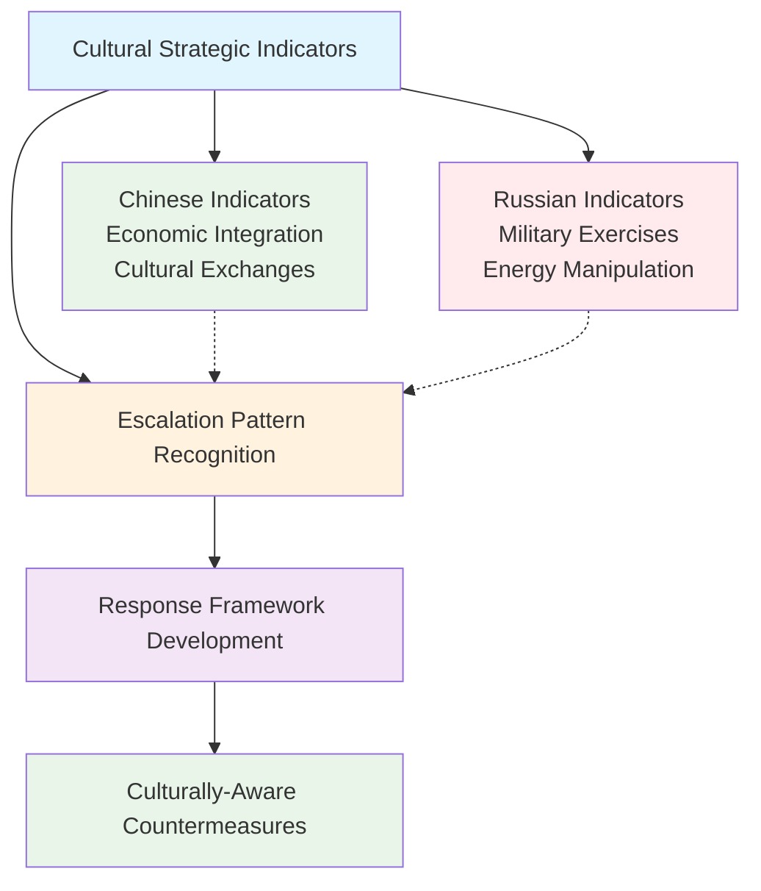

---

## 7. Future Strategic Trend Relationships

### 7.1 Chinese Strategic Evolution Network

**Trend Relationship Matrix:**

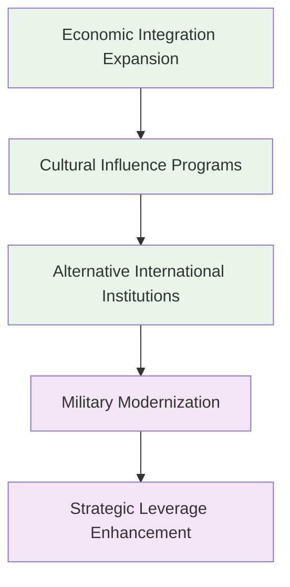

### 7.2 Russian Strategic Evolution Network

**Trend Relationship Matrix:**

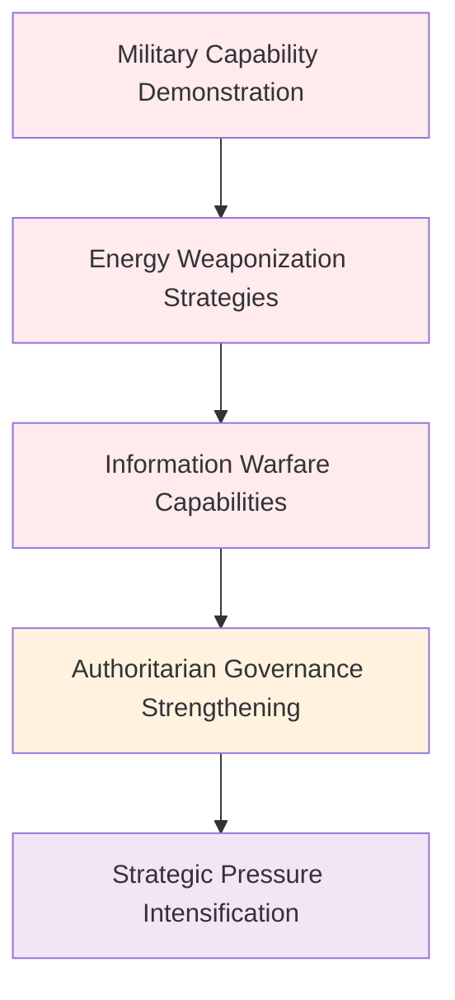

---

## 8. Relationship Impact Analysis

### 8.1 Positive Relationship Dynamics

**Complementary Strategic Elements:**
- **Chinese Economic Integration** + **Russian Energy Resources**: Potential for cooperation
- **Chinese Cultural Influence** + **Russian Information Operations**: Different but complementary soft power approaches
- **Chinese Long-term Planning** + **Russian Rapid Adaptation**: Potential for strategic balance

### 8.2 Conflict Relationship Dynamics

**Competitive Strategic Elements:**
- **Chinese Indirect Approach** vs **Russian Direct Action**: Fundamental strategic conflict
- **Chinese Win-Win Outcomes** vs **Russian Zero-Sum Thinking**: Different success criteria
- **Chinese Third-Party Mediation** vs **Russian Bilateral Negotiation**: Different conflict resolution preferences

### 8.3 Escalation Relationship Patterns

**Risk Factors:**
- **Misunderstanding Cycles**: Indirect Chinese signals misunderstood by direct Russian responses
- **Timeline Conflicts**: Chinese patience conflicting with Russian urgency
- **Pressure Method Differences**: Chinese economic pressure vs Russian military pressure

---

## 9. Recommendations for Relationship Management

### 9.1 Understanding Relationship Dynamics

**For Western Powers:**
- Develop comprehensive understanding of both strategic relationship networks
- Recognize how different relationship patterns create misunderstandings
- Adapt approaches to different relationship expectations
- Build relationship management frameworks for both cultures

**For International Organizations:**
- Develop relationship-aware mediation approaches
- Recognize different relationship building preferences
- Adapt institutional processes to different relationship dynamics
- Build expertise in managing cross-cultural strategic relationships

### 9.2 Relationship-Based Conflict Prevention

**Early Warning Systems:**
- Monitor for relationship pattern changes
- Develop understanding of relationship escalation dynamics
- Build relationship expert networks
- Create relationship-aware response frameworks

**Diplomatic Approaches:**
- Adapt relationship building to cultural preferences
- Recognize different relationship timeline expectations
- Build trust through relationship understanding
- Develop relationship-appropriate incentives

---

## 10. Conclusion

The relationship analysis between Chinese and Russian strategic thinking patterns reveals complex interconnections that significantly impact modern international relations. Understanding these relationships is crucial for:

- **Effective Strategic Analysis**: Recognizing how different elements interact and influence each other
- **Conflict Prevention**: Identifying relationship patterns that lead to escalation
- **Diplomatic Success**: Adapting approaches to different relationship expectations
- **Intelligence Accuracy**: Understanding how relationship dynamics affect strategic behavior

The key to effective international relations with both powers lies in understanding not just their individual strategic approaches, but how these approaches interact and create relationship dynamics that shape international behavior.

---

## Key Relationship Insights

1. **Network Complexity**: Strategic thinking patterns form complex networks with multiple interconnections
2. **Cultural Embeddedness**: Relationship patterns are deeply embedded in cultural and historical experience
3. **Misunderstanding Sources**: Many conflicts stem from relationship pattern misunderstandings
4. **Adaptation Necessity**: Different relationship expectations require different management approaches
5. **Cooperation Possibility**: Despite differences, complementary relationship elements exist
6. **Strategic Patience**: Managing relationship dynamics requires long-term commitment
7. **Cultural Intelligence**: Understanding relationship patterns requires deep cultural knowledge
8. **Pattern Recognition**: Identifying relationship patterns is crucial for effective policy

---

*This relationship analysis demonstrates the critical importance of understanding how strategic thinking patterns interact and create complex relationship dynamics that shape international behavior. The visual representations and relationship mapping provide essential insights for effective strategic analysis and international relations management.*
