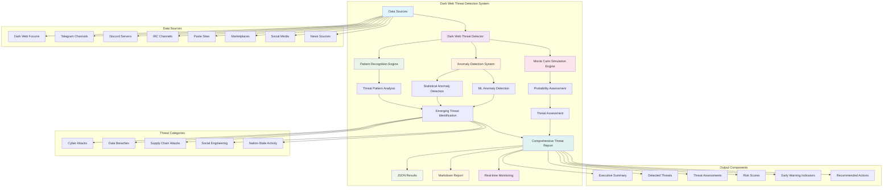

# Dark Web Threat Detection System Architecture

## System Overview

The Dark Web Threat Detection System is a comprehensive intelligence platform that combines pattern recognition, anomaly detection, and Monte Carlo simulation to identify emerging threats from dark web sources and assess their probability of materialization.

## System Architecture Diagram

## Component Descriptions

### Core System Components

1. **Dark Web Threat Detector**
   - Main orchestrator that coordinates all analysis components
   - Manages data flow and result aggregation
   - Provides unified interface for threat detection

2. **Pattern Recognition Engine**
   - Analyzes threat patterns across multiple data sources
   - Identifies recurring threat indicators and behaviors
   - Provides confidence scoring for pattern-based threats

3. **Anomaly Detection System**
   - Uses statistical and machine learning methods to detect unusual activity
   - Identifies outliers in threat data that may indicate emerging threats
   - Provides anomaly scoring and severity classification

4. **Monte Carlo Simulation Engine**
   - Performs probabilistic assessment of threat materialization
   - Generates confidence intervals and risk scores
   - Provides timeline estimates for threat development

### Data Sources

The system supports multiple dark web data sources:

- **Dark Web Forums**: Underground discussion boards and threat actor communities
- **Telegram Channels**: Encrypted messaging channels used by threat actors
- **Discord Servers**: Gaming and communication platforms exploited by malicious actors
- **IRC Channels**: Traditional chat networks still used by some threat groups
- **Paste Sites**: Code and data sharing platforms (Pastebin, etc.)
- **Marketplaces**: Dark web marketplaces for cybercrime tools and services
- **Social Media**: Public social media platforms for threat intelligence
- **News Sources**: Open-source intelligence and threat reporting

### Threat Categories

The system monitors and analyzes five main threat categories:

1. **Cyber Attacks**: Zero-day exploits, malware, APTs, ransomware
2. **Data Breaches**: Stolen credentials, database dumps, financial data
3. **Supply Chain Attacks**: Software compromises, vendor attacks
4. **Social Engineering**: Phishing, BEC, insider threats
5. **Nation-State Activity**: State-sponsored espionage, critical infrastructure targeting

### Output Components

The system generates comprehensive outputs including:

- **Executive Summary**: High-level threat assessment overview
- **Detected Threats**: Individual threat details and classifications
- **Threat Assessments**: Risk scores and confidence intervals
- **Risk Scores**: Quantified risk assessment metrics
- **Early Warning Indicators**: Specific indicators to monitor
- **Recommended Actions**: Actionable response recommendations

## Data Flow

1. **Data Ingestion**: Multiple dark web sources feed into the system
2. **Pattern Analysis**: Pattern recognition engine identifies recurring threats
3. **Anomaly Detection**: Statistical and ML methods detect unusual activity
4. **Threat Identification**: Emerging threats are identified and classified
5. **Probability Assessment**: Monte Carlo simulation assesses threat probability
6. **Report Generation**: Comprehensive reports are generated in multiple formats
7. **Real-time Monitoring**: Continuous monitoring provides ongoing threat detection

## Integration Points

- **API Integration**: RESTful APIs for external system integration
- **SIEM Integration**: Real-time threat feeds for security platforms
- **SOAR Platforms**: Automated response workflow integration
- **Threat Intelligence Platforms**: Data sharing and correlation capabilities

---

**Generated**: 2025-08-17  
**System Version**: 1.0  
**Classification**: UNCLASSIFIED
