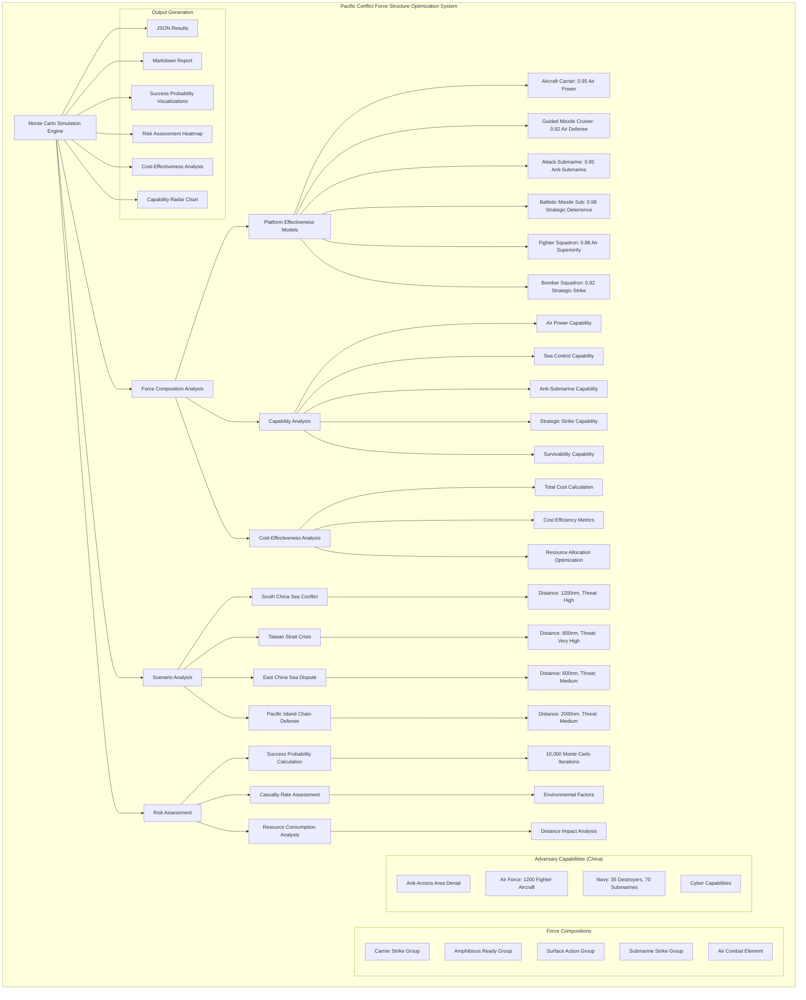

# Pacific Conflict Force Structure Optimization System Architecture

## System Overview

This document provides a comprehensive overview of the Pacific Conflict Force Structure Optimization System, which uses Monte Carlo simulation to optimize force structure for Pacific Conflict scenarios with China and assess the probability of success for different force compositions.

## System Architecture Diagram

## System Components

### 1. Monte Carlo Simulation Engine
- **Purpose**: Core simulation engine that performs probabilistic analysis
- **Capabilities**: 10,000+ iterations per force composition-scenario combination
- **Outputs**: Success probabilities, casualty rates, resource consumption

### 2. Force Composition Analysis
- **Carrier Strike Group**: Aircraft carrier, guided missile cruisers, destroyers, submarines
- **Amphibious Ready Group**: Amphibious assault ships, transport docks, landing ships
- **Surface Action Group**: Cruisers, destroyers, frigates, submarines
- **Submarine Strike Group**: Ballistic missile submarines, attack submarines
- **Air Combat Element**: Fighter squadrons, bomber squadrons, electronic warfare

### 3. Scenario Analysis
- **South China Sea Conflict**: Distance 1200nm, High threat level
- **Taiwan Strait Crisis**: Distance 800nm, Very High threat level
- **East China Sea Dispute**: Distance 600nm, Medium threat level
- **Pacific Island Chain Defense**: Distance 2000nm, Medium threat level

### 4. Platform Effectiveness Models
- **Aircraft Carrier**: Air power (0.95), Sea control (0.90), Power projection (0.98)
- **Guided Missile Cruiser**: Air defense (0.92), Surface warfare (0.88)
- **Attack Submarine**: Anti-surface (0.90), Anti-submarine (0.95)
- **Ballistic Missile Submarine**: Strategic deterrence (0.98)
- **Fighter Squadron**: Air superiority (0.88), Ground attack (0.82)
- **Bomber Squadron**: Strategic strike (0.92), Maritime strike (0.85)

### 5. Adversary Capabilities (China)
- **Anti-Access Area Denial**: 1500km missile range, 1200 missiles
- **Air Force**: 1200 fighter aircraft, 60% modern aircraft
- **Navy**: 35 destroyers, 50 frigates, 70 submarines, 2 aircraft carriers
- **Cyber Capabilities**: Cyber attack (0.80), Electronic warfare (0.85)

### 6. Risk Assessment Framework
- **Success Probability Calculation**: Based on force effectiveness vs. adversary threat
- **Casualty Rate Assessment**: Inverse relationship with force effectiveness
- **Resource Consumption Analysis**: Cost factors and mission duration impact

### 7. Output Generation
- **JSON Results**: Machine-readable comprehensive analysis data
- **Markdown Report**: Human-readable executive summary and recommendations
- **Visualizations**: Success probability comparisons, risk heatmaps, cost-effectiveness analysis, capability radar charts

## Data Flow

1. **Input**: Force compositions, scenarios, platform effectiveness, adversary capabilities
2. **Processing**: Monte Carlo simulation with 10,000 iterations per combination
3. **Analysis**: Success probability, risk assessment, cost-effectiveness calculation
4. **Output**: Comprehensive results, reports, and visualizations

## Key Features

- **Comprehensive Analysis**: 5 force compositions × 4 scenarios = 20 combinations
- **Probabilistic Modeling**: Monte Carlo simulation with uncertainty quantification
- **Multi-Dimensional Assessment**: Success probability, risk, cost-effectiveness
- **Visualization**: Multiple chart types for different analysis perspectives
- **Actionable Intelligence**: Specific recommendations for force structure optimization

## Technical Specifications

- **Simulation Engine**: Python-based Monte Carlo implementation
- **Data Processing**: NumPy, Pandas for statistical analysis
- **Visualization**: Matplotlib, Seaborn for comprehensive charts
- **Output Formats**: JSON, Markdown, PNG images
- **Reproducibility**: Fixed random seed for consistent results

---

*System Architecture Document - Pacific Conflict Force Structure Optimization*
*Generated: 2025-08-17*
*DIA3 Monte Carlo Simulation System*
