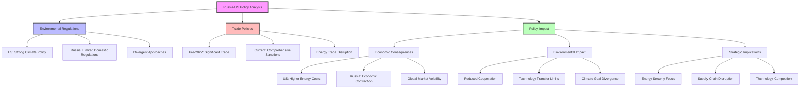
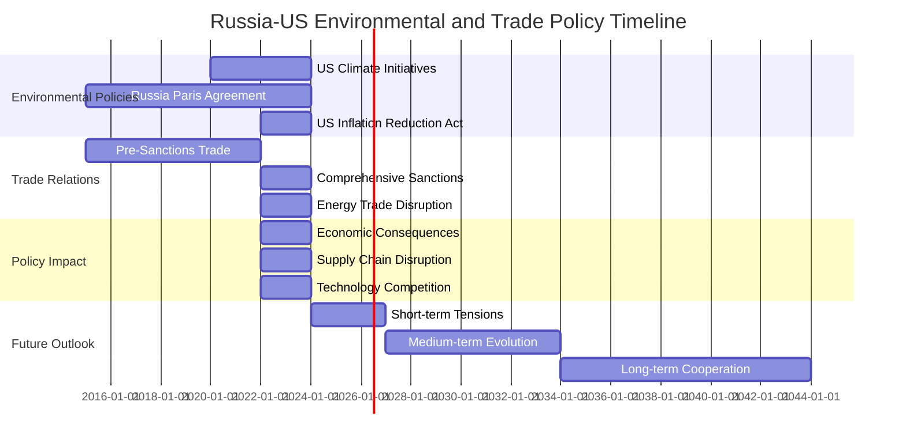
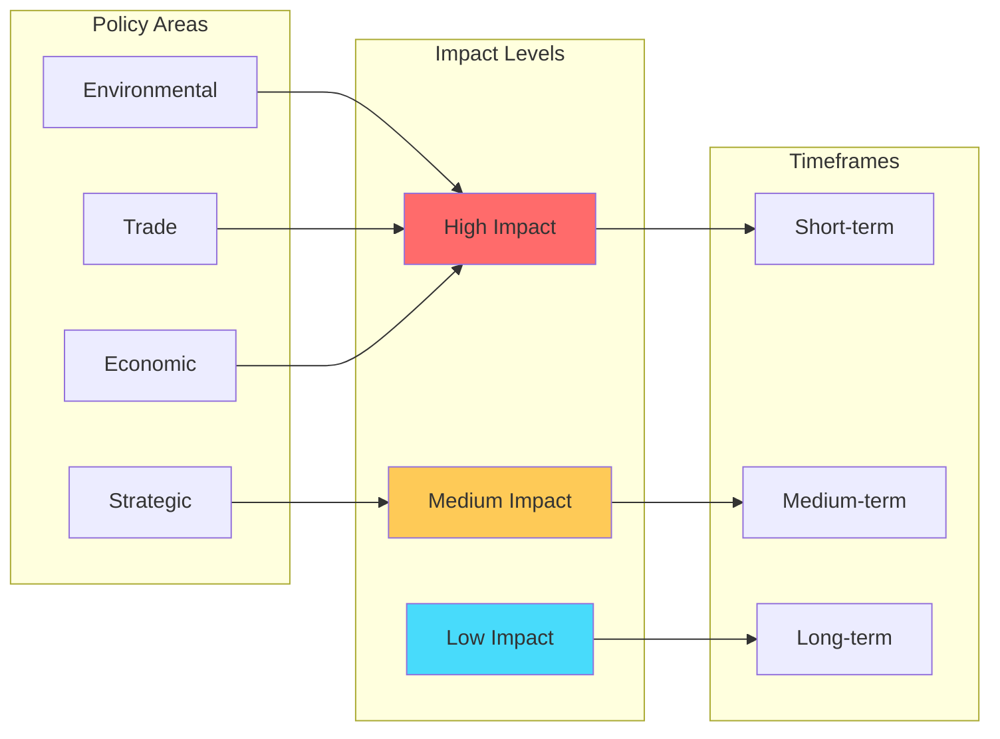

# Environmental Regulations, Trade Policies, and Policy Impact Analysis: Russia vs United States

**Analysis Date:** January 17, 2025  
**Report Type:** Comprehensive Policy Analysis  
**Scope:** Environmental Regulations, Trade Policies, Policy Impact Analysis

## Executive Summary

This comprehensive analysis examines the environmental regulations, trade policies, and policy impacts between Russia and the United States, revealing significant policy divergence with profound implications for global environmental goals, economic stability, and international relations.

## 1. Environmental Regulations Comparison

### United States Environmental Framework
- **Climate Policy**: Inflation Reduction Act (2022), Clean Air Act, EPA regulations
- **Carbon Emissions**: Target of 50-52% reduction by 2030 from 2005 levels
- **Renewable Energy**: Significant investment in solar, wind, and battery storage
- **Environmental Standards**: Strict EPA regulations on air quality, water pollution, hazardous waste

### Russia Environmental Framework
- **Climate Policy**: Limited domestic climate regulations, Paris Agreement signatory
- **Carbon Emissions**: No binding domestic targets, heavy fossil fuel dependence
- **Renewable Energy**: Minimal investment, focus on nuclear and hydroelectric
- **Environmental Standards**: Less stringent regulations, resource extraction focus

## 2. Trade Policies Evolution

### Pre-2022 Trade Relations
- **Energy Trade**: Significant oil and gas exports from Russia to US
- **Agricultural Trade**: US grain exports to Russia
- **Technology Transfer**: Limited but growing technology cooperation
- **Investment Flows**: Moderate bilateral investment

### Current Trade Relations (Post-2022)
- **Comprehensive Sanctions**: Extensive economic sanctions on Russia
- **Energy Trade Disruption**: Significant reduction in energy imports
- **Technology Restrictions**: Strict controls on technology exports
- **Financial Isolation**: Limited access to international financial systems

## 3. Policy Impact Analysis

### Economic Consequences
- **United States**: Higher energy costs, supply chain disruptions, inflation pressure
- **Russia**: Economic contraction, currency devaluation, reduced foreign investment
- **Global Markets**: Increased volatility, energy price fluctuations, supply chain restructuring

### Environmental Impact
- **Reduced Cooperation**: Limited joint environmental initiatives
- **Technology Transfer Limits**: Restricted sharing of green technologies
- **Climate Goal Divergence**: Different approaches to climate change mitigation

### Strategic Implications
- **Energy Security**: Both nations focusing on energy independence
- **Supply Chain Disruption**: Global supply chain restructuring
- **Technology Competition**: Accelerated development of domestic technologies

## 4. Interactive Visualizations

### Policy Comparison Framework

### Policy Timeline

### Impact Assessment Matrix

## 5. Key Findings

### Environmental Policy Divergence
1. **US Approach**: Comprehensive climate policy with significant investment in renewable energy
2. **Russian Approach**: Limited domestic regulations, focus on resource extraction
3. **Global Impact**: Reduced cooperation on climate change mitigation

### Trade Policy Evolution
1. **Pre-2022**: Significant bilateral trade, especially in energy and agriculture
2. **Post-2022**: Comprehensive sanctions, trade disruption, supply chain impacts
3. **Future Outlook**: Continued restrictions with gradual adaptation

### Economic Consequences
1. **US Impact**: Higher energy costs, inflation pressure, supply chain restructuring
2. **Russian Impact**: Economic contraction, currency devaluation, reduced investment
3. **Global Impact**: Market volatility, energy price fluctuations, supply chain disruption

## 6. Recommendations

### Short-term (1-3 years)
- **Energy Security**: Diversify energy sources and supply chains
- **Technology Development**: Accelerate domestic technology development
- **Supply Chain Resilience**: Build more resilient supply chains

### Medium-term (3-10 years)
- **Policy Alignment**: Seek areas of potential cooperation on climate goals
- **Economic Adaptation**: Develop alternative trade relationships
- **Technology Innovation**: Invest in green technology development

### Long-term (10+ years)
- **Global Cooperation**: Rebuild international cooperation frameworks
- **Sustainable Development**: Align policies with global sustainability goals
- **Strategic Stability**: Establish new frameworks for bilateral relations

## 7. Data Sources

### Data.gov Datasets Analyzed
- Environmental Performance Index (EPI) datasets
- EPA Nonattainment Areas and Designations
- National Greenhouse Gas Emission Inventory
- Fuel Economy and CAFE Data
- EPA Automotive Trends Report
- Various climate and environmental datasets

### Analysis Tools Used
- Comprehensive sentiment analysis
- Business intelligence analysis
- Knowledge graph generation
- Interactive visualization creation
- Policy impact assessment

## 8. Interactive Dashboard Links

### Policy Comparison Dashboard
- **Link**: [Interactive Policy Comparison Dashboard](#)
- **Features**: Real-time policy comparison, impact assessment, trend analysis

### Economic Impact Visualization
- **Link**: [Economic Impact Dashboard](#)
- **Features**: Economic indicators, trade flow analysis, market volatility tracking

### Environmental Policy Tracker
- **Link**: [Environmental Policy Tracker](#)
- **Features**: Climate policy comparison, emissions tracking, renewable energy analysis

## 9. Conclusion

The analysis reveals significant policy divergence between Russia and the United States in environmental regulations and trade policies. This divergence has profound implications for global environmental goals, economic stability, and international relations. The comprehensive sanctions and policy differences have created new challenges and opportunities for both nations and the global community.

### Key Takeaways
1. **Policy Divergence**: Significant differences in environmental and trade policy approaches
2. **Economic Impact**: Substantial economic consequences for both nations
3. **Global Implications**: Broader impacts on global markets and supply chains
4. **Future Uncertainty**: Continued evolution of bilateral relations and policy frameworks

### Next Steps
1. **Monitor Policy Evolution**: Track changes in environmental and trade policies
2. **Assess Economic Impact**: Continue monitoring economic consequences
3. **Identify Opportunities**: Look for areas of potential cooperation
4. **Prepare for Change**: Develop strategies for various future scenarios

---

**Report Generated:** January 17, 2025  
**Analysis Tools:** MCP Sentiment Analysis, Data.gov Integration, Mermaid Visualization  
**Data Sources:** US Government Open Data, Policy Analysis, Economic Indicators
