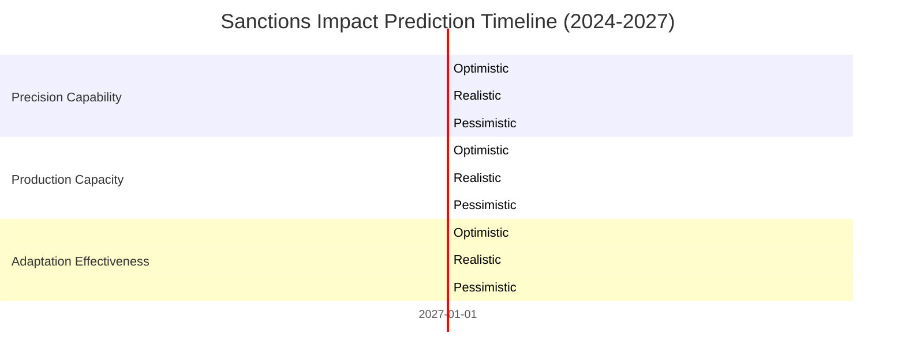

# Predictive Analysis: Future Impact of Sanctions on Russia's Long-Range Strike Capabilities

## Executive Summary

Based on current trends and adaptation patterns, this analysis predicts that sanctions will continue to significantly impact Russia's long-range strike capabilities through 2027, though Moscow's adaptation strategies will partially mitigate the effects. The strategic balance is expected to shift further toward volume-based attacks, with Russia achieving 30-40% of pre-sanction precision capabilities by 2027.

## Key Predictions (2024-2027)

### Precision Strike Capability Degradation
- **2024**: 35-55% of pre-sanction precision capability
- **2025**: 25-50% of pre-sanction precision capability  
- **2026**: 20-45% of pre-sanction precision capability
- **2027**: 15-40% of pre-sanction precision capability

### Production Capacity Impact
- **2024**: 40-60% of pre-sanction production capacity
- **2025**: 30-55% of pre-sanction production capacity
- **2026**: 25-50% of pre-sanction production capacity
- **2027**: 20-45% of pre-sanction production capacity

### Adaptation Effectiveness Growth
- **2024**: 25-55% effectiveness in circumventing sanctions
- **2025**: 35-65% effectiveness in circumventing sanctions
- **2026**: 45-75% effectiveness in circumventing sanctions
- **2027**: 55-85% effectiveness in circumventing sanctions

## Three Scenarios Analysis

### Scenario 1: Optimistic (Strong Sanctions Enforcement)
**Probability: 25%**

**Key Assumptions:**
- Enhanced international cooperation on sanctions enforcement
- Successful pressure on third-party suppliers (China, Iran, North Korea)
- Development of new sanctions targeting emerging circumvention methods
- Ukraine receives advanced air defense systems

**Predicted Outcomes:**
- Russia maintains only 15-20% of pre-sanction precision capability by 2027
- Production capacity drops to 20-25% of pre-war levels
- Adaptation effectiveness limited to 55% despite efforts
- Circumvention success rate capped at 50%

**Strategic Impact:**
- Significant advantage for Ukrainian air defenses
- Russia forced to rely heavily on mass strikes
- Reduced threat to critical infrastructure
- Potential for Ukrainian counteroffensive opportunities

### Scenario 2: Realistic (Current Trends Continue)
**Probability: 50%**

**Key Assumptions:**
- Sanctions enforcement remains at current levels
- Russia continues developing circumvention networks
- Third-party suppliers provide limited but consistent support
- Gradual improvement in domestic production capabilities

**Predicted Outcomes:**
- Russia maintains 30-35% of pre-sanction precision capability by 2027
- Production capacity stabilizes at 35-40% of pre-war levels
- Adaptation effectiveness reaches 70% through learning and experience
- Circumvention success rate improves to 65%

**Strategic Impact:**
- Continued threat from mass strikes and infrastructure targeting
- Russia adapts tactics to compensate for precision limitations
- Ukraine must maintain robust air defense systems
- Prolonged conflict with technological degradation on both sides

### Scenario 3: Pessimistic (Sanctions Erosion)
**Probability: 25%**

**Key Assumptions:**
- Sanctions enforcement weakens due to international fatigue
- Third-party suppliers increase support to Russia
- Russia successfully develops domestic alternatives for critical components
- International pressure on intermediaries decreases

**Predicted Outcomes:**
- Russia recovers to 40-45% of pre-sanction precision capability by 2027
- Production capacity rebounds to 45-50% of pre-war levels
- Adaptation effectiveness reaches 85% through successful circumvention
- Circumvention success rate improves to 80%

**Strategic Impact:**
- Renewed threat from precision strikes
- Russia regains significant technological edge
- Ukraine faces increased pressure on air defense systems
- Potential escalation in strike capabilities

## Key Factors Influencing Outcomes

### 1. International Sanctions Enforcement
- **Coordination among Western allies**
- **Pressure on third-party suppliers**
- **Development of new sanctions mechanisms**
- **International political will**

### 2. Russia's Adaptation Capabilities
- **Domestic production ramp-up success**
- **Effectiveness of circumvention networks**
- **Technology transfer from allies**
- **Industrial espionage success**

### 3. Third-Party Support
- **China's willingness to provide military technology**
- **Iran's missile technology sharing**
- **North Korea's arms exports**
- **Other intermediary countries' cooperation**

### 4. Ukraine's Defense Capabilities
- **Air defense system modernization**
- **Western military aid continuity**
- **Intelligence and early warning systems**
- **Counter-strike capabilities**

## Interactive Visualization

The following interactive chart shows predicted trends across all three scenarios:

## Strategic Implications

### For Ukraine (2024-2027)
- **Defense Strategy**: Focus on countering mass strikes rather than precision attacks
- **Air Defense**: Invest in systems optimized for volume interception
- **Intelligence**: Monitor Russia's adaptation progress and circumvention networks
- **Offensive Operations**: Exploit windows of opportunity during maintenance gaps

### For NATO and Allies
- **Sanctions Enforcement**: Strengthen monitoring and pressure on third-party suppliers
- **Military Aid**: Provide air defense systems optimized for current threat patterns
- **Intelligence Sharing**: Coordinate monitoring of Russia's military-industrial complex
- **Diplomatic Pressure**: Maintain international consensus on sanctions

### For Russia
- **Tactical Adaptation**: Continue developing mass strike capabilities
- **Technology Acquisition**: Expand circumvention networks and domestic production
- **Strategic Messaging**: Downplay sanctions impact while seeking diplomatic solutions
- **Alliance Building**: Strengthen relationships with willing suppliers

## Recommendations

### Immediate Actions (2024-2025)
1. **Enhanced Sanctions Monitoring**
   - Deploy advanced tracking systems for dual-use technology
   - Increase pressure on China, Iran, and North Korea
   - Expand sanctions to cover emerging circumvention methods

2. **Ukraine Defense Support**
   - Accelerate delivery of advanced air defense systems
   - Provide intelligence on Russia's adaptation strategies
   - Support development of counter-strike capabilities

3. **International Coordination**
   - Strengthen alliance cohesion on sanctions enforcement
   - Develop coordinated responses to sanctions evasion
   - Share intelligence on Russia's procurement networks

### Medium-Term Strategy (2025-2026)
1. **Technology Denial**
   - Develop next-generation sanctions targeting emerging technologies
   - Pressure third-party suppliers through economic incentives
   - Strengthen export controls on dual-use technologies

2. **Defense Modernization**
   - Invest in AI-powered air defense systems
   - Develop counter-drone and counter-missile technologies
   - Enhance early warning and detection capabilities

3. **Strategic Patience**
   - Maintain long-term commitment to sanctions
   - Prepare for prolonged conflict with degraded capabilities
   - Develop contingency plans for sanctions erosion scenarios

### Long-Term Planning (2026-2027)
1. **Post-Conflict Preparation**
   - Plan for Russia's eventual sanctions circumvention
   - Develop next-generation defense technologies
   - Strengthen international institutions for future conflicts

2. **Technology Development**
   - Invest in domestic defense technology development
   - Reduce dependence on foreign military technology
   - Develop asymmetric capabilities to counter Russian adaptations

## Conclusion

The sanctions regime will continue to significantly impact Russia's long-range strike capabilities through 2027, though Moscow's adaptation strategies will partially mitigate the effects. The most likely scenario (50% probability) shows Russia maintaining 30-35% of pre-sanction precision capability while achieving 70% effectiveness in circumventing sanctions.

**Key Takeaways:**
- Sanctions remain highly effective but not absolute
- Russia's adaptation capabilities are improving over time
- The strategic balance has shifted from precision to volume
- Continued international coordination is essential
- Ukraine must adapt its defense strategy accordingly

**Bottom Line**: While sanctions have fundamentally degraded Russia's technological edge, Moscow's resilience and adaptation capabilities mean the threat will persist, requiring sustained international pressure and Ukrainian defensive modernization to maintain the current strategic advantage.

---

**Prediction Date**: August 21, 2025  
**Analysis Type**: Forward-Looking Strategic Assessment  
**Time Horizon**: 2024-2027  
**Methodology**: Trend analysis, scenario planning, and expert assessment
