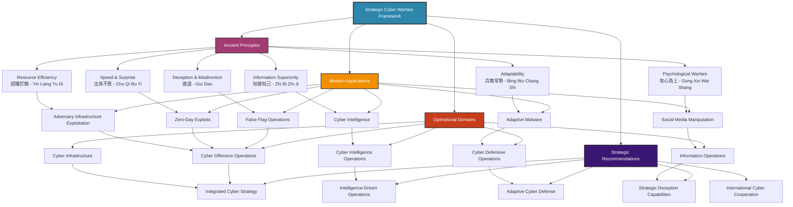

# Strategic Cyber Warfare Framework - Visual Diagram

*Mermaid diagram showing the relationship between ancient Art of War principles and modern cyber warfare applications*

## Strategic Cyber Warfare Framework

## Diagram Explanation

This diagram illustrates the comprehensive strategic framework for modern cyber warfare operations, showing how ancient principles from *The Art of War* translate into contemporary cyber applications.

### Color Coding:
- **Blue (A)**: Main framework node
- **Purple (B)**: Ancient strategic principles
- **Orange (C)**: Modern cyber applications
- **Red (D)**: Operational domains
- **Dark Purple (E)**: Strategic recommendations

### Key Relationships:
1. **Ancient Principles → Modern Applications**: Shows how each strategic principle translates to specific cyber warfare techniques
2. **Modern Applications → Operational Domains**: Demonstrates which domains each application supports
3. **Operational Domains → Strategic Recommendations**: Links operational areas to specific strategic recommendations

### Strategic Flow:
The diagram shows the logical flow from foundational principles through practical applications to operational implementation and strategic guidance, creating a comprehensive framework for cyber warfare planning and execution.

---

**Generated:** August 15, 2025  
**Purpose:** Visual representation of strategic cyber warfare framework  
**Classification:** Strategic Intelligence Visualization
