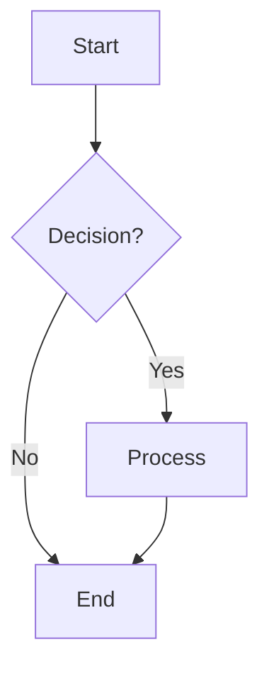

# Markdown Export Guide

## Overview

The DIA3 system now includes comprehensive markdown export capabilities that can convert markdown content to both PDF and Word documents. This functionality supports complex markdown elements including headers, lists, tables, code blocks, Mermaid diagrams, images, and more.

## Features

### ✅ Supported Markdown Elements

- **Headers** (H1-H6) with proper styling
- **Paragraphs** with text formatting
- **Lists** (ordered and unordered) with indentation
- **Tables** with headers and data rows
- **Code blocks** with syntax highlighting
- **Mermaid diagrams** converted to PNG images
- **Images** with alt text and captions
- **Blockquotes** with styling
- **Horizontal rules**
- **Links** and inline elements

### ✅ Export Formats

- **PDF** using ReportLab with professional styling
- **Word documents** using python-docx with proper formatting
- **Dual export** to both formats simultaneously

### ✅ Template System

- **Pre-defined templates**: Executive Summary, Technical Report, Business Report, Academic Paper, Whitepaper
- **Custom templates**: Create your own styling configurations
- **Template categories**: Business, Technical, Academic

### ✅ Advanced Features

- **Async processing** with progress tracking
- **Error handling** with graceful fallbacks
- **Image embedding** and Mermaid diagram conversion
- **Custom styling** for both PDF and Word formats
- **Operation management** with status tracking and cancellation

## Installation

### Dependencies

The markdown export functionality requires additional dependencies. Add these to your `pyproject.toml`:

```toml
dependencies = [
    # ... existing dependencies ...
    "reportlab>=4.0.0",
    "python-docx>=1.1.0",
    "markdown>=3.5.0",
    "mermaid-cli>=10.6.0",
    "pillow>=10.0.0",
]
```

### Install Dependencies

```bash
# Install Python dependencies
pip install reportlab python-docx markdown pillow

# Install Mermaid CLI (for diagram conversion)
npm install -g @mermaid-js/mermaid-cli
```

## Usage

### Basic Usage

#### 1. Using the Export Service Directly

```python
import asyncio
from src.core.export import MarkdownExportService

async def export_example():
    # Initialize the export service
    export_service = MarkdownExportService("exports")
    
    # Sample markdown content
    markdown_content = """
# My Document
## Introduction
This is a sample document with **bold text** and *italic text*.

### Features
- Feature 1
- Feature 2
- Feature 3

| Column 1 | Column 2 |
|----------|----------|
| Data 1   | Data 2   |
| Data 3   | Data 4   |
"""
    
    # Export to PDF
    pdf_result = await export_service.export_markdown_to_pdf(
        markdown_content,
        "my_document.pdf",
        "whitepaper"
    )
    
    if pdf_result["success"]:
        print(f"PDF created: {pdf_result['output_path']}")
    
    # Export to Word
    word_result = await export_service.export_markdown_to_word(
        markdown_content,
        "my_document.docx",
        "whitepaper"
    )
    
    if word_result["success"]:
        print(f"Word document created: {word_result['output_path']}")

# Run the export
asyncio.run(export_example())
```

#### 2. Using the Export Manager

```python
import asyncio
from src.core.reporting.export_manager import ExportManager

async def export_with_manager():
    export_manager = ExportManager()
    
    # Export markdown to PDF
    result = await export_manager.export_markdown_to_pdf(
        markdown_content="Your markdown content here",
        output_filename="document.pdf",
        template_name="whitepaper"
    )
    
    print(f"Export result: {result}")

asyncio.run(export_with_manager())
```

#### 3. Using API Endpoints

```bash
# Export to PDF
curl -X POST "http://localhost:8000/export/markdown-to-pdf" \
  -H "Content-Type: application/json" \
  -d '{
    "markdown_content": "# My Document\n\nThis is content...",
    "output_filename": "document.pdf",
    "template_name": "whitepaper"
  }'

# Export to Word
curl -X POST "http://localhost:8000/export/markdown-to-word" \
  -H "Content-Type: application/json" \
  -d '{
    "markdown_content": "# My Document\n\nThis is content...",
    "output_filename": "document.docx",
    "template_name": "whitepaper"
  }'

# Export to both formats
curl -X POST "http://localhost:8000/export/markdown-to-both" \
  -H "Content-Type: application/json" \
  -d '{
    "markdown_content": "# My Document\n\nThis is content...",
    "output_filename": "document",
    "template_name": "whitepaper"
  }'
```

### Advanced Usage

#### 1. Custom Templates

```python
# Create a custom template
custom_template = {
    "name": "My Custom Template",
    "description": "A custom template for my documents",
    "category": "business",
    "pdf_styles": {
        "page_size": "A4",
        "margins": {"top": 1, "bottom": 1, "left": 1, "right": 1},
        "title": {
            "font": "Helvetica-Bold",
            "font_size": 24,
            "color": "#2c3e50",
            "alignment": "center"
        },
        "body": {
            "font": "Helvetica",
            "font_size": 12,
            "color": "#333",
            "line_spacing": 1.6
        }
    },
    "word_styles": {
        "title_style": "Title",
        "body_style": "Normal",
        "font_family": "Calibri",
        "font_size": 12
    },
    "metadata": {
        "author": "Your Name",
        "subject": "Custom Document",
        "keywords": ["custom", "template", "document"]
    }
}

# Use the custom template
result = await export_service.export_markdown_to_pdf(
    markdown_content,
    "custom_document.pdf",
    custom_template=custom_template
)
```

#### 2. Progress Tracking

```python
def progress_callback(status):
    print(f"Progress: {status['progress_percentage']:.1f}% - {status['current_stage']}")

# Export with progress tracking
result = await export_service.export_markdown_to_pdf(
    markdown_content,
    "document.pdf",
    "whitepaper",
    progress_callback=progress_callback
)
```

#### 3. Operation Management

```python
# Start an export operation
result = await export_service.export_markdown_to_pdf(
    markdown_content,
    "document.pdf",
    "whitepaper"
)

operation_id = result["operation_id"]

# Check status
status = export_service.get_export_status(operation_id)
print(f"Status: {status['current_stage']}")
print(f"Progress: {status['progress_percentage']}%")

# Cancel operation if needed
cancelled = export_service.cancel_export(operation_id)
if cancelled:
    print("Export cancelled successfully")
```

## Templates

### Available Templates

1. **Executive Summary** - Professional template for executive summaries
2. **Technical Report** - Comprehensive template for technical documentation
3. **Business Report** - Professional template for business reports
4. **Academic Paper** - Formal template for academic papers
5. **Whitepaper** - Professional template for whitepapers

### Template Configuration

Each template includes:

- **PDF Styles**: Fonts, colors, spacing, page layout
- **Word Styles**: Document styles, fonts, formatting
- **Metadata**: Author, subject, keywords

### Creating Custom Templates

```python
# List available templates
templates = export_service.list_templates()
for template in templates:
    print(f"- {template['name']}: {template['description']}")

# Create a custom template
template_config = {
    "name": "My Template",
    "description": "Custom template description",
    "category": "business",
    "pdf_styles": {
        # PDF styling configuration
    },
    "word_styles": {
        # Word styling configuration
    },
    "metadata": {
        # Document metadata
    }
}

success = export_service.create_custom_template("my_template", template_config)
```

## Mermaid Diagrams

The system automatically converts Mermaid diagrams to PNG images for embedding in documents.

### Supported Diagram Types

- Flowcharts
- Sequence diagrams
- Class diagrams
- State diagrams
- Entity Relationship diagrams
- User Journey diagrams
- Gantt charts
- Pie charts

### Example

```markdown

```

## Error Handling

The system includes comprehensive error handling:

- **Missing images**: Shows placeholder text
- **Failed Mermaid conversion**: Falls back to code block
- **Unsupported elements**: Skips with warning
- **Template errors**: Uses default styling
- **File system errors**: Provides detailed error messages

## API Reference

### Export Service Methods

#### `export_markdown_to_pdf()`
```python
async def export_markdown_to_pdf(
    markdown_content: str,
    output_filename: Optional[str] = None,
    template_name: str = "whitepaper",
    custom_template: Optional[Dict[str, Any]] = None,
    progress_callback: Optional[Callable] = None
) -> Dict[str, Any]
```

#### `export_markdown_to_word()`
```python
async def export_markdown_to_word(
    markdown_content: str,
    output_filename: Optional[str] = None,
    template_name: str = "whitepaper",
    custom_template: Optional[Dict[str, Any]] = None,
    progress_callback: Optional[Callable] = None
) -> Dict[str, Any]
```

#### `export_markdown_to_both()`
```python
async def export_markdown_to_both(
    markdown_content: str,
    output_filename: Optional[str] = None,
    template_name: str = "whitepaper",
    custom_template: Optional[Dict[str, Any]] = None,
    progress_callback: Optional[Callable] = None
) -> Dict[str, Any]
```

### API Endpoints

- `POST /export/markdown-to-pdf` - Export to PDF
- `POST /export/markdown-to-word` - Export to Word
- `POST /export/markdown-to-both` - Export to both formats
- `GET /export/status/{operation_id}` - Get export status
- `POST /export/cancel/{operation_id}` - Cancel export
- `GET /export/templates` - List templates
- `POST /export/templates` - Create custom template

## Testing

Run the test script to verify functionality:

```bash
python test_markdown_export.py
```

This will test:
- PDF export with sample content
- Word export with sample content
- Dual export functionality
- Template listing
- Progress tracking
- Real whitepaper file export

## Troubleshooting

### Common Issues

1. **Mermaid CLI not found**
   - Install with: `npm install -g @mermaid-js/mermaid-cli`
   - Verify with: `mmdc --version`

2. **Missing dependencies**
   - Install all required packages: `pip install reportlab python-docx markdown pillow`

3. **Font issues**
   - Ensure system fonts are available
   - Use standard fonts like Helvetica, Times-Roman

4. **Image conversion failures**
   - Check image file paths
   - Verify image formats are supported
   - Ensure sufficient disk space

### Debug Mode

Enable debug logging:

```python
import logging
logging.basicConfig(level=logging.DEBUG)
```

## Performance Considerations

- **Large documents**: Use progress callbacks for user feedback
- **Many images**: Consider image optimization
- **Complex diagrams**: Mermaid conversion may take time
- **Memory usage**: Large documents may require significant memory

## Best Practices

1. **Use appropriate templates** for your document type
2. **Optimize images** before embedding
3. **Test with sample content** before processing large documents
4. **Monitor progress** for long-running exports
5. **Handle errors gracefully** in your applications
6. **Clean up temporary files** after processing

## Examples

See the `test_markdown_export.py` file for comprehensive examples of all features.

## Support

For issues and questions:
1. Check the troubleshooting section
2. Review the test script for examples
3. Check the API documentation
4. Enable debug logging for detailed error information
