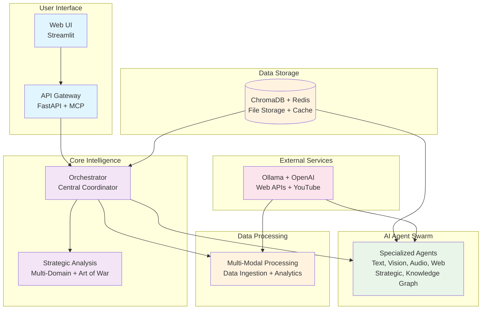

# DIA3 High-Level System Overview

## Executive Summary

DIA3 (Distributed Intelligence Analysis System) is a comprehensive multi-domain intelligence analysis platform that combines AI agents, strategic analysis engines, and advanced analytics to provide deep insights across defense, intelligence, business, cybersecurity, and geopolitical domains.

## Core Architecture

## Key Components

### 🎯 **User Interface Layer**
- **Web UI**: Streamlit-based interactive dashboards
- **API Gateway**: FastAPI + Model Context Protocol (MCP) server
- **Multi-Interface Support**: Web, API, CLI, and MCP client access

### 🧠 **Core Intelligence Layer**
- **Orchestrator**: Central task management and workflow coordination
- **Strategic Analysis**: Multi-domain analysis with Art of War principles
- **Enhanced Engines**: Force projection, Monte Carlo simulations, language processing

### 🤖 **AI Agent Swarm**
- **Text Agent**: NLP, sentiment analysis, entity extraction
- **Vision Agent**: Image/video analysis, OCR, object detection
- **Audio Agent**: Speech recognition, audio transcription
- **Web Agent**: Web scraping, social media monitoring
- **Strategic Agent**: Military and business intelligence analysis
- **Knowledge Graph Agent**: Entity relationship mapping

### 📊 **Data Processing Layer**
- **Multi-Modal Integration**: Unified processing of text, audio, video, images
- **Data Ingestion**: Automated data collection and preprocessing
- **Advanced Analytics**: ML, predictive modeling, pattern recognition
- **Real-Time Processing**: Stream processing and live analysis

### 🗄️ **Data Storage Layer**
- **ChromaDB**: Vector database for semantic search
- **Redis**: High-performance caching and session management
- **File Storage**: Document and media file management
- **Results Storage**: Analysis outputs and historical data

### 🔗 **External Services**
- **Ollama**: Local large language model inference
- **OpenAI API**: Cloud-based AI services
- **Web APIs**: External data sources and services
- **YouTube API**: Video content analysis

## Key Features

### 🎯 **Multi-Modal Intelligence**
- Text, audio, video, and image analysis
- Cross-modal data fusion and correlation
- Real-time processing capabilities

### 🧠 **Strategic Assessment**
- Art of War deception detection
- Monte Carlo scenario modeling
- Force projection analysis
- Multi-domain intelligence fusion

### 🔄 **Scalable Architecture**
- Microservices-based design
- Kubernetes-native deployment
- Horizontal scaling capabilities
- Fault tolerance and high availability

### 📈 **Advanced Analytics**
- Predictive modeling and forecasting
- Pattern recognition and anomaly detection
- Causal inference and risk assessment
- Interactive visualization and reporting

## Technology Stack

- **Backend**: FastAPI, Uvicorn, Pydantic
- **AI/ML**: Ollama, OpenAI API, Transformers, PyTorch
- **Database**: ChromaDB, Redis, SQLite
- **Processing**: OpenCV, Librosa, PyMuPDF, FFmpeg
- **Deployment**: Docker, Kubernetes, Nginx
- **Monitoring**: Prometheus, Grafana, Loguru

## Performance Targets

- **Response Time**: < 2 seconds for simple requests
- **Throughput**: 1000+ requests per minute
- **Availability**: 99.9% uptime
- **Scalability**: Linear scaling with resources

---

**Last Updated**: January 2025  
**Version**: 1.0  
**Status**: Active Development
