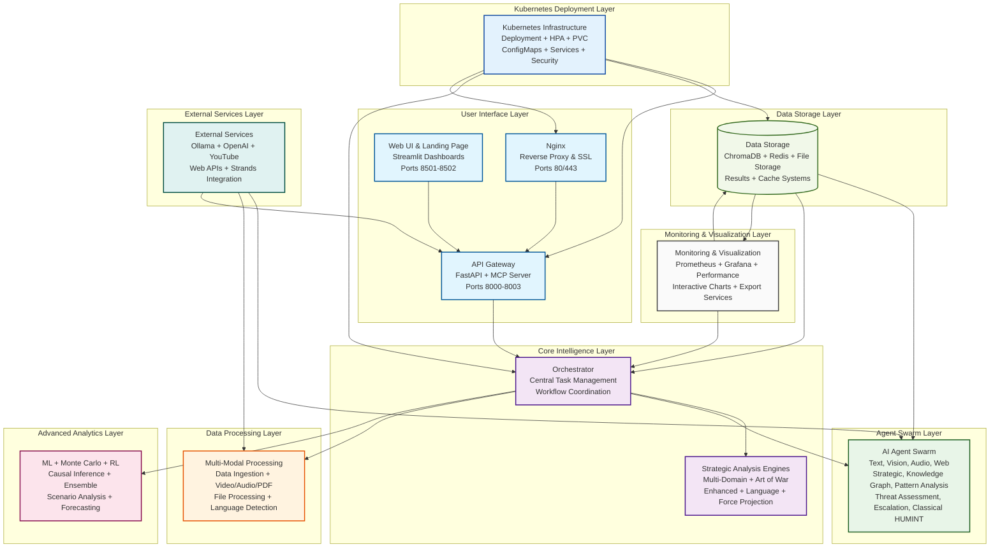

# DIA3 System Architecture Overview

## Executive Summary

The DIA3 (Distributed Intelligence Analysis System) is a comprehensive, multi-domain intelligence analysis platform that combines advanced AI agents, strategic analysis engines, and cutting-edge analytics to provide deep insights across defense, intelligence, business, cybersecurity, and geopolitical domains. The system architecture is designed for scalability, high availability, and real-time processing capabilities.

## System Overview

DIA3 is built as a microservices-based architecture with the following key characteristics:

- **Multi-Modal Processing**: Text, audio, video, and image analysis capabilities
- **Strategic Intelligence**: Art of War principles, deception detection, and threat assessment
- **Advanced Analytics**: Machine learning, Monte Carlo simulations, and predictive modeling
- **Scalable Deployment**: Kubernetes-native architecture with horizontal scaling
- **Real-Time Processing**: Stream processing and interactive visualization
- **Multi-Domain Support**: Defense, intelligence, business, cybersecurity, and geopolitical analysis

## System Architecture Diagram

The following diagram illustrates the comprehensive architecture of the DIA3 system:

## Architecture Layers

### 1. User Interface Layer

The user interface layer provides multiple access points to the system:

- **Web UI (Streamlit Dashboard)**: Port 8501 - Main interactive dashboard for analysis and visualization
- **Landing Page**: Port 8502 - Entry point with system overview and navigation
- **API Gateway (FastAPI)**: Port 8003 - RESTful API endpoints for programmatic access
- **MCP Server**: Port 8000 - Model Context Protocol server for AI agent integration
- **Nginx Reverse Proxy**: Port 80/443 - Load balancing and SSL termination

### 2. Core Intelligence Layer

The core intelligence layer orchestrates all system operations:

- **Orchestrator**: Central coordinator managing task distribution and workflow execution
- **Strategic Analysis Engine**: Multi-domain analysis with Art of War integration
- **Enhanced Strategic Engine**: Advanced analytics with domain-specific capabilities
- **Language Capabilities Engine**: Multi-language support with strategic advantages
- **Force Projection Engine**: Military capability analysis and strategic planning

### 3. Agent Swarm Layer

A comprehensive collection of specialized AI agents:

- **Text Agent**: NLP, entity extraction, and sentiment analysis
- **Vision Agent**: Image and video analysis with OCR and object detection
- **Audio Agent**: Speech recognition and audio intelligence
- **Web Agent**: Web intelligence and data collection
- **Strategic Agent**: Military and business analysis with deception detection
- **Knowledge Graph Agent**: Entity and relationship mapping with graph analytics
- **Pattern Analysis Agent**: Anomaly detection and trend analysis
- **Threat Assessment Agent**: Risk analysis and warning indicators
- **Escalation Analysis Agent**: Conflict analysis and strategic positioning
- **Classical Chinese HUMINT Agent**: Ancient wisdom integration for strategic intelligence

### 4. Data Processing Layer

Multi-modal data processing capabilities:

- **Multi-Modal Integration**: Unified processing of text, audio, and video
- **Data Ingestion Service**: Multi-format support with language detection
- **Video Processing**: YouTube analysis and content extraction
- **Audio Processing**: Transcription and audio intelligence
- **PDF Processing**: Text and image extraction from documents
- **File Processing**: Multi-format support for various file types

### 5. Advanced Analytics Layer

Cutting-edge analytical capabilities:

- **ML Forecasting**: Time series analysis and predictive modeling
- **Monte Carlo Simulation**: Multi-domain scenarios and risk assessment
- **Reinforcement Learning**: Decision optimization and multi-agent coordination
- **Causal Inference**: Root cause analysis and impact assessment
- **Ensemble Forecasting**: Multi-model integration for advanced prediction
- **Scenario Analysis**: Strategic planning and what-if analysis

### 6. Data Storage Layer

Comprehensive data management:

- **ChromaDB**: Vector database for semantic search and similarity matching
- **Redis Cache**: In-memory storage for session management and caching
- **File Storage**: Document and media storage with structured data
- **Results Database**: Analysis outputs, reports, and visualizations
- **Cache System**: Performance optimization and data persistence

### 7. External Services Layer

Integration with external systems:

- **Ollama LLM**: Local AI models for text and vision processing
- **OpenAI API**: Cloud AI services for advanced capabilities
- **YouTube API**: Video intelligence and content analysis
- **Web APIs**: External data sources for real-time information
- **Strands Integration**: MCP protocol for agent communication

### 8. Monitoring & Visualization Layer

System monitoring and visualization:

- **Prometheus**: Metrics collection and performance monitoring
- **Grafana**: Dashboard visualization and real-time monitoring
- **Performance Monitor**: System metrics and resource optimization
- **Interactive Charts**: Forecasting visualization and analytics dashboard
- **Markdown Export**: PDF/Word generation and report creation

### 9. Kubernetes Deployment Layer

Scalable deployment architecture:

- **Kubernetes Deployment**: Scalable architecture with high availability
- **Horizontal Pod Autoscaler**: Dynamic scaling and load management
- **Persistent Volume Claims**: Data persistence and storage management
- **ConfigMaps & Secrets**: Configuration management and security
- **Kubernetes Services**: Load balancing and service discovery

## Key Features

### Strategic Analysis Capabilities

- **Multi-Domain Analysis**: Defense, intelligence, business, cybersecurity, and geopolitical domains
- **Art of War Integration**: Ancient strategic principles for modern analysis
- **Deception Detection**: Advanced algorithms for identifying strategic deception
- **Threat Assessment**: Comprehensive risk analysis with warning indicators
- **Escalation Analysis**: Conflict analysis and strategic positioning

### Advanced Analytics

- **Machine Learning Forecasting**: Time series analysis and predictive modeling
- **Monte Carlo Simulations**: Multi-domain scenario analysis and risk assessment
- **Reinforcement Learning**: Decision optimization and multi-agent coordination
- **Causal Inference**: Root cause analysis and impact assessment
- **Ensemble Methods**: Multi-model integration for improved accuracy

### Multi-Modal Processing

- **Text Analysis**: NLP, entity extraction, sentiment analysis, and language processing
- **Audio Processing**: Speech recognition, transcription, and audio intelligence
- **Video Analysis**: YouTube content analysis, object detection, and video intelligence
- **Image Processing**: OCR, object detection, and visual content analysis
- **Document Processing**: PDF text extraction, document analysis, and structured data extraction

### Real-Time Capabilities

- **Stream Processing**: Real-time data ingestion and analysis
- **Interactive Visualization**: Dynamic charts and dashboards
- **Live Monitoring**: Real-time system performance and health monitoring
- **Instant Analysis**: Quick response to queries and analysis requests

## Data Flow Architecture

### Primary Data Flow

1. **User Input**: Requests enter through UI, API, or MCP interfaces
2. **Orchestration**: Central orchestrator routes requests to appropriate components
3. **Agent Processing**: Specialized agents process data according to their domain
4. **Analytics Processing**: Advanced analytics engines perform deep analysis
5. **Storage**: Results are stored in appropriate databases and caches
6. **Visualization**: Results are presented through interactive dashboards
7. **Export**: Reports and visualizations can be exported in various formats

### Multi-Domain Data Flow

1. **Domain Identification**: System identifies the appropriate domain for analysis
2. **Specialized Processing**: Domain-specific agents and engines process the data
3. **Cross-Domain Analysis**: Multi-domain engines integrate insights across domains
4. **Strategic Synthesis**: Strategic analysis engines synthesize domain insights
5. **Comprehensive Output**: Integrated analysis results across all relevant domains

## Deployment Architecture

### Container Orchestration

The system is designed for Kubernetes deployment with:

- **Horizontal Scaling**: Automatic scaling based on load
- **High Availability**: Multi-replica deployment with failover
- **Resource Management**: CPU and memory limits with resource requests
- **Health Monitoring**: Liveness and readiness probes
- **Security**: Non-root containers with security contexts

### Service Mesh

- **Load Balancing**: Kubernetes services provide load balancing
- **Service Discovery**: Automatic service discovery and registration
- **Traffic Management**: Ingress controllers manage external traffic
- **Security**: TLS termination and certificate management

### Monitoring Stack

- **Metrics Collection**: Prometheus collects system and application metrics
- **Visualization**: Grafana provides dashboards and alerting
- **Logging**: Centralized logging with structured log formats
- **Tracing**: Distributed tracing for request flow analysis

## Security Architecture

### Authentication & Authorization

- **API Security**: JWT-based authentication for API access
- **MCP Security**: Secure Model Context Protocol implementation
- **Service-to-Service**: Mutual TLS for inter-service communication
- **Role-Based Access**: Domain-specific access controls

### Data Security

- **Encryption at Rest**: Database encryption for sensitive data
- **Encryption in Transit**: TLS for all network communications
- **Secret Management**: Kubernetes secrets for sensitive configuration
- **Data Classification**: Automatic classification of sensitive information

### Network Security

- **Network Policies**: Kubernetes network policies for traffic control
- **Firewall Rules**: Network-level security controls
- **VPN Integration**: Secure access to external data sources
- **DDoS Protection**: Protection against distributed denial of service attacks

## Performance Characteristics

### Scalability

- **Horizontal Scaling**: Automatic scaling based on CPU and memory usage
- **Load Distribution**: Intelligent load balancing across multiple instances
- **Resource Optimization**: Efficient resource utilization with limits and requests
- **Caching Strategy**: Multi-level caching for improved performance

### Reliability

- **High Availability**: Multi-replica deployment with automatic failover
- **Fault Tolerance**: Graceful handling of component failures
- **Data Persistence**: Persistent storage for critical data
- **Backup & Recovery**: Automated backup and recovery procedures

### Performance Monitoring

- **Real-Time Metrics**: Continuous monitoring of system performance
- **Alerting**: Proactive alerting for performance issues
- **Capacity Planning**: Predictive capacity planning based on usage patterns
- **Optimization**: Continuous performance optimization based on metrics

## Integration Capabilities

### External Systems

- **AI/ML Platforms**: Integration with Ollama, OpenAI, and other AI services
- **Data Sources**: YouTube, web APIs, and other external data sources
- **Analytics Tools**: Integration with external analytics and visualization tools
- **Security Tools**: Integration with security information and event management (SIEM) systems

### Protocols & Standards

- **REST APIs**: Standard RESTful API endpoints
- **MCP Protocol**: Model Context Protocol for AI agent integration
- **GraphQL**: Optional GraphQL interface for flexible data querying
- **WebSocket**: Real-time communication for live updates

### Data Formats

- **JSON**: Primary data exchange format
- **Markdown**: Report generation and documentation
- **PDF/Word**: Export capabilities for reports and analysis
- **CSV/Excel**: Data export for external analysis tools

## Development & Operations

### Development Workflow

- **Version Control**: Git-based development with branching strategies
- **CI/CD Pipeline**: Automated testing and deployment
- **Code Quality**: Automated code quality checks and testing
- **Documentation**: Comprehensive documentation and API specifications

### Operations Management

- **Monitoring**: Comprehensive monitoring and alerting
- **Logging**: Centralized logging with structured formats
- **Backup**: Automated backup and disaster recovery
- **Updates**: Rolling updates with zero-downtime deployment

## Future Roadmap

### Planned Enhancements

- **Advanced AI Models**: Integration of next-generation AI models
- **Enhanced Analytics**: More sophisticated analytical capabilities
- **Extended Domains**: Additional domain-specific analysis capabilities
- **Performance Optimization**: Continued performance improvements

### Technology Evolution

- **Edge Computing**: Edge deployment for low-latency processing
- **Federated Learning**: Privacy-preserving distributed learning
- **Quantum Computing**: Integration with quantum computing capabilities
- **Advanced Visualization**: Enhanced visualization and interaction capabilities

## Conclusion

The DIA3 system architecture represents a comprehensive, scalable, and secure platform for multi-domain intelligence analysis. With its modular design, advanced analytics capabilities, and robust deployment architecture, DIA3 provides a powerful foundation for strategic intelligence analysis across multiple domains.

The system's ability to integrate ancient strategic wisdom with modern AI capabilities, combined with its scalable and secure architecture, makes it a unique and powerful tool for intelligence analysis and strategic planning.

---

*This architecture overview provides a comprehensive view of the DIA3 system's design, capabilities, and deployment characteristics. For detailed implementation information, please refer to the specific component documentation and API specifications.*
