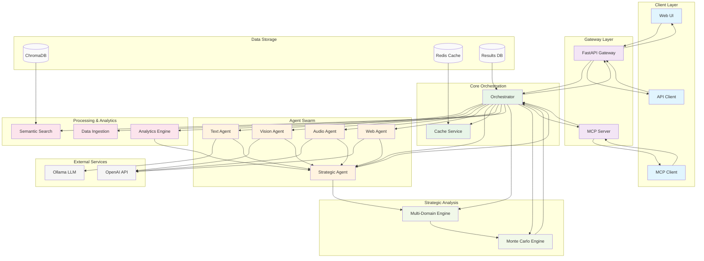

# DIA3 Component Interaction Diagram

## Overview

This diagram illustrates the key component interactions within the DIA3 (Distributed Intelligence Analysis System) platform, showing how different system components communicate and coordinate to process multi-modal intelligence data.

## Component Interaction Flow

## Key Interaction Patterns

### 1. **Request Flow**
- Clients (UI/API/MCP) → Gateway → Orchestrator
- Orchestrator coordinates all subsequent interactions

### 2. **Agent Coordination**
- Orchestrator routes tasks to specialized agents
- Agents process data and communicate with external AI services
- Results flow back through Strategic Analysis

### 3. **Data Processing Pipeline**
- Multi-modal data ingestion through specialized processors
- Vector storage for semantic search and retrieval
- Caching for performance optimization

### 4. **Strategic Analysis Integration**
- All agent outputs feed into strategic analysis engines
- Monte Carlo simulations for complex scenario modeling
- Multi-domain intelligence fusion

### 5. **Analytics Integration**
- Predictive analytics and pattern recognition
- Anomaly detection feeds into strategic assessment
- Real-time monitoring and alerting

## Component Responsibilities

| Component | Primary Responsibility |
|-----------|----------------------|
| **Orchestrator** | Central coordination and task routing |
| **Agent Swarm** | Specialized data processing and analysis |
| **Processing Services** | Multi-modal data ingestion and transformation |
| **Analytics Engine** | Pattern recognition and predictive modeling |
| **Strategic Analysis** | Military and business intelligence assessment |
| **Data Storage** | Vector storage, caching, and results persistence |
| **External Services** | AI/ML model integration and web intelligence |

## Performance Characteristics

- **Response Time**: < 2 seconds for simple requests
- **Throughput**: 1000+ requests per minute
- **Scalability**: Horizontal scaling of all components
- **Fault Tolerance**: Automatic failover and recovery

---

**Last Updated**: January 2025  
**Version**: 1.0

