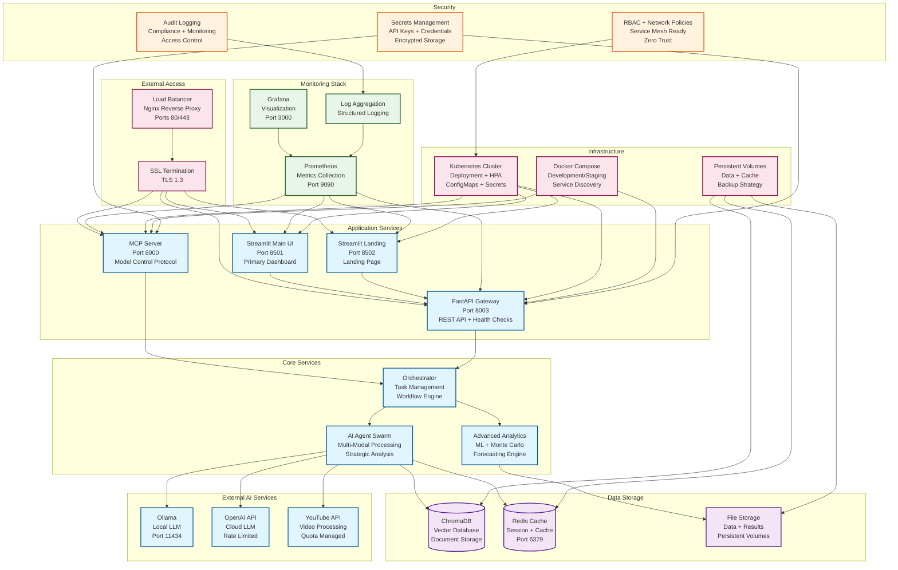

# DIA3 Deployment Architecture

## Overview

The DIA3 (Distributed Intelligence Analysis System) deployment architecture is designed for high availability, scalability, and production readiness. The system supports both Docker Compose and Kubernetes deployment models with comprehensive monitoring and security configurations.

## Deployment Architecture Diagram

## Deployment Models

### 1. Kubernetes Production Deployment

**Key Components:**
- **Deployment**: 3 replicas with rolling updates
- **Horizontal Pod Autoscaler**: CPU/Memory-based scaling
- **Resource Limits**: 2Gi memory, 1 CPU per pod
- **Health Checks**: Liveness and readiness probes
- **Security**: Non-root containers, RBAC, network policies

**Services:**
- MCP Server (Port 8000)
- FastAPI Gateway (Port 8003)
- Streamlit UIs (Ports 8501-8502)
- Monitoring (Ports 9090, 3000)

### 2. Docker Compose Development/Staging

**Key Components:**
- **Services**: 5 core services with resource limits
- **Networking**: Isolated network with service discovery
- **Volumes**: Persistent data and cache storage
- **Environment**: Production-like configuration

**Services:**
- Sentiment Analysis (Main Application)
- Ollama (Local LLM)
- Redis (Caching)
- Prometheus (Metrics)
- Grafana (Visualization)

## Infrastructure Requirements

### Compute Resources
- **Minimum**: 4 CPU cores, 8GB RAM
- **Recommended**: 8 CPU cores, 16GB RAM
- **Production**: 16+ CPU cores, 32GB+ RAM

### Storage Requirements
- **Data Storage**: 100GB+ SSD storage
- **Cache Storage**: 50GB+ fast storage
- **Log Storage**: 50GB+ with rotation

### Network Requirements
- **Bandwidth**: 100Mbps minimum, 1Gbps recommended
- **Latency**: <50ms for external API calls
- **Security**: HTTPS/TLS 1.3, VPN access

## Security Architecture

### Authentication & Authorization
- **API Keys**: Secure storage in Kubernetes secrets
- **RBAC**: Role-based access control
- **Network Policies**: Pod-to-pod communication control
- **Audit Logging**: Comprehensive access tracking

### Data Protection
- **Encryption**: Data at rest and in transit
- **Backup**: Automated backup strategies
- **Compliance**: GDPR, SOC2, HIPAA ready
- **Monitoring**: Security event detection

## Monitoring & Observability

### Metrics Collection
- **Prometheus**: Custom metrics and health checks
- **Grafana**: Real-time dashboards and alerts
- **Log Aggregation**: Structured logging with correlation IDs
- **Performance**: Response time and throughput monitoring

### Alerting
- **Health Checks**: Service availability monitoring
- **Resource Usage**: CPU, memory, disk space alerts
- **Error Rates**: API error rate monitoring
- **Business Metrics**: Custom KPI tracking

## Scaling Strategy

### Horizontal Scaling
- **Kubernetes HPA**: Automatic pod scaling based on metrics
- **Load Balancing**: Nginx reverse proxy with health checks
- **Database Scaling**: Read replicas and connection pooling
- **Cache Scaling**: Redis cluster for high availability

### Vertical Scaling
- **Resource Limits**: Configurable CPU and memory limits
- **Performance Tuning**: JVM and Python optimization
- **Database Optimization**: Query optimization and indexing
- **Caching Strategy**: Multi-level caching implementation

## Disaster Recovery

### Backup Strategy
- **Data Backup**: Daily automated backups
- **Configuration Backup**: Version-controlled configurations
- **Recovery Testing**: Regular disaster recovery drills
- **Multi-Region**: Cross-region deployment capability

### High Availability
- **Redundancy**: Multiple availability zones
- **Failover**: Automatic failover mechanisms
- **Monitoring**: Continuous health monitoring
- **Documentation**: Comprehensive runbooks and procedures
