# DIA3 Architecture - Simplified High-Level View

## Overview

This document presents a simplified, high-level view of the DIA3 (Distributed Intelligence Analysis System) architecture, focusing on core components and main data flows for better clarity and understanding.

## Simplified Architecture Diagram

```mermaid
graph TB
    %% Simplified High-Level DIA3 Architecture
    subgraph "User Interface"
        UI[Web UI<br/>Streamlit]
        API[API Gateway<br/>FastAPI]
        MCP[MCP Server<br/>Model Context Protocol]
    end
    
    subgraph "Core Intelligence"
        Orchestrator[Orchestrator<br/>Central Coordinator]
        StrategicEngine[Strategic Analysis<br/>Multi-Domain Engine]
        AnalyticsEngine[Advanced Analytics<br/>Predictive & Pattern Recognition]
    end
    
    subgraph "Agent Swarm"
        TextAgent[Text Agent<br/>NLP & Analysis]
        VisionAgent[Vision Agent<br/>Image & Video]
        AudioAgent[Audio Agent<br/>Speech & Audio]
        WebAgent[Web Agent<br/>Web Intelligence]
        StrategicAgent[Strategic Agent<br/>Military & Business]
        KnowledgeGraph[Knowledge Graph Agent<br/>Entity & Relationship]
    end
    
    subgraph "Data Processing"
        MultiModal[Multi-Modal<br/>Integration Engine]
        DataIngestion[Data Ingestion<br/>& Processing]
        VideoProcessor[Video Processing<br/>Analysis & Extraction]
        AudioProcessor[Audio Processing<br/>Transcription & Analysis]
        PDFProcessor[PDF Processing<br/>Text & Image Extraction]
    end
    
    subgraph "Analytics"
        PredictiveAnalytics[Predictive Analytics<br/>Time Series & Forecasting]
        PatternRecognition[Pattern Recognition<br/>Advanced Detection]
        SemanticSearch[Semantic Search<br/>Vector-Based Search]
        AnomalyDetection[Anomaly Detection<br/>Statistical & ML]
    end
    
    subgraph "Data Storage"
        ChromaDB[(ChromaDB<br/>Vector Database)]
        Redis[(Redis Cache<br/>In-Memory Storage)]
        FileStorage[(File Storage<br/>Document & Media)]
        Results[(Results Database<br/>Analysis Outputs)]
    end
    
    subgraph "External Services"
        Ollama[Ollama LLM<br/>Local AI Models]
        OpenAI[OpenAI API<br/>Cloud AI Services]
        YouTube[YouTube API<br/>Video Intelligence]
        WebAPIs[Web APIs<br/>External Data Sources]
    end
    
    subgraph "Monitoring & Visualization"
        PerformanceMonitor[Performance Monitor<br/>System Metrics]
        InteractiveCharts[Interactive Charts<br/>Forecasting & Analytics]
        Dashboard[Dashboard System<br/>Real-Time Visualization]
        Grafana[Grafana<br/>Monitoring Dashboards]
    end
    
    %% Main Data Flow Connections
    UI --> API
    MCP --> API
    API --> Orchestrator
    
    %% Core Intelligence Connections
    Orchestrator --> StrategicEngine
    Orchestrator --> AnalyticsEngine
    
    %% Agent Swarm Connections
    Orchestrator --> TextAgent
    Orchestrator --> VisionAgent
    Orchestrator --> AudioAgent
    Orchestrator --> WebAgent
    Orchestrator --> StrategicAgent
    Orchestrator --> KnowledgeGraph
    
    %% Data Processing Connections
    Orchestrator --> MultiModal
    Orchestrator --> DataIngestion
    Orchestrator --> VideoProcessor
    Orchestrator --> AudioProcessor
    Orchestrator --> PDFProcessor
    
    %% Analytics Connections
    Orchestrator --> PredictiveAnalytics
    Orchestrator --> PatternRecognition
    Orchestrator --> SemanticSearch
    Orchestrator --> AnomalyDetection
    
    %% Data Storage Connections
    ChromaDB --> SemanticSearch
    ChromaDB --> KnowledgeGraph
    Redis --> Orchestrator
    FileStorage --> DataIngestion
    Results --> Orchestrator
    
    %% External Services Connections
    TextAgent --> Ollama
    VisionAgent --> OpenAI
    AudioAgent --> OpenAI
    WebAgent --> YouTube
    WebAgent --> WebAPIs
    
    %% Monitoring Connections
    PerformanceMonitor --> Grafana
    InteractiveCharts --> Dashboard
    Results --> Dashboard
    
    %% Data Flow Connections
    MultiModal --> ChromaDB
    DataIngestion --> FileStorage
    VideoProcessor --> ChromaDB
    AudioProcessor --> ChromaDB
    PDFProcessor --> ChromaDB
    
    %% Results Flow
    StrategicEngine --> Results
    AnalyticsEngine --> Results
    
    %% Cross-Layer Intelligence Connections
    StrategicEngine --> KnowledgeGraph
    KnowledgeGraph --> StrategicAgent
    
    %% Styling
    classDef userLayer fill:#e3f2fd,stroke:#1976d2,stroke-width:2px
    classDef coreLayer fill:#e8f5e8,stroke:#388e3c,stroke-width:2px
    classDef agentLayer fill:#fff3e0,stroke:#f57c00,stroke-width:2px
    classDef dataLayer fill:#fce4ec,stroke:#c2185b,stroke-width:2px
    classDef analyticsLayer fill:#e0f2f1,stroke:#00695c,stroke-width:2px
    classDef storageLayer fill:#f1f8e9,stroke:#689f38,stroke-width:2px
    classDef externalLayer fill:#e8eaf6,stroke:#3f51b5,stroke-width:2px
    classDef monitoringLayer fill:#fafafa,stroke:#424242,stroke-width:2px
    
    class UI,API,MCP userLayer
    class Orchestrator,StrategicEngine,AnalyticsEngine coreLayer
    class TextAgent,VisionAgent,AudioAgent,WebAgent,StrategicAgent,KnowledgeGraph agentLayer
    class MultiModal,DataIngestion,VideoProcessor,AudioProcessor,PDFProcessor dataLayer
    class PredictiveAnalytics,PatternRecognition,SemanticSearch,AnomalyDetection analyticsLayer
    class ChromaDB,Redis,FileStorage,Results storageLayer
    class Ollama,OpenAI,YouTube,WebAPIs externalLayer
    class PerformanceMonitor,InteractiveCharts,Dashboard,Grafana monitoringLayer
```

## Core Architecture Layers

### 1. User Interface
- **Web UI (Streamlit)**: Interactive web interface for analysis
- **API Gateway (FastAPI)**: Main entry point for all requests
- **MCP Server**: Model Context Protocol for AI tool integration

### 2. Core Intelligence
- **Orchestrator**: Central coordinator managing all operations
- **Strategic Analysis Engine**: Multi-domain analysis with Art of War principles
- **Advanced Analytics Engine**: Predictive analytics and pattern recognition

### 3. Agent Swarm
- **Text Agent**: Natural language processing and text analysis
- **Vision Agent**: Image and video analysis capabilities
- **Audio Agent**: Speech recognition and audio processing
- **Web Agent**: Web intelligence and data collection
- **Strategic Agent**: Military and business intelligence analysis
- **Knowledge Graph Agent**: Entity and relationship mapping

### 4. Data Processing
- **Multi-Modal Integration Engine**: Coordinates different data types
- **Data Ingestion**: Handles data collection and initial processing
- **Video Processor**: Video analysis and content extraction
- **Audio Processor**: Audio transcription and analysis
- **PDF Processor**: PDF text and image extraction

### 5. Analytics
- **Predictive Analytics**: Time series analysis and forecasting
- **Pattern Recognition**: Advanced pattern detection algorithms
- **Semantic Search**: Vector-based semantic similarity search
- **Anomaly Detection**: Statistical and ML-based anomaly detection

### 6. Data Storage
- **ChromaDB**: Vector database for semantic search and embeddings
- **Redis Cache**: In-memory caching for performance optimization
- **File Storage**: Document and media file storage
- **Results Database**: Analysis outputs and results storage

### 7. External Services
- **Ollama LLM**: Local large language model inference
- **OpenAI API**: Cloud-based AI services
- **YouTube API**: Video intelligence and content analysis
- **Web APIs**: External data sources and services

### 8. Monitoring & Visualization
- **Performance Monitor**: System metrics and performance tracking
- **Interactive Charts**: Forecasting and analytics visualizations
- **Dashboard System**: Real-time data visualization
- **Grafana**: Monitoring dashboards and alerting

## Key Data Flows

### Request Flow
1. **User Interface** → **API Gateway** → **Orchestrator**
2. **Orchestrator** coordinates with **Core Intelligence** and **Agent Swarm**
3. **Data Processing** handles multi-modal data ingestion
4. **Analytics** applies advanced analysis techniques
5. **Results** are stored and visualized through **Dashboard**

### Intelligence Flow
1. **External Services** provide AI capabilities to agents
2. **Data Processing** converts raw data into structured formats
3. **Vector Storage** enables semantic search and knowledge graphs
4. **Analytics** extract insights and patterns
5. **Strategic Analysis** applies domain-specific intelligence

## Key Features

### Multi-Modal Intelligence
- **Text Analysis**: NLP, sentiment analysis, entity extraction
- **Visual Intelligence**: Image/video analysis, OCR, object detection
- **Audio Processing**: Speech recognition, transcription, analysis
- **Web Intelligence**: Web scraping, social media monitoring

### Strategic Capabilities
- **Art of War Integration**: Classical military strategy analysis
- **Multi-Domain Analysis**: Cross-domain intelligence fusion
- **Predictive Analytics**: Time series forecasting and modeling
- **Knowledge Graphs**: Entity and relationship mapping

### Scalable Architecture
- **Agent Swarm**: Specialized agents for different tasks
- **Dynamic Orchestration**: Intelligent task routing
- **Horizontal Scaling**: Services can be scaled independently
- **Fault Tolerance**: Automatic failover and recovery

## Technology Highlights

### Core Technologies
- **FastAPI**: Modern web framework for APIs
- **Streamlit**: Interactive web interface
- **ChromaDB**: Vector database for semantic search
- **Redis**: In-memory caching and session management

### AI/ML Stack
- **Ollama**: Local LLM inference
- **OpenAI API**: Cloud AI services
- **Transformers**: Hugging Face library
- **PyTorch**: Deep learning framework

### Multi-Modal Processing
- **OpenCV**: Computer vision
- **Librosa**: Audio analysis
- **PyMuPDF**: PDF processing
- **FFmpeg**: Video/audio processing

## Benefits of Simplified View

### Clarity
- **Reduced Complexity**: Focuses on essential components
- **Clear Data Flow**: Shows main information pathways
- **Logical Grouping**: Components organized by function
- **Easy Understanding**: Suitable for stakeholders and new team members

### Communication
- **High-Level Overview**: Perfect for executive presentations
- **Architecture Discussion**: Facilitates system design conversations
- **Onboarding**: Helps new developers understand the system
- **Documentation**: Serves as a quick reference guide

### Planning
- **System Design**: Supports architectural decision-making
- **Scalability Planning**: Shows where to add new components
- **Integration Planning**: Identifies external service dependencies
- **Performance Optimization**: Highlights data flow bottlenecks

## Conclusion

This simplified architecture view provides a clear, high-level understanding of the DIA3 system while maintaining the essential details needed for comprehension and decision-making. It serves as an excellent starting point for understanding the system's capabilities and structure.

For detailed implementation specifics, refer to the complete architecture documentation.

---

**Last Updated**: January 2025  
**Version**: 1.0  
**Status**: Active Development
