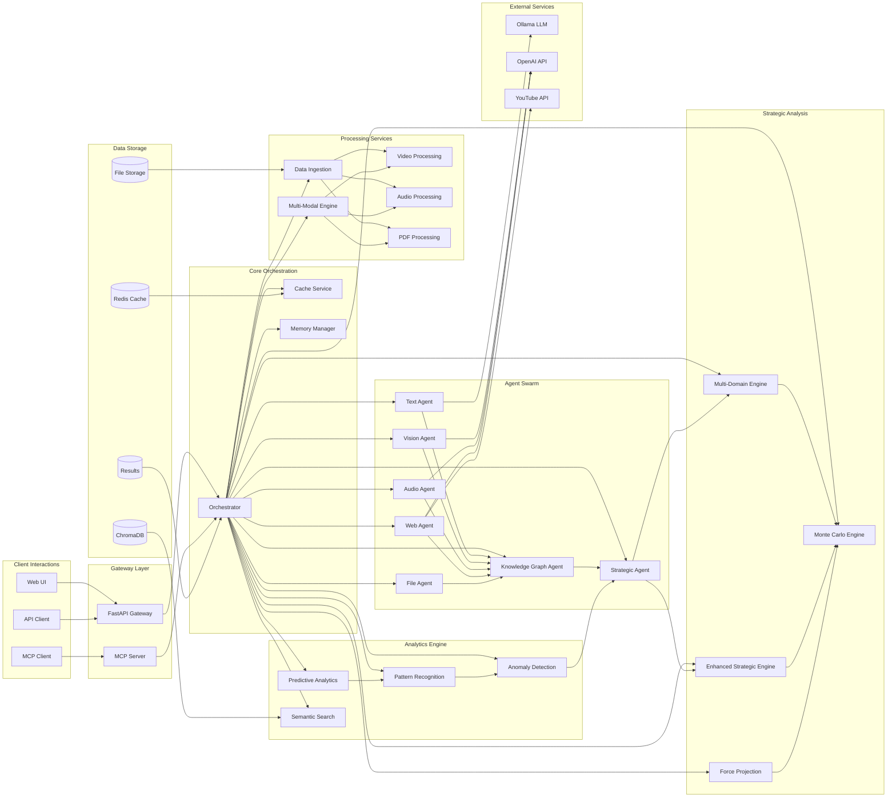
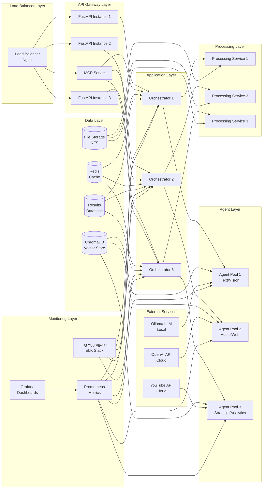

# DIA3 Architecture Documentation

## Overview

This directory contains comprehensive architecture documentation for the DIA3 (Distributed Intelligence Analysis System) platform. The documentation provides detailed insights into the system's design, implementation, and operational aspects.

## High-Level System Overview

```mermaid
graph TB
    %% High-Level DIA3 Architecture
    subgraph "DIA3 Platform"
        subgraph "User Interface Layer"
            UI[Web UI<br/>Streamlit]
            API[API Gateway<br/>FastAPI]
            MCP[MCP Server<br/>Model Context Protocol]
        end
        
        subgraph "Core Intelligence Layer"
            Orchestrator[Orchestrator<br/>Central Coordinator]
            StrategicEngine[Strategic Analysis<br/>Multi-Domain Engine]
            AnalyticsEngine[Advanced Analytics<br/>Predictive & Pattern Recognition]
        end
        
        subgraph "Agent Swarm Layer"
            TextAgent[Text Agent<br/>NLP & Analysis]
            VisionAgent[Vision Agent<br/>Image & Video]
            AudioAgent[Audio Agent<br/>Speech & Audio]
            WebAgent[Web Agent<br/>Web Intelligence]
            FileAgent[File Agent<br/>Document Processing]
            StrategicAgent[Strategic Agent<br/>Military & Business]
        end
        
        subgraph "Data Processing Layer"
            MultiModal[Multi-Modal<br/>Integration Engine]
            DataIngestion[Data Ingestion<br/>& Processing]
            VectorDB[Vector Database<br/>ChromaDB]
        end
        
        subgraph "External Intelligence"
            Ollama[Ollama LLM<br/>Local AI]
            OpenAI[OpenAI API<br/>Cloud AI]
            WebAPIs[Web APIs<br/>External Data]
        end
    end
    
    %% User interactions
    User[Users] --> UI
    User --> API
    User --> MCP
    
    %% Core flow
    UI --> Orchestrator
    API --> Orchestrator
    MCP --> Orchestrator
    
    %% Orchestrator to engines
    Orchestrator --> StrategicEngine
    Orchestrator --> AnalyticsEngine
    
    %% Agent coordination
    Orchestrator --> TextAgent
    Orchestrator --> VisionAgent
    Orchestrator --> AudioAgent
    Orchestrator --> WebAgent
    Orchestrator --> FileAgent
    Orchestrator --> StrategicAgent
    
    %% Data processing
    Orchestrator --> MultiModal
    Orchestrator --> DataIngestion
    Orchestrator --> VectorDB
    
    %% External integrations
    TextAgent --> Ollama
    VisionAgent --> OpenAI
    AudioAgent --> OpenAI
    WebAgent --> WebAPIs
    StrategicAgent --> OpenAI
    
    %% Data flow
    MultiModal --> VectorDB
    DataIngestion --> VectorDB
    VectorDB --> AnalyticsEngine
    VectorDB --> StrategicEngine
    
    %% Results flow
    StrategicEngine --> Orchestrator
    AnalyticsEngine --> Orchestrator
    Orchestrator --> UI
    Orchestrator --> API
    Orchestrator --> MCP
    
    %% Styling
    classDef userLayer fill:#e1f5fe
    classDef coreLayer fill:#f3e5f5
    classDef agentLayer fill:#e8f5e8
    classDef dataLayer fill:#fff3e0
    classDef externalLayer fill:#fce4ec
    
    class UI,API,MCP userLayer
    class Orchestrator,StrategicEngine,AnalyticsEngine coreLayer
    class TextAgent,VisionAgent,AudioAgent,WebAgent,FileAgent,StrategicAgent agentLayer
    class MultiModal,DataIngestion,VectorDB dataLayer
    class Ollama,OpenAI,WebAPIs externalLayer
```

The DIA3 platform is a comprehensive distributed intelligence analysis system that combines multiple AI agents, strategic analysis engines, and advanced analytics to provide deep insights across various domains. The system processes multi-modal data (text, images, audio, video) and applies strategic military and business intelligence principles to deliver actionable intelligence.

## Documentation Structure

### 📋 [System Architecture](system_architecture.md)
Comprehensive overview of the DIA3 system architecture including:
- **System Overview**: High-level description of the platform
- **Core Architecture Principles**: Modular design, multi-modal processing, strategic assessment
- **Component Architecture**: Detailed breakdown of all system layers and components
- **Data Flow Architecture**: Request processing and multi-modal data flows
- **Deployment Architecture**: Development, production, and scaling strategies
- **Security Architecture**: Authentication, authorization, and data security
- **Performance Architecture**: Caching, database optimization, and async processing
- **Integration Architecture**: API, external services, and MCP integration
- **Future Architecture Considerations**: Scalability, AI/ML, and analytics enhancements

### 🔧 [Technical Specifications](technical_specifications.md)
Detailed technical implementation specifications including:
- **Technology Stack**: Complete list of technologies and frameworks
- **System Architecture Specifications**: Microservices, data architecture, API specs
- **Agent Specifications**: Agent interfaces, capabilities, and configuration
- **Configuration Management**: Environment and agent configuration
- **Performance Specifications**: System targets, caching, and database performance
- **Security Specifications**: Authentication, authorization, and data security
- **Monitoring Specifications**: Metrics collection and alerting
- **Deployment Specifications**: Docker, Kubernetes, and environment configuration
- **Testing Specifications**: Unit, integration, and performance testing

## System Architecture Diagrams

### 🏗️ System Architecture Overview

```mermaid
graph LR
    %% Client Layer
    subgraph "Client Layer"
        UI[Web UI - Streamlit]
        API[API Clients]
        MCP[MCP Clients]
        CLI[CLI Interface]
    end
    
    %% API Gateway Layer
    subgraph "API Gateway Layer"
        FastAPI[FastAPI Gateway]
        MCP_Server[Unified MCP Server]
        Standalone_MCP[Standalone MCP Server]
    end
    
    %% Core Services Layer
    subgraph "Core Services Layer"
        Orchestrator[Orchestrator]
        MultiDomain[Multi-Domain Strategic Engine]
        EnhancedStrategic[Enhanced Strategic Analysis Engine]
        ForceProjection[Force Projection Engine]
        MonteCarlo[Monte Carlo Engine]
        VectorDB[Vector Database Service]
        CacheService[Advanced Caching Service]
        MemoryManager[Memory Manager]
    end
    
    %% Agent Swarm Layer
    subgraph "Agent Swarm Layer"
        TextAgent[Unified Text Agent]
        VisionAgent[Unified Vision Agent]
        AudioAgent[Unified Audio Agent]
        WebAgent[Web Agent]
        FileAgent[File Extraction Agent]
        KnowledgeGraph[Knowledge Graph Agent]
        StrategicAgent[Strategic Analysis Agent]
        DeceptionAgent[Art of War Deception Agent]
        BusinessAgent[Business Intelligence Agent]
        MarketAgent[Market Data Agent]
        ForecastingAgent[Advanced Forecasting Agent]
        MLAgent[Advanced ML Agent]
    end
    
    %% Data Processing Layer
    subgraph "Data Processing Layer"
        DataIngestion[Data Ingestion Service]
        MultiModal[Multi-Modal Integration Engine]
        VideoProcessor[Video Processing Service]
        AudioProcessor[Audio Processing Service]
        PDFProcessor[PDF Processing Service]
        ImageProcessor[Image Processing Service]
        TranslationService[Translation Service]
    end
    
    %% Analytics Layer
    subgraph "Analytics Layer"
        PredictiveAnalytics[Predictive Analytics]
        PatternRecognition[Pattern Recognition]
        SemanticSearch[Semantic Search Service]
        AnomalyDetection[Anomaly Detection]
        CausalAnalysis[Causal Analysis]
        RiskAssessment[Risk Assessment]
        RealTimeMonitoring[Real-Time Monitoring]
    end
    
    %% Data Layer
    subgraph "Data Layer"
        ChromaDB[(ChromaDB Vector Store)]
        Cache[(Redis Cache)]
        FileStorage[(File Storage)]
        Results[(Results Storage)]
        Logs[(Logs)]
    end
    
    %% External Integrations
    subgraph "External Integrations"
        Ollama[Ollama LLM]
        OpenAI[OpenAI API]
        YouTube[YouTube API]
        WebAPIs[Web APIs]
        MCP_Tools[MCP Tools]
    end
    
    %% Monitoring & Visualization
    subgraph "Monitoring & Visualization"
        PerformanceMonitor[Performance Monitor]
        InteractiveCharts[Interactive Forecasting Charts]
        Dashboard[Dashboard System]
        Grafana[Grafana Monitoring]
        Prometheus[Prometheus Metrics]
    end
    
    %% Connections - Client to Gateway
    UI --> FastAPI
    API --> FastAPI
    MCP --> MCP_Server
    CLI --> FastAPI
    
    %% Connections - Gateway to Core
    FastAPI --> Orchestrator
    MCP_Server --> Orchestrator
    Standalone_MCP --> Orchestrator
    
    %% Connections - Core to Agents
    Orchestrator --> TextAgent
    Orchestrator --> VisionAgent
    Orchestrator --> AudioAgent
    Orchestrator --> WebAgent
    Orchestrator --> FileAgent
    Orchestrator --> KnowledgeGraph
    Orchestrator --> StrategicAgent
    Orchestrator --> DeceptionAgent
    Orchestrator --> BusinessAgent
    Orchestrator --> MarketAgent
    Orchestrator --> ForecastingAgent
    Orchestrator --> MLAgent
    
    %% Connections - Core Services
    Orchestrator --> MultiDomain
    Orchestrator --> EnhancedStrategic
    Orchestrator --> ForceProjection
    Orchestrator --> MonteCarlo
    Orchestrator --> VectorDB
    Orchestrator --> CacheService
    Orchestrator --> MemoryManager
    
    %% Connections - Data Processing
    Orchestrator --> DataIngestion
    Orchestrator --> MultiModal
    Orchestrator --> VideoProcessor
    Orchestrator --> AudioProcessor
    Orchestrator --> PDFProcessor
    Orchestrator --> ImageProcessor
    Orchestrator --> TranslationService
    
    %% Connections - Analytics
    Orchestrator --> PredictiveAnalytics
    Orchestrator --> PatternRecognition
    Orchestrator --> SemanticSearch
    Orchestrator --> AnomalyDetection
    Orchestrator --> CausalAnalysis
    Orchestrator --> RiskAssessment
    Orchestrator --> RealTimeMonitoring
    
    %% Connections - Data Layer
    VectorDB --> ChromaDB
    CacheService --> Cache
    DataIngestion --> FileStorage
    Orchestrator --> Results
    PerformanceMonitor --> Logs
    
    %% Connections - External Integrations
    TextAgent --> Ollama
    VisionAgent --> OpenAI
    AudioAgent --> WebAPIs
    WebAgent --> YouTube
    WebAgent --> WebAPIs
    MCP_Server --> MCP_Tools
    
    %% Connections - Monitoring
    PerformanceMonitor --> Grafana
    PerformanceMonitor --> Prometheus
    InteractiveCharts --> Dashboard
```

The main system architecture diagram shows the complete DIA3 system with all major components and their interactions.

### 🔄 Component Interaction Diagram

Detailed component interaction diagram showing how different system components communicate and work together.

### 🚀 Deployment Architecture

Production deployment architecture showing load balancing, service scaling, and infrastructure components.

## Key Architecture Features

### 🎯 Multi-Modal Intelligence Processing
- **Text Analysis**: Natural language processing, sentiment analysis, entity extraction
- **Visual Intelligence**: Image and video analysis, OCR, object detection
- **Audio Processing**: Speech recognition, audio transcription, audio analysis
- **Web Intelligence**: Web scraping, social media monitoring, real-time data collection

### 🧠 Strategic Assessment Capabilities
- **Art of War Integration**: Classical Chinese military strategy analysis
- **Monte Carlo Simulations**: Probabilistic modeling for complex scenarios
- **Force Projection**: Military and strategic force analysis
- **Multi-Domain Analysis**: Cross-domain intelligence fusion

### 🔄 Agent Swarm Architecture
- **Unified Agents**: Specialized agents for different data types and analysis tasks
- **Dynamic Orchestration**: Intelligent task routing and load balancing
- **Scalable Processing**: Horizontal scaling of agent instances
- **Fault Tolerance**: Automatic failover and recovery mechanisms

### 📊 Advanced Analytics
- **Predictive Analytics**: Time series forecasting and predictive modeling
- **Pattern Recognition**: Advanced pattern detection and classification
- **Semantic Search**: Vector-based semantic similarity search
- **Anomaly Detection**: Statistical and ML-based anomaly detection

## Technology Stack Highlights

### 🐍 Backend Framework
- **FastAPI**: Modern, fast web framework for building APIs
- **Uvicorn**: ASGI server for high-performance async operations
- **Pydantic**: Data validation and settings management

### 🤖 AI/ML Technologies
- **Ollama**: Local large language model inference
- **OpenAI API**: Cloud-based AI services
- **Transformers**: Hugging Face transformers library
- **Torch**: PyTorch for deep learning

### 🗄️ Database & Storage
- **ChromaDB**: Vector database for semantic search
- **Redis**: In-memory caching and session management
- **SQLite**: Lightweight local database

### 🎨 Multi-Modal Processing
- **OpenCV**: Computer vision and image processing
- **Librosa**: Audio and music analysis
- **PyMuPDF**: PDF processing and text extraction
- **FFmpeg**: Video and audio processing

## Performance & Scalability

### 📈 Performance Targets
- **Response Time**: < 2 seconds for simple requests
- **Throughput**: 1000+ requests per minute
- **Availability**: 99.9% uptime
- **Scalability**: Linear scaling with resources

### 🔄 Scaling Strategy
- **Horizontal Scaling**: Services can be scaled horizontally
- **Load Balancing**: Intelligent load balancing across instances
- **Resource Management**: Dynamic resource allocation
- **Performance Optimization**: Multi-level caching and optimization

## Security & Compliance

### 🔐 Security Features
- **Authentication**: JWT-based authentication
- **Authorization**: Role-based access control (RBAC)
- **Data Encryption**: AES-256 for data at rest and TLS 1.3 for data in transit
- **Audit Logging**: Comprehensive audit trails

### 📋 Compliance
- **GDPR Compliance**: Data privacy and protection
- **Security Standards**: Industry-standard security practices
- **Access Control**: Fine-grained access control mechanisms

## Monitoring & Observability

### 📊 Monitoring Stack
- **Prometheus**: Metrics collection and storage
- **Grafana**: Metrics visualization and alerting
- **Loguru**: Advanced logging with structured output
- **Health Checks**: Comprehensive health monitoring

### 🚨 Alerting
- **Performance Alerts**: Response time and throughput monitoring
- **Error Rate Alerts**: Error rate and failure monitoring
- **Resource Alerts**: Memory, CPU, and disk usage monitoring
- **Business Alerts**: Custom business metrics monitoring

## Development & Deployment

### 🛠️ Development Environment
- **Local Development**: Docker Compose for local development
- **Testing**: Comprehensive test suite with pytest
- **Code Quality**: Black, isort, flake8, mypy for code quality
- **Documentation**: Automated documentation generation

### 🚀 Production Deployment
- **Containerization**: Docker containers for all services
- **Orchestration**: Kubernetes for container orchestration
- **Load Balancing**: Nginx for load balancing
- **Monitoring**: Prometheus and Grafana for monitoring

## Getting Started

### 📖 Quick Start
1. Review the [System Architecture](system_architecture.md) for high-level understanding
2. Check [Technical Specifications](technical_specifications.md) for implementation details
3. Examine the architecture diagrams for visual understanding
4. Review deployment and configuration sections for operational setup

### 🔧 Implementation Guide
1. Set up development environment with Docker Compose
2. Configure environment variables and settings
3. Deploy core services (API, MCP Server, Orchestrator)
4. Deploy agent swarm and processing services
5. Configure monitoring and alerting
6. Run comprehensive tests and validation

### 📚 Additional Resources
- **API Documentation**: Available at `/docs` when running the API server
- **Configuration Examples**: See `config/` directory for configuration templates
- **Test Suite**: Comprehensive tests in `Test/` directory
- **Deployment Scripts**: Kubernetes and Docker configurations in `k8s/` and root directory

## Contributing

When contributing to the DIA3 system architecture:

1. **Review Existing Documentation**: Understand current architecture before making changes
2. **Update Diagrams**: Regenerate Mermaid diagrams when architecture changes
3. **Update Specifications**: Keep technical specifications current with implementation
4. **Test Changes**: Ensure all changes are tested and validated
5. **Document Changes**: Update relevant documentation sections

## Support

For questions about the DIA3 architecture:

1. **Review Documentation**: Check this documentation first
2. **Examine Code**: Look at the actual implementation in `src/` directory
3. **Check Issues**: Review existing issues and discussions
4. **Create Issue**: Open a new issue for specific questions or problems

---

**Last Updated**: January 2025  
**Version**: 1.0  
**Status**: Active Development
