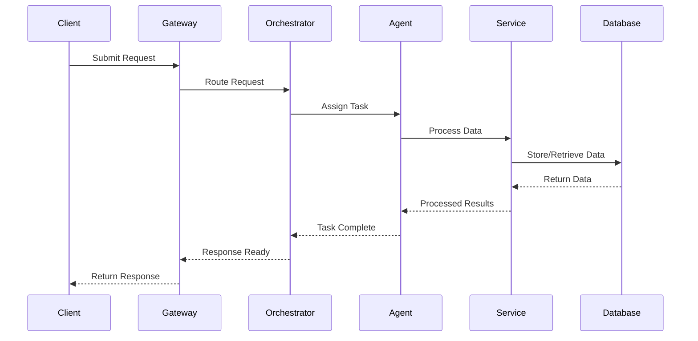
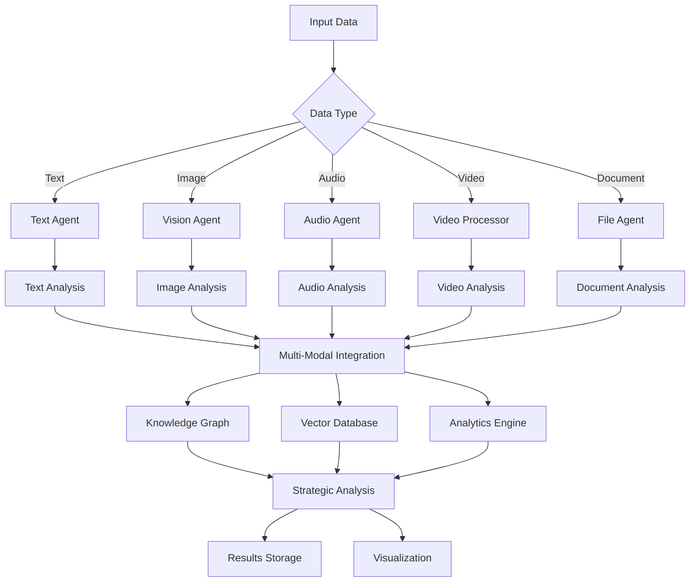

# DIA3 System Architecture Documentation

## Overview

DIA3 (Distributed Intelligence Analysis System) is a comprehensive, multi-modal intelligence analysis platform that combines advanced AI agents, Monte Carlo simulations, and strategic assessment capabilities for defense, intelligence, and business applications.

## System Architecture Diagram

## Core Architecture Principles

### 1. Modular Microservices Design
- **Decoupled Components**: Each service operates independently with well-defined interfaces
- **Scalability**: Services can be scaled horizontally based on demand
- **Fault Tolerance**: Individual service failures don't cascade to the entire system
- **Technology Diversity**: Different services can use optimal technologies for their specific use cases

### 2. Multi-Modal Intelligence Processing
- **Text Analysis**: Natural language processing, sentiment analysis, entity extraction
- **Visual Intelligence**: Image and video analysis, OCR, object detection
- **Audio Processing**: Speech recognition, audio transcription, audio analysis
- **Web Intelligence**: Web scraping, social media monitoring, real-time data collection

### 3. Strategic Assessment Capabilities
- **Art of War Integration**: Classical Chinese military strategy analysis
- **Monte Carlo Simulations**: Probabilistic modeling for complex scenarios
- **Force Projection**: Military and strategic force analysis
- **Multi-Domain Analysis**: Cross-domain intelligence fusion

## Component Architecture

### 1. Client Layer

#### Web UI (Streamlit)
- **Purpose**: Primary user interface for system interaction
- **Features**: 
  - Interactive dashboards
  - Real-time monitoring
  - Scenario comparison tools
  - Predictive analytics visualization
- **Technology**: Streamlit framework with custom components

#### API Clients
- **Purpose**: Programmatic access to system capabilities
- **Features**:
  - RESTful API endpoints
  - WebSocket connections for real-time updates
  - Batch processing capabilities
- **Technology**: FastAPI with OpenAPI documentation

#### MCP Clients
- **Purpose**: Model Context Protocol integration
- **Features**:
  - Tool calling capabilities
  - Dynamic tool registration
  - Cross-platform compatibility
- **Technology**: MCP (Model Context Protocol) implementation

#### CLI Interface
- **Purpose**: Command-line access for automation and scripting
- **Features**:
  - Batch processing commands
  - System administration tools
  - Configuration management
- **Technology**: Click/Typer framework

### 2. API Gateway Layer

#### FastAPI Gateway
- **Purpose**: Primary API entry point and request routing
- **Features**:
  - Request validation and authentication
  - Rate limiting and throttling
  - Load balancing
  - API versioning
- **Technology**: FastAPI with Uvicorn ASGI server

#### Unified MCP Server
- **Purpose**: Centralized MCP server for tool integration
- **Features**:
  - Dynamic tool registration
  - Tool orchestration
  - Cross-agent communication
  - Resource management
- **Technology**: Custom MCP server implementation

#### Standalone MCP Server
- **Purpose**: Independent MCP server for external integrations
- **Features**:
  - Strands integration
  - External tool connectivity
  - Isolated processing environment
- **Technology**: Standalone MCP server with custom tools

### 3. Core Services Layer

#### Orchestrator
- **Purpose**: Central coordination hub for all system operations
- **Features**:
  - Agent lifecycle management
  - Request routing and load balancing
  - Resource allocation
  - Error handling and recovery
- **Technology**: Custom orchestrator with async/await patterns

#### Multi-Domain Strategic Engine
- **Purpose**: Cross-domain intelligence analysis and fusion
- **Features**:
  - Multi-domain data integration
  - Strategic pattern recognition
  - Cross-domain correlation analysis
  - Strategic forecasting
- **Technology**: Custom engine with ML/AI integration

#### Enhanced Strategic Analysis Engine
- **Purpose**: Advanced strategic assessment and decision support
- **Features**:
  - Art of War strategy analysis
  - Deception detection
  - Strategic positioning analysis
  - Threat evolution modeling
- **Technology**: Custom analysis engine with classical strategy integration

#### Force Projection Engine
- **Purpose**: Military and strategic force analysis
- **Features**:
  - Force capability assessment
  - Strategic positioning analysis
  - Conflict scenario modeling
  - Resource optimization
- **Technology**: Custom engine with Monte Carlo simulation

#### Monte Carlo Engine
- **Purpose**: Probabilistic modeling and simulation
- **Features**:
  - Scenario simulation
  - Risk assessment
  - Uncertainty quantification
  - Predictive modeling
- **Technology**: Custom Monte Carlo implementation with parallel processing

#### Vector Database Service
- **Purpose**: Semantic search and vector storage
- **Features**:
  - Document embedding and storage
  - Semantic similarity search
  - Knowledge graph integration
  - Multi-modal vector storage
- **Technology**: ChromaDB with custom extensions

#### Advanced Caching Service
- **Purpose**: Performance optimization and data caching
- **Features**:
  - Multi-level caching
  - Cache invalidation strategies
  - Performance monitoring
  - Memory optimization
- **Technology**: Redis with custom caching logic

#### Memory Manager
- **Purpose**: System memory and resource management
- **Features**:
  - Memory allocation and deallocation
  - Resource monitoring
  - Garbage collection optimization
  - Memory leak detection
- **Technology**: Custom memory management with monitoring

### 4. Agent Swarm Layer

#### Unified Text Agent
- **Purpose**: Comprehensive text analysis and processing
- **Features**:
  - Natural language processing
  - Sentiment analysis
  - Entity extraction
  - Text classification
  - Language translation
- **Technology**: Ollama integration with custom NLP pipelines

#### Unified Vision Agent
- **Purpose**: Image and video analysis
- **Features**:
  - Object detection and recognition
  - Image classification
  - OCR (Optical Character Recognition)
  - Video analysis
  - Visual pattern recognition
- **Technology**: LLaVA model integration with OpenCV

#### Unified Audio Agent
- **Purpose**: Audio processing and analysis
- **Features**:
  - Speech recognition
  - Audio transcription
  - Audio classification
  - Sound pattern recognition
  - Audio enhancement
- **Technology**: Whisper integration with custom audio processing

#### Web Agent
- **Purpose**: Web intelligence and data collection
- **Features**:
  - Web scraping
  - Social media monitoring
  - Real-time data collection
  - Web content analysis
  - Link analysis
- **Technology**: Selenium, BeautifulSoup, custom web crawlers

#### File Extraction Agent
- **Purpose**: Multi-format file processing
- **Features**:
  - PDF text extraction
  - Document parsing
  - File format conversion
  - Metadata extraction
  - Content analysis
- **Technology**: PyMuPDF, python-docx, custom parsers

#### Knowledge Graph Agent
- **Purpose**: Knowledge graph construction and analysis
- **Features**:
  - Entity relationship mapping
  - Graph construction
  - Graph analysis
  - Knowledge discovery
  - Graph visualization
- **Technology**: NetworkX, custom graph algorithms

#### Strategic Analysis Agent
- **Purpose**: Strategic intelligence analysis
- **Features**:
  - Strategic pattern recognition
  - Threat assessment
  - Strategic forecasting
  - Decision support
  - Risk analysis
- **Technology**: Custom strategic analysis algorithms

#### Art of War Deception Agent
- **Purpose**: Classical Chinese military strategy analysis
- **Features**:
  - Deception pattern recognition
  - Strategic deception analysis
  - Classical strategy interpretation
  - Modern application mapping
- **Technology**: Custom classical strategy analysis

#### Business Intelligence Agent
- **Purpose**: Business and market intelligence
- **Features**:
  - Market analysis
  - Competitive intelligence
  - Business pattern recognition
  - Economic forecasting
- **Technology**: Custom business intelligence algorithms

#### Market Data Agent
- **Purpose**: Financial and market data analysis
- **Features**:
  - Market data collection
  - Financial analysis
  - Market trend analysis
  - Economic indicators
- **Technology**: Custom market data processing

#### Advanced Forecasting Agent
- **Purpose**: Predictive modeling and forecasting
- **Features**:
  - Time series analysis
  - Predictive modeling
  - Trend forecasting
  - Scenario planning
- **Technology**: Custom forecasting algorithms with ML integration

#### Advanced ML Agent
- **Purpose**: Machine learning and AI capabilities
- **Features**:
  - Model training and deployment
  - Feature engineering
  - Model evaluation
  - Automated ML
- **Technology**: Scikit-learn, TensorFlow, custom ML pipelines

### 5. Data Processing Layer

#### Data Ingestion Service
- **Purpose**: Multi-source data collection and processing
- **Features**:
  - Batch data processing
  - Real-time data streaming
  - Data validation
  - Data transformation
- **Technology**: Custom data ingestion with async processing

#### Multi-Modal Integration Engine
- **Purpose**: Integration of different data modalities
- **Features**:
  - Cross-modal data fusion
  - Multi-modal analysis
  - Modality-specific processing
  - Unified data representation
- **Technology**: Custom multi-modal integration

#### Video Processing Service
- **Purpose**: Video analysis and processing
- **Features**:
  - Video frame extraction
  - Video analysis
  - Video enhancement
  - Video metadata extraction
- **Technology**: OpenCV, FFmpeg, custom video processing

#### Audio Processing Service
- **Purpose**: Audio analysis and processing
- **Features**:
  - Audio preprocessing
  - Audio analysis
  - Audio enhancement
  - Audio format conversion
- **Technology**: Librosa, custom audio processing

#### PDF Processing Service
- **Purpose**: PDF document processing
- **Features**:
  - PDF text extraction
  - PDF analysis
  - PDF conversion
  - PDF metadata extraction
- **Technology**: PyMuPDF, custom PDF processing

#### Image Processing Service
- **Purpose**: Image analysis and processing
- **Features**:
  - Image preprocessing
  - Image analysis
  - Image enhancement
  - Image format conversion
- **Technology**: Pillow, OpenCV, custom image processing

#### Translation Service
- **Purpose**: Multi-language translation and processing
- **Features**:
  - Text translation
  - Language detection
  - Translation quality assessment
  - Multi-language support
- **Technology**: Custom translation with LLM integration

### 6. Analytics Layer

#### Predictive Analytics
- **Purpose**: Advanced predictive modeling
- **Features**:
  - Time series forecasting
  - Predictive modeling
  - Anomaly detection
  - Risk assessment
- **Technology**: Custom predictive analytics with ML integration

#### Pattern Recognition
- **Purpose**: Pattern identification and analysis
- **Features**:
  - Pattern detection
  - Pattern classification
  - Pattern evolution tracking
  - Pattern correlation analysis
- **Technology**: Custom pattern recognition algorithms

#### Semantic Search Service
- **Purpose**: Semantic search and retrieval
- **Features**:
  - Semantic similarity search
  - Context-aware search
  - Multi-modal search
  - Search result ranking
- **Technology**: Vector search with semantic embeddings

#### Anomaly Detection
- **Purpose**: Anomaly identification and analysis
- **Features**:
  - Statistical anomaly detection
  - Machine learning-based detection
  - Real-time anomaly monitoring
  - Anomaly classification
- **Technology**: Custom anomaly detection algorithms

#### Causal Analysis
- **Purpose**: Causal relationship analysis
- **Features**:
  - Causal inference
  - Causal graph construction
  - Causal effect estimation
  - Counterfactual analysis
- **Technology**: Custom causal analysis algorithms

#### Risk Assessment
- **Purpose**: Risk identification and quantification
- **Features**:
  - Risk identification
  - Risk quantification
  - Risk monitoring
  - Risk mitigation strategies
- **Technology**: Custom risk assessment algorithms

#### Real-Time Monitoring
- **Purpose**: Real-time system monitoring
- **Features**:
  - Performance monitoring
  - System health monitoring
  - Alert generation
  - Real-time dashboards
- **Technology**: Custom monitoring with real-time processing

### 7. Data Layer

#### ChromaDB Vector Store
- **Purpose**: Vector database for semantic search
- **Features**:
  - Vector storage and retrieval
  - Semantic similarity search
  - Multi-modal vector storage
  - Vector indexing
- **Technology**: ChromaDB with custom extensions

#### Redis Cache
- **Purpose**: High-performance caching
- **Features**:
  - Multi-level caching
  - Cache invalidation
  - Performance optimization
  - Session management
- **Technology**: Redis with custom caching strategies

#### File Storage
- **Purpose**: File system storage
- **Features**:
  - File organization
  - File versioning
  - File access control
  - File backup and recovery
- **Technology**: Local file system with custom organization

#### Results Storage
- **Purpose**: Analysis results storage
- **Features**:
  - Result organization
  - Result versioning
  - Result access control
  - Result export capabilities
- **Technology**: Structured storage with custom organization

#### Logs
- **Purpose**: System logging and monitoring
- **Features**:
  - Structured logging
  - Log aggregation
  - Log analysis
  - Log retention
- **Technology**: Custom logging with loguru integration

### 8. External Integrations

#### Ollama LLM
- **Purpose**: Local large language model inference
- **Features**:
  - Text generation
  - Text analysis
  - Model management
  - Custom model support
- **Technology**: Ollama with custom model integration

#### OpenAI API
- **Purpose**: Cloud-based AI services
- **Features**:
  - Advanced language models
  - Vision models
  - Embedding models
  - Fine-tuned models
- **Technology**: OpenAI API with custom integration

#### YouTube API
- **Purpose**: YouTube data collection
- **Features**:
  - Video metadata extraction
  - Video content analysis
  - Channel analysis
  - Comment analysis
- **Technology**: YouTube Data API with custom processing

#### Web APIs
- **Purpose**: External web service integration
- **Features**:
  - REST API integration
  - Web service consumption
  - Data aggregation
  - Service orchestration
- **Technology**: Custom API integration framework

#### MCP Tools
- **Purpose**: Model Context Protocol tools
- **Features**:
  - Tool registration
  - Tool execution
  - Tool management
  - Cross-platform compatibility
- **Technology**: MCP protocol with custom tools

### 9. Monitoring & Visualization

#### Performance Monitor
- **Purpose**: System performance monitoring
- **Features**:
  - Performance metrics collection
  - Performance analysis
  - Performance optimization
  - Performance reporting
- **Technology**: Custom monitoring with Prometheus integration

#### Interactive Forecasting Charts
- **Purpose**: Interactive data visualization
- **Features**:
  - Interactive charts
  - Real-time updates
  - Custom visualizations
  - Export capabilities
- **Technology**: Plotly, custom visualization components

#### Dashboard System
- **Purpose**: System dashboard and monitoring
- **Features**:
  - Real-time dashboards
  - Custom widgets
  - Dashboard customization
  - Dashboard sharing
- **Technology**: Streamlit with custom dashboard components

#### Grafana Monitoring
- **Purpose**: Advanced monitoring and alerting
- **Features**:
  - Metrics visualization
  - Alert management
  - Dashboard creation
  - Performance analysis
- **Technology**: Grafana with custom data sources

#### Prometheus Metrics
- **Purpose**: Metrics collection and storage
- **Features**:
  - Metrics collection
  - Metrics storage
  - Metrics querying
  - Metrics analysis
- **Technology**: Prometheus with custom exporters

## Data Flow Architecture

### 1. Request Processing Flow

### 2. Multi-Modal Data Processing Flow

## Deployment Architecture

### 1. Development Environment
- **Local Development**: Docker Compose for local development
- **Testing**: Comprehensive test suite with pytest
- **Code Quality**: Black, isort, flake8, mypy for code quality
- **Documentation**: Automated documentation generation

### 2. Production Environment
- **Containerization**: Docker containers for all services
- **Orchestration**: Kubernetes for container orchestration
- **Load Balancing**: Nginx for load balancing
- **Monitoring**: Prometheus and Grafana for monitoring
- **Logging**: Centralized logging with log aggregation

### 3. Scaling Strategy
- **Horizontal Scaling**: Services can be scaled horizontally
- **Load Balancing**: Intelligent load balancing across instances
- **Resource Management**: Dynamic resource allocation
- **Performance Optimization**: Caching and optimization strategies

## Security Architecture

### 1. Authentication & Authorization
- **API Authentication**: JWT-based authentication
- **Role-Based Access Control**: Granular permission system
- **Session Management**: Secure session handling
- **API Key Management**: Secure API key storage and rotation

### 2. Data Security
- **Data Encryption**: Encryption at rest and in transit
- **Data Privacy**: GDPR and privacy compliance
- **Access Control**: Fine-grained access control
- **Audit Logging**: Comprehensive audit trails

### 3. Network Security
- **Network Segmentation**: Isolated network segments
- **Firewall Rules**: Strict firewall configuration
- **SSL/TLS**: Secure communication protocols
- **DDoS Protection**: DDoS mitigation strategies

## Performance Architecture

### 1. Caching Strategy
- **Multi-Level Caching**: Application, database, and CDN caching
- **Cache Invalidation**: Intelligent cache invalidation
- **Cache Warming**: Proactive cache population
- **Cache Monitoring**: Cache performance monitoring

### 2. Database Optimization
- **Indexing Strategy**: Optimized database indexing
- **Query Optimization**: Efficient query patterns
- **Connection Pooling**: Database connection management
- **Read Replicas**: Database read scaling

### 3. Async Processing
- **Asynchronous Operations**: Non-blocking operations
- **Background Tasks**: Background task processing
- **Queue Management**: Task queue management
- **Parallel Processing**: Parallel task execution

## Integration Architecture

### 1. API Integration
- **RESTful APIs**: Standard REST API design
- **GraphQL**: Flexible data querying
- **WebSocket**: Real-time communication
- **gRPC**: High-performance RPC

### 2. External Service Integration
- **Ollama Integration**: Local LLM inference
- **OpenAI Integration**: Cloud AI services
- **YouTube Integration**: Video data collection
- **Web Service Integration**: External API consumption

### 3. MCP Integration
- **Tool Registration**: Dynamic tool registration
- **Tool Execution**: Tool execution management
- **Cross-Platform**: Platform-independent tools
- **Protocol Compliance**: MCP protocol compliance

## Future Architecture Considerations

### 1. Scalability Enhancements
- **Microservices Evolution**: Further service decomposition
- **Event-Driven Architecture**: Event-driven communication
- **Distributed Processing**: Distributed computing capabilities
- **Cloud-Native**: Cloud-native architecture patterns

### 2. AI/ML Enhancements
- **Federated Learning**: Distributed machine learning
- **AutoML**: Automated machine learning
- **Model Serving**: Dedicated model serving infrastructure
- **MLOps**: Machine learning operations

### 3. Advanced Analytics
- **Real-Time Analytics**: Real-time analytical processing
- **Stream Processing**: Stream data processing
- **Advanced Visualization**: Advanced data visualization
- **Predictive Analytics**: Enhanced predictive capabilities

## Conclusion

The DIA3 system architecture provides a comprehensive, scalable, and flexible foundation for multi-modal intelligence analysis. The modular design allows for easy extension and modification while maintaining system reliability and performance. The integration of classical strategic thinking with modern AI/ML capabilities creates a unique platform for strategic intelligence and decision support.

The architecture supports both current operational requirements and future growth, with clear pathways for enhancement and scaling. The focus on security, performance, and maintainability ensures the system can operate effectively in demanding environments while providing valuable insights for strategic decision-making.
