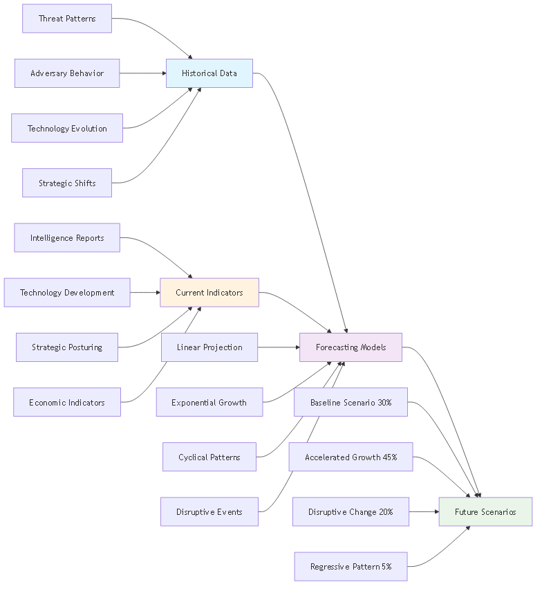
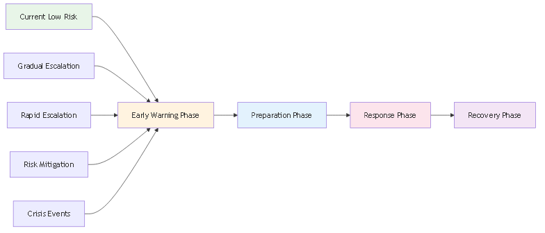
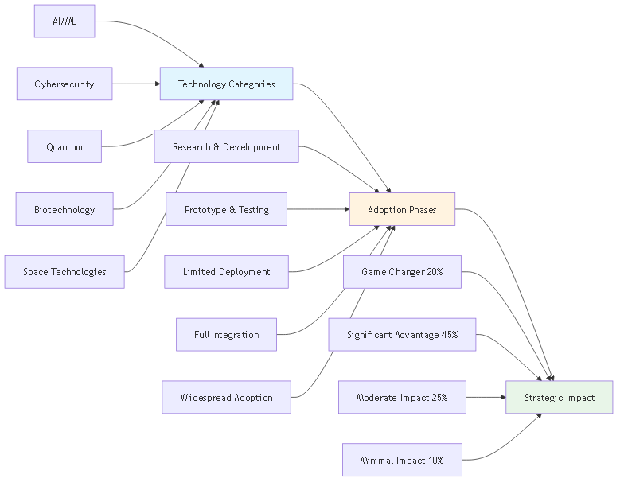
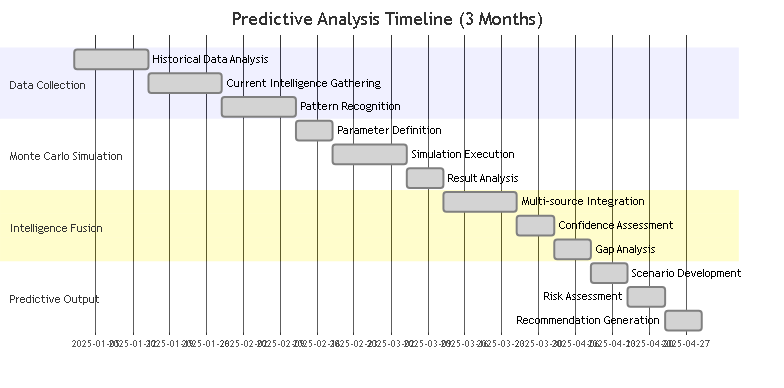
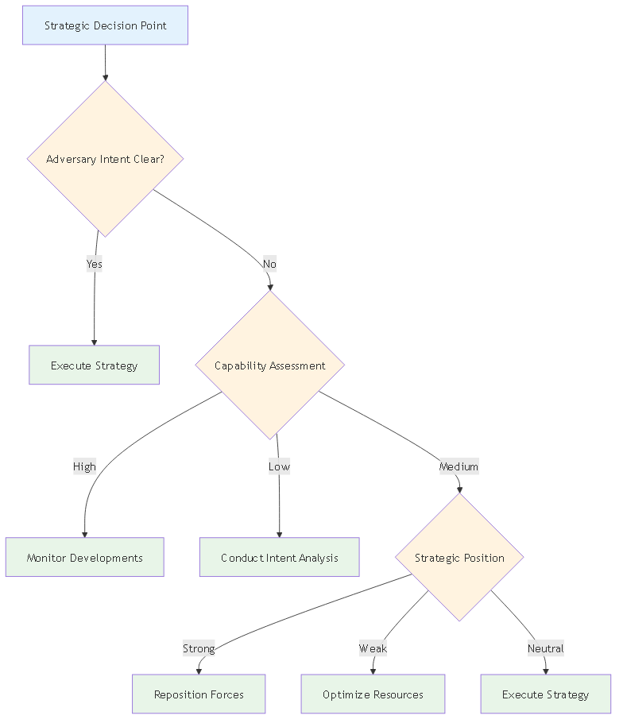

# DIA3: Decision Intelligence Agentic, Autonomous, & Adaptive
## Strategic Intelligence Question Framework Whitepaper

*Transforming Intelligence Analysis Through Multi-Domain Predictive Analytics*

---

## Executive Summary

In an era where the complexity of global threats exceeds human cognitive capacity, the need for intelligent, adaptive decision support systems has never been more critical. DIA3 (Decision Intelligence Agentic, Autonomous, & Adaptive) represents a paradigm shift in strategic intelligence analysis, combining classical strategic wisdom with cutting-edge artificial intelligence to answer the most complex questions facing decision-makers today.

This whitepaper presents a comprehensive framework that transforms how intelligence analysts approach scenario analysis, threat assessment, and strategic planning. Through the integration of Monte Carlo simulation, classical literature analysis, and multi-agent coordination, DIA3 provides unprecedented insights into adversary behavior, risk quantification, and strategic positioning.

### Key Capabilities
- **17 Specialized AI Agents** working in coordinated intelligence analysis
- **Monte Carlo Simulation Engine** with 10,000+ iterations for probabilistic assessment
- **Classical Literature Integration** leveraging Art of War and historical strategic principles
- **Multi-Domain Analysis** spanning military, cyber, economic, and political domains
- **Real-time Intelligence Fusion** from structured and unstructured data sources
- **Predictive Analytics** with confidence intervals and early warning indicators

### Strategic Impact
DIA3 enables intelligence analysts to:
- Quantify uncertainty in complex scenarios through probabilistic modeling
- Leverage 2,500 years of strategic wisdom from classical literature
- Generate actionable intelligence with measurable confidence levels
- Support decision-making with data-driven recommendations
- Maintain analytical rigor while accelerating analysis timelines

---

## The Intelligence Challenge: A Story of Complexity

Imagine an intelligence analyst facing a critical decision: a regional power is showing signs of aggressive posturing, but the signals are mixed. Economic indicators suggest restraint, while military movements indicate preparation. Cyber activities show both defensive and offensive patterns. Traditional analysis methods struggle with this complexity, often leading to either paralysis or oversimplification.

This is the challenge DIA3 was designed to solve. By integrating multiple analytical approaches and data sources, DIA3 transforms complex, ambiguous situations into clear, actionable intelligence with quantified confidence levels.

### The Traditional Approach vs. DIA3

**Traditional Intelligence Analysis:**
- Linear, sequential analysis
- Limited to human cognitive capacity
- Subjective confidence assessments
- Isolated data sources
- Static threat models

**DIA3 Intelligence Analysis:**
- Multi-dimensional, parallel processing
- AI-enhanced cognitive capabilities
- Quantified probability distributions
- Integrated multi-source fusion
- Dynamic, adaptive threat modeling

---

## System Architecture: The Foundation of Intelligence Excellence

DIA3's architecture represents a revolutionary approach to intelligence analysis, combining the best of human strategic thinking with artificial intelligence capabilities.

### Core System Components

The DIA3 system is built upon five foundational pillars:

1. **Monte Carlo Simulation Engine** - The quantitative backbone providing probabilistic assessment
2. **17 Specialized AI Agents** - Domain experts working in coordinated analysis
3. **Vector Database** - Knowledge repository containing classical literature and intelligence data
4. **Knowledge Graph** - Entity relationship mapping and pattern analysis
5. **MCP Tools Integration** - 25 consolidated tools for comprehensive analysis

### System Architecture Overview

The DIA3 system architecture represents a comprehensive integration of multiple analytical capabilities, each working in harmony to provide unprecedented intelligence insights. The system processes data from multiple sources including text documents, PDF files, audio recordings, video files, structured databases, and real-time intelligence feeds.

**Narrative**: The DIA3 system architecture demonstrates how multiple data sources flow through a sophisticated processing pipeline. Text, PDF, audio, and video data are ingested and processed by the Monte Carlo Simulation Engine, while structured data feeds into the Vector Database and real-time intelligence populates the Knowledge Graph. The system's 17 specialized AI agents work in coordinated analysis, each focusing on specific domains such as threat assessment, predictive analytics, pattern recognition, and strategic planning. The results flow through five analysis categories, ultimately producing comprehensive intelligence products including strategic reports, predictive intelligence, decision support tools, risk assessments, and interactive visualization dashboards. This architecture ensures that no piece of intelligence is analyzed in isolation, but rather integrated into a comprehensive analytical framework that leverages the full power of artificial intelligence and classical strategic wisdom.

### Data Integration Framework

DIA3 seamlessly integrates with existing data infrastructure:

- **Structured Data**: Databases, spreadsheets, formal reports
- **Unstructured Data**: Text documents, PDFs, audio recordings, video files
- **Real-time Feeds**: Open-source intelligence, social media, news sources
- **Historical Archives**: Classical literature, historical conflict analysis
- **Multi-format Support**: Text, PDF, audio, video, and image processing

---

## The Intelligence Question Framework: A Systematic Approach

The DIA3 Strategic Intelligence Question Framework provides analysts with a systematic methodology for leveraging the system's full capabilities. This framework transforms complex intelligence requirements into structured analytical processes that generate actionable insights.

### Framework Process Overview

The intelligence question framework follows a systematic four-step process that ensures comprehensive analysis and actionable results. This process transforms raw intelligence requirements into structured analytical approaches that leverage DIA3's full capabilities.

**Narrative**: The intelligence question framework process begins with question preparation, where analysts identify intelligence needs, select appropriate question categories, customize questions for specific scenarios, and define parameters including timeframes and constraints. The process then moves to tool coordination, where primary and supporting tools are selected, data sources are integrated, and specialized AI agents are coordinated for comprehensive analysis. Analysis execution follows, with sequential tool execution, data fusion from multiple sources, validation across different methods, and synthesis into comprehensive assessments. Finally, intelligence product generation creates executive summaries, detailed technical analysis, visualizations, and actionable recommendations. This systematic approach ensures that every intelligence requirement is addressed comprehensively while maintaining analytical rigor and producing actionable results.

### Framework Categories

The framework is organized into five primary categories, each addressing critical aspects of strategic intelligence:

1. **Adversary Intent & Capability Assessment**
2. **Strategic Risk Assessment**
3. **Operational Planning & Decision Support**
4. **Intelligence Fusion & Predictive Analysis**
5. **Strategic Planning & Force Development**

Each category contains specific question templates that trigger coordinated analysis across multiple DIA3 components, ensuring comprehensive coverage of intelligence requirements.

### Framework Categories Overview

The five framework categories work together to provide comprehensive intelligence analysis coverage, with each category building upon and informing the others.

**Narrative**: The framework categories overview demonstrates how the five primary categories work together in a coordinated analytical approach. Category 1 (Adversary Intent & Capability Assessment) includes decision-making analysis, threat evolution modeling, and strategic thinking analysis, providing the foundation for understanding adversary behavior and capabilities. Category 2 (Strategic Risk Assessment) builds upon this foundation with multi-scenario risk quantification, resource allocation risk analysis, and strategic position risk assessment. Category 3 (Operational Planning & Decision Support) translates strategic understanding into operational capabilities through optimal strategy identification, tactical effectiveness assessment, and decision point analysis. Category 4 (Intelligence Fusion & Predictive Analysis) integrates multiple intelligence sources through multi-source intelligence fusion, emerging threat detection, and intelligence gap analysis. Finally, Category 5 (Strategic Planning & Force Development) provides long-term strategic guidance through force structure optimization, technology investment assessment, and strategic positioning analysis. Each category flows into the next, creating a comprehensive analytical framework that addresses intelligence requirements from tactical to strategic levels, ensuring that all aspects of intelligence analysis are covered systematically and comprehensively.

---

## Category 1: Adversary Intent & Capability Assessment

### The Art of Understanding the Adversary

In the ancient text "The Art of War," Sun Tzu wrote, "Know your enemy and know yourself, and in a hundred battles you will never be in peril." DIA3 operationalizes this timeless wisdom through advanced analytical techniques that reveal adversary decision-making processes, strategic thinking patterns, and capability evolution.

### Adversary Decision-Making Analysis

**The Challenge**: Understanding how adversaries make decisions in complex, dynamic environments where multiple factors influence choices and outcomes are uncertain.

**The DIA3 Solution**: By combining Monte Carlo simulation with classical strategic principles, DIA3 creates probabilistic models of adversary decision-making that account for uncertainty, competing priorities, and strategic constraints.

**Key Capabilities**:
- Probability distribution of adversary courses of action
- Strategic intent assessment with confidence intervals
- Capability vs. intent analysis
- Risk assessment matrix with quantified probabilities

**Implementation Example**: When analyzing a regional power's decision-making process, DIA3 runs 10,000+ Monte Carlo simulations incorporating factors such as economic conditions, military capabilities, political constraints, and historical behavioral patterns. The result is a probability distribution showing the likelihood of different strategic choices, enabling planners to prepare for multiple scenarios rather than betting on a single outcome.

### Monte Carlo Simulation Process

The Monte Carlo simulation process forms the quantitative backbone of DIA3's analytical capabilities, providing probabilistic assessments that account for uncertainty and complexity in strategic decision-making.

**Narrative**: The Monte Carlo simulation process begins with input parameter definition, where scenario parameters, variable ranges, probability distributions, and constraints are established. The simulation engine then performs random sampling from these parameter distributions, executes the model with sampled values, collects results, and performs statistical analysis. The output analysis generates probability distributions, confidence intervals, risk metrics, and scenario rankings. The process includes comprehensive validation through historical comparison, sensitivity analysis, cross-validation, and expert review. This rigorous approach ensures that all predictions include quantified uncertainty and confidence levels, enabling decision-makers to understand not just what might happen, but how likely it is and how confident we can be in those predictions. The process typically involves 10,000+ simulation iterations to ensure statistical significance and robust probability distributions.

### Threat Evolution Modeling

**The Challenge**: Threats don't remain static; they evolve, adapt, and transform based on changing circumstances, technological advances, and strategic opportunities.

**The DIA3 Solution**: DIA3 models threat evolution as a dynamic process, using historical pattern recognition and Monte Carlo simulation to predict how threats might develop over time.

**Key Capabilities**:
- Threat trajectory analysis with multiple pathways
- Critical decision point identification
- Early warning indicators with confidence levels
- Mitigation strategy recommendations with effectiveness assessment

**Implementation Example**: In analyzing cyber threat evolution, DIA3 examines historical patterns of APT campaigns, technological adoption rates, and strategic objectives to model how cyber capabilities might develop over the next 12-24 months. This enables proactive defense planning rather than reactive responses.

### Threat Evolution Forecasting Chart

The threat evolution forecasting process combines historical data analysis with current indicators to predict future threat developments across multiple scenarios.

**Narrative**: The threat evolution forecasting chart demonstrates how DIA3 combines historical threat patterns, adversary behavior, technology evolution, and strategic shifts with current intelligence reports, technology development, strategic posturing, and economic indicators. The system applies multiple forecasting models including linear projection, exponential growth, cyclical patterns, and disruptive events to generate future scenarios. The forecasting process typically produces four main scenarios: baseline scenario (30% probability), accelerated growth (45% probability), disruptive change (20% probability), and regressive pattern (5% probability). This probabilistic approach ensures that planners are prepared for multiple possible futures rather than betting on a single outcome. The forecasting process includes continuous refinement as new intelligence becomes available, ensuring that predictions remain relevant and accurate.

### Adversary Strategic Thinking Analysis

**The Challenge**: Understanding not just what adversaries can do, but how they think strategically, what principles guide their decision-making, and how they view the strategic landscape.

**The DIA3 Solution**: DIA3 integrates classical strategic literature, particularly "The Art of War," with modern behavioral analysis to understand adversary strategic thinking patterns.

**Key Capabilities**:
- Strategic doctrine analysis with cultural context
- Adversary mindset assessment using psychological profiling
- Predictive behavioral modeling with historical validation
- Counter-strategy development based on strategic principles

**Implementation Example**: When analyzing a competitor's strategic thinking, DIA3 searches its knowledge base for relevant Art of War principles, applies them to the current situation, and generates predictions about likely strategic moves. This analysis might reveal that the adversary is following a "divide and conquer" strategy or preparing for a "feigned retreat" maneuver.

### Art of War Integration Framework

DIA3's integration of classical strategic literature, particularly Sun Tzu's "The Art of War," represents a unique capability that bridges ancient wisdom with modern intelligence analysis.

**Narrative**: The Art of War integration framework applies Sun Tzu's Five Fundamentals (五事) to modern intelligence analysis. The Moral Law (道) translates to strategic doctrine analysis, examining the alignment between political objectives and military capabilities. Heaven (天) becomes environmental factor analysis, including weather, timing, and broader contextual conditions. Earth (地) transforms into geographic analysis, examining terrain, resources, and strategic positioning. The Commander (将) becomes leadership assessment, analyzing decision-making patterns and strategic thinking. Method (法) translates to organizational structure analysis, examining discipline, coordination, and operational effectiveness. These classical principles are applied to modern analysis components including adversary mindset assessment, strategic intent analysis, capability assessment, decision pattern recognition, and counter-strategy development. The framework produces strategic assessments, behavioral predictions, risk analysis, and tactical recommendations that combine classical wisdom with modern analytical rigor. This integration ensures that intelligence analysis benefits from 2,500 years of strategic thinking while leveraging cutting-edge artificial intelligence capabilities.

---

## Category 2: Strategic Risk Assessment

### Quantifying the Unquantifiable

Risk assessment has traditionally been more art than science, relying heavily on expert judgment and historical precedent. DIA3 transforms this process by providing quantitative, probabilistic risk assessments that account for uncertainty and complexity.

### Multi-Scenario Risk Quantification

**The Challenge**: Strategic decisions often involve multiple possible scenarios, each with different probabilities and impacts. Traditional analysis struggles to compare these scenarios systematically.

**The DIA3 Solution**: DIA3 runs parallel Monte Carlo simulations for multiple scenarios, quantifying both probability and impact to create comprehensive risk matrices.

**Key Capabilities**:
- Risk probability matrix with confidence intervals
- Impact assessment framework with multiple dimensions
- Confidence intervals for all predictions
- Risk mitigation prioritization based on cost-benefit analysis

**Implementation Example**: When assessing the risk of a regional conflict, DIA3 simultaneously models scenarios ranging from diplomatic resolution to full-scale military engagement, assigning probabilities and impacts to each. This enables decision-makers to understand not just the most likely outcome, but the full range of possibilities and their implications.

### Risk Timeline Forecasting Chart

The risk timeline forecasting process provides a temporal view of how risks evolve over time, enabling proactive risk management and strategic planning.

**Narrative**: The risk timeline forecasting chart demonstrates how DIA3 projects risk evolution over time, from current low-risk periods through various escalation scenarios. The chart shows multiple risk evolution scenarios including gradual escalation, rapid escalation, risk mitigation, and crisis events. Each scenario includes specific timeframes and response phases including early warning, preparation, response, and recovery phases. This temporal forecasting enables organizations to prepare for different risk trajectories and develop appropriate response strategies. The forecasting process typically covers time horizons from 6 months to 3+ years, providing both tactical and strategic planning support. The process includes continuous monitoring and adjustment as new intelligence becomes available, ensuring that risk assessments remain current and actionable.

### Resource Allocation Risk Analysis

**The Challenge**: Strategic resources are finite, and misallocation can have catastrophic consequences. Understanding the risk of current allocation strategies under adverse conditions is critical.

**The DIA3 Solution**: DIA3 models resource allocation under various stress conditions, identifying vulnerabilities and optimization opportunities.

**Key Capabilities**:
- Resource vulnerability assessment with stress testing
- Alternative allocation strategies with performance comparison
- Risk-adjusted performance metrics
- Optimization recommendations with implementation roadmaps

**Implementation Example**: DIA3 might analyze how current military force allocation would perform under simultaneous threats in multiple regions, identifying critical vulnerabilities and recommending optimal redistribution strategies that maximize effectiveness while minimizing risk.

### Strategic Position Risk Assessment

**The Challenge**: Strategic positioning involves complex trade-offs between multiple factors including geography, capabilities, alliances, and adversary actions.

**The DIA3 Solution**: DIA3 evaluates strategic positions using historical comparison and Monte Carlo simulation to identify vulnerabilities and opportunities.

**Key Capabilities**:
- Strategic position vulnerability analysis
- Historical comparison framework with classical literature
- Risk mitigation strategies with effectiveness assessment
- Strategic repositioning recommendations with implementation guidance

**Implementation Example**: DIA3 might analyze a current strategic position by comparing it to historical examples from classical literature, running simulations to test its resilience under various threat scenarios, and recommending adjustments to improve strategic advantage.

### Strategic Position Forecasting Chart

The strategic position forecasting process evaluates current positions and trends to predict future strategic advantages and vulnerabilities.

**Narrative**: The strategic position forecasting chart shows how DIA3 analyzes current strategic positions including geographic advantage, resource availability, alliance strength, and technology edge. The system then evaluates trends in these areas including geographic trends, resource depletion, alliance shifts, and technology race dynamics. Monte Carlo simulation generates four main scenarios: position strengthening (40% probability), position weakening (35% probability), radical shift (20% probability), and status quo (5% probability). Based on these scenarios, the system provides strategic recommendations including reinforcing position, developing alternatives, strategic repositioning, or maintaining current course. This forecasting process enables proactive strategic planning rather than reactive responses to changing conditions. The process includes continuous monitoring and adjustment as new intelligence becomes available, ensuring that strategic positions remain optimized for current and future conditions.

---

## Category 3: Operational Planning & Decision Support

### From Strategy to Execution

The best strategic analysis is worthless without effective operational planning and execution. DIA3 bridges the gap between strategic insight and operational effectiveness through systematic analysis of tactics, strategies, and decision points.

### Optimal Strategy Identification

**The Challenge**: Identifying the optimal strategy for complex operations requires balancing multiple objectives, constraints, and uncertainties.

**The DIA3 Solution**: DIA3 uses pattern recognition and Monte Carlo simulation to identify optimal strategies and assess their probability of success.

**Key Capabilities**:
- Strategy effectiveness matrix with multiple criteria
- Success probability assessment with confidence intervals
- Resource requirement analysis with optimization
- Implementation roadmap with critical path identification

**Implementation Example**: When planning a complex operation, DIA3 analyzes historical patterns of similar operations, runs simulations to test different approaches, and identifies the strategy that maximizes success probability while minimizing resource requirements and risk.

### Tactical Effectiveness Assessment

**The Challenge**: Understanding which tactics work best in which situations requires analysis of historical performance, current conditions, and future scenarios.

**The DIA3 Solution**: DIA3 analyzes tactical effectiveness using historical data and Monte Carlo simulation to provide evidence-based recommendations.

**Key Capabilities**:
- Tactical effectiveness metrics with statistical validation
- Historical performance comparison with contextual analysis
- Improvement recommendations with implementation guidance
- Training and doctrine implications with curriculum development

**Implementation Example**: DIA3 might analyze the effectiveness of different cyber defense tactics by examining historical incident data, running simulations of various attack scenarios, and identifying which tactics provide the best protection under different conditions.

### Decision Point Analysis

**The Challenge**: Complex operations involve multiple decision points, each with different implications for success or failure.

**The DIA3 Solution**: DIA3 identifies critical decision points and assesses the probability of success for each decision branch.

**Key Capabilities**:
- Decision tree analysis with probability assessment
- Critical path identification with bottleneck analysis
- Success probability at each decision node
- Decision support framework with real-time guidance

**Implementation Example**: DIA3 might analyze a military operation by identifying key decision points (e.g., whether to proceed with an attack based on intelligence), assessing the probability of success for each choice, and providing real-time decision support based on current conditions.

---

## Category 4: Intelligence Fusion & Predictive Analysis

### The Power of Integrated Intelligence

Modern intelligence challenges require integrating information from multiple sources, domains, and time periods. DIA3 excels at intelligence fusion, combining structured and unstructured data to generate predictive insights.

### Intelligence Fusion Process

The intelligence fusion process represents one of DIA3's most powerful capabilities, combining information from multiple intelligence disciplines to create comprehensive, predictive assessments.

**Narrative**: The intelligence fusion process begins with data ingestion from multiple intelligence sources including HUMINT (human intelligence), SIGINT (signals intelligence), OSINT (open-source intelligence), GEOINT (geospatial intelligence), IMINT (imagery intelligence), and MASINT (measurement and signature intelligence). The processing pipeline includes data quality assessment, source reliability scoring, correlation analysis, pattern recognition, and anomaly detection. The fusion engine performs multi-source correlation, confidence assessment, conflict resolution, and gap identification. The final output products include fused intelligence assessments, predictive intelligence forecasts, confidence intervals, and collection recommendations. This process ensures that intelligence from all sources is properly weighted, correlated, and validated, creating a comprehensive picture that is greater than the sum of its parts. The fusion process typically involves thousands of data points and multiple validation steps to ensure accuracy and reliability.

### Multi-Source Intelligence Fusion

**The Challenge**: Intelligence comes from multiple sources including HUMINT, SIGINT, OSINT, GEOINT, and others. Each source has different reliability, timeliness, and relevance.

**The DIA3 Solution**: DIA3 fuses intelligence from multiple sources using advanced algorithms and Monte Carlo simulation to generate predictive intelligence with confidence intervals.

**Key Capabilities**:
- Fused intelligence assessment with source reliability weighting
- Predictive intelligence forecast with multiple time horizons
- Confidence level analysis with uncertainty quantification
- Intelligence gap identification with collection recommendations

**Implementation Example**: DIA3 might combine satellite imagery (GEOINT), intercepted communications (SIGINT), and open-source reporting (OSINT) to predict an adversary's next move, assigning confidence levels based on source reliability and information consistency.

### Predictive Intelligence Forecasting Chart

The predictive intelligence forecasting process integrates multiple intelligence sources to generate forward-looking assessments with quantified confidence levels.

**Narrative**: The predictive intelligence forecasting chart illustrates how DIA3 integrates intelligence from multiple sources including HUMINT, SIGINT, OSINT, GEOINT, IMINT, and MASINT to create comprehensive predictive assessments. The process begins with data quality assessment and source reliability scoring, followed by correlation analysis, pattern recognition, and anomaly detection. The fusion engine performs multi-source correlation, confidence assessment, conflict resolution, and gap identification. The final output includes fused intelligence assessments, predictive intelligence forecasts, confidence intervals, and collection recommendations. This process typically generates predictions with confidence levels ranging from 60-95%, depending on source reliability and information consistency. The forecasting process includes continuous refinement as new intelligence becomes available, ensuring that predictions remain accurate and relevant. The system can generate both short-term tactical predictions (1-30 days) and long-term strategic forecasts (3-24 months), providing comprehensive support for both operational and strategic planning.

### Emerging Threat Detection

**The Challenge**: Identifying emerging threats before they fully materialize requires pattern recognition and anomaly detection across multiple data sources.

**The DIA3 Solution**: DIA3 uses pattern recognition and anomaly detection to identify emerging threats and assess their probability of materialization.

**Key Capabilities**:
- Emerging threat assessment with early warning indicators
- Probability of threat materialization with timeline estimates
- Response timeline recommendations with resource requirements
- Threat evolution modeling with adaptation scenarios

**Implementation Example**: DIA3 might analyze dark web chatter, unusual network activity, and geopolitical developments to identify an emerging cyber threat, assess its probability of becoming operational, and recommend response timelines and resource allocations.

### Intelligence Gap Analysis

**The Challenge**: Understanding what we don't know is as important as understanding what we do know. Intelligence gaps can lead to strategic surprises and operational failures.

**The DIA3 Solution**: DIA3 systematically identifies intelligence gaps and prioritizes collection requirements based on strategic importance and collection feasibility.

**Key Capabilities**:
- Intelligence gap matrix with priority ranking
- Collection priority ranking with resource allocation
- Impact assessment for each gap with risk quantification
- Collection strategy recommendations with implementation guidance

**Implementation Example**: DIA3 might analyze current intelligence coverage across multiple domains (military, cyber, economic, political), identify critical gaps in understanding adversary capabilities, and recommend optimal collection strategies to fill those gaps.

---

## Category 5: Strategic Planning & Force Development

### Building for the Future

Strategic planning requires understanding not just current capabilities and threats, but how they might evolve over time. DIA3 provides the analytical foundation for long-term strategic planning and force development.

### Force Structure Optimization

**The Challenge**: Force structure decisions involve massive investments with long-term implications. Optimizing force structure for future scenarios requires sophisticated modeling and analysis.

**The DIA3 Solution**: DIA3 uses Monte Carlo simulation to optimize force structure for multiple scenarios and assess the probability of success for different force compositions.

**Key Capabilities**:
- Force structure effectiveness analysis with scenario testing
- Optimal composition recommendations with resource constraints
- Success probability assessment with confidence intervals
- Resource allocation optimization with cost-benefit analysis

**Implementation Example**: DIA3 might analyze different naval force compositions for Pacific scenarios, running simulations to test effectiveness against various threats, and recommending the optimal mix of carriers, submarines, and surface combatants for maximum strategic impact.

### Capability Evolution Forecasting Chart

The capability evolution forecasting process analyzes how military, technological, economic, and alliance capabilities develop over time, enabling long-term strategic planning.

**Narrative**: The capability evolution forecasting chart shows how DIA3 analyzes current capabilities across military, technology, economic, and alliance domains and projects their development trajectories. The system models different development patterns including linear development, exponential growth, disruptive innovation, and stagnation/decline. The forecasting process covers multiple time horizons from short-term (6-12 months) to strategic (10+ years). The system generates four main scenarios: capability parity (35% probability), capability superiority (40% probability), capability gap (20% probability), and disruptive change (5% probability). This forecasting enables organizations to understand not just current capability gaps but how those gaps might evolve over time, supporting long-term strategic planning and investment decisions. The process includes continuous refinement as new intelligence becomes available, ensuring that capability assessments remain accurate and actionable.

### Technology Investment Assessment

**The Challenge**: Technology investments involve significant resources and long development timelines. Understanding the strategic value of different technology investments is critical for long-term planning.

**The DIA3 Solution**: DIA3 assesses the strategic value of technology investments using Monte Carlo simulation and compares them against alternative investments.

**Key Capabilities**:
- Technology value assessment with strategic impact analysis
- Investment comparison matrix with risk-adjusted returns
- Strategic investment recommendations with implementation roadmaps
- Technology evolution modeling with adaptation scenarios

**Implementation Example**: DIA3 might compare the strategic value of investing in artificial intelligence versus quantum computing versus biotechnology, assessing not just financial returns but strategic advantages in intelligence, operations, and decision-making.

### Technology Adoption Forecasting Chart

The technology adoption forecasting process analyzes how emerging technologies are adopted across different sectors and their strategic impact over time.

**Narrative**: The technology adoption forecasting chart demonstrates how DIA3 analyzes technology adoption patterns across AI/ML, cybersecurity, quantum, biotechnology, and space technologies. The system tracks adoption through five phases: research & development, prototype & testing, limited deployment, full integration, and widespread adoption. The forecasting process models adoption rates including early adopters (5%), early majority (15%), late majority (35%), and laggards (45%). The system assesses strategic impact across four categories: game changer (20% probability), significant advantage (45% probability), moderate impact (25% probability), and minimal impact (10% probability). This forecasting enables organizations to understand not just which technologies to invest in, but when to invest and how to position themselves for maximum strategic advantage. The process includes continuous monitoring of technology development and adoption trends, ensuring that investment decisions remain aligned with strategic objectives.

### Strategic Positioning Analysis

**The Challenge**: Strategic positioning involves complex trade-offs between geography, capabilities, alliances, and adversary actions across multiple domains.

**The DIA3 Solution**: DIA3 analyzes optimal strategic positioning using Monte Carlo simulation and historical strategic principles from classical literature.

**Key Capabilities**:
- Strategic positioning assessment with multi-domain analysis
- Geographic advantage analysis with terrain and resource assessment
- Historical comparison framework with classical literature
- Positioning optimization recommendations with implementation guidance

**Implementation Example**: DIA3 might analyze optimal strategic positioning for a region by examining geographic factors, historical strategic outcomes, current capabilities, and potential adversary actions, recommending positioning strategies that maximize strategic advantage while minimizing vulnerability.

### Alliance Dynamics Forecasting Chart

The alliance dynamics forecasting process analyzes how strategic, economic, technology, and security alliances evolve over time and their impact on strategic positioning.

**Narrative**: The alliance dynamics forecasting chart shows how DIA3 analyzes current alliances across strategic, economic, technology, and security domains and projects their evolution. The system models alliance dynamics including strengthening, weakening, formation, dissolution, and transformation. The forecasting process considers driving factors including geopolitical shifts, economic interests, security threats, technology competition, and cultural factors. The system generates four main scenarios: alliance consolidation (30% probability), alliance fragmentation (25% probability), new alliance formation (35% probability), and alliance neutralization (10% probability). This forecasting enables organizations to understand how alliance structures might evolve and how to position themselves within changing alliance dynamics. The process includes continuous monitoring of alliance developments and geopolitical shifts, ensuring that strategic positioning remains optimized for current and future alliance structures. This forecasting supports both bilateral and multilateral strategic planning and helps organizations understand the broader geopolitical context of their strategic decisions.

---

## Implementation Methodology: From Framework to Action

The DIA3 Strategic Intelligence Question Framework provides a systematic approach to leveraging the system's capabilities. This methodology ensures consistent, rigorous analysis while maintaining flexibility for specific intelligence requirements.

### Step 1: Question Preparation

The foundation of effective intelligence analysis is asking the right questions. DIA3's question preparation process ensures that intelligence requirements are clearly defined and appropriately scoped.

**Process**:
1. **Identify Intelligence Need**: Determine the specific intelligence requirement and decision context
2. **Select Question Category**: Choose the most appropriate category from the framework
3. **Customize Question**: Adapt the template question to the specific scenario and constraints
4. **Define Parameters**: Specify timeframes, scenarios, constraints, and success criteria

**Example**: An analyst might identify a need to understand adversary decision-making in a regional conflict scenario. They would select Category 1 (Adversary Intent & Capability Assessment), customize the adversary decision-making analysis question for their specific region and timeframe, and define parameters including the types of decisions to analyze and the time horizon for the assessment.

### Step 2: Tool Coordination

DIA3's power comes from the coordinated use of multiple analytical tools and data sources. The tool coordination process ensures that all relevant capabilities are leveraged for comprehensive analysis.

**Process**:
1. **Primary Tool Selection**: Choose the main MCP tool or API endpoint for the analysis
2. **Supporting Tools**: Identify additional tools for comprehensive analysis
3. **Data Source Integration**: Specify vector database and knowledge graph queries
4. **Agent Coordination**: Determine which specialized agents to engage

**Example**: For adversary decision-making analysis, the analyst might select the Monte Carlo simulation tool as the primary tool, add pattern recognition and sentiment analysis as supporting tools, specify queries to the Art of War knowledge base, and engage the threat assessment and predictive analytics agents.

### Step 3: Analysis Execution

The analysis execution process ensures that tools are used in the optimal sequence to generate comprehensive, validated results.

**Process**:
1. **Sequential Execution**: Run tools in logical sequence to build comprehensive analysis
2. **Data Fusion**: Combine results from multiple sources and methods
3. **Validation**: Cross-check results across different methods and data sources
4. **Synthesis**: Integrate findings into comprehensive assessment with confidence levels

**Example**: The analysis might start with Monte Carlo simulation to establish baseline probabilities, then add pattern recognition to identify behavioral patterns, validate results against historical data, and synthesize findings into a comprehensive adversary assessment with quantified confidence levels.

### Step 4: Intelligence Product Generation

The final step transforms analytical results into actionable intelligence products that support decision-making.

**Process**:
1. **Executive Summary**: High-level findings and recommendations for decision-makers
2. **Detailed Analysis**: Comprehensive technical assessment with methodology and results
3. **Visualizations**: Charts, graphs, and interactive dashboards for clear communication
4. **Actionable Recommendations**: Specific next steps and priorities with implementation guidance

**Example**: The final intelligence product might include an executive summary highlighting key adversary decision patterns, detailed analysis showing probability distributions and confidence intervals, visualizations of decision trees and risk matrices, and specific recommendations for counter-strategy development.

---

## Expected Intelligence Products: Transforming Analysis into Action

DIA3 generates a comprehensive range of intelligence products designed to support decision-making at all levels, from tactical operations to strategic planning.

### Strategic Intelligence Reports

Strategic intelligence reports provide high-level analysis and recommendations for senior decision-makers.

**Threat Assessment Reports**: Comprehensive adversary analysis including capabilities, intentions, and likely courses of action with quantified confidence levels.

**Risk Assessment Matrices**: Quantified risk analysis showing probability and impact of various scenarios with confidence intervals and mitigation strategies.

**Strategic Planning Documents**: Long-term planning guidance based on predictive analysis and scenario modeling with implementation roadmaps.

**Operational Planning Support**: Tactical and operational recommendations derived from strategic analysis with specific guidance for implementation.

### Predictive Intelligence

Predictive intelligence products provide forward-looking analysis to anticipate future developments and opportunities.

**Scenario Forecasts**: Probability-based future scenarios with confidence intervals and early warning indicators for strategic planning.

**Early Warning Indicators**: Threat detection frameworks with specific indicators and thresholds for monitoring and response.

**Trend Analysis**: Pattern recognition and trend identification with predictive modeling for strategic advantage.

**Impact Assessments**: Consequence analysis for different outcomes with resource requirements and mitigation strategies.

### Predictive Analysis Timeline

The predictive analysis process follows a structured timeline that ensures comprehensive coverage from historical analysis through future forecasting.

**Narrative**: The predictive analysis timeline spans approximately three months, beginning with data collection phases including historical data analysis, current intelligence gathering, and pattern recognition. The Monte Carlo simulation phase follows, including parameter definition, simulation execution, and result analysis. Intelligence fusion phases include multi-source integration, confidence assessment, and gap analysis. The final predictive output phases include scenario development, risk assessment, and recommendation generation. This timeline ensures that each phase builds upon the previous one, creating a comprehensive analytical foundation that supports robust predictive intelligence. The process typically involves multiple iterations and validation steps, with continuous refinement based on new intelligence and changing conditions. The timeline is designed to be flexible, allowing for acceleration when time-critical intelligence is required or extension when additional analysis is needed for complex scenarios.

### Decision Support Products

Decision support products provide structured frameworks and tools to support decision-making processes.

**Decision Trees**: Structured decision-making frameworks with probability assessment at each node and optimal path identification.

**Risk Matrices**: Visual risk assessment tools showing probability vs. impact with color-coded risk levels and mitigation strategies.

**Performance Metrics**: Quantified effectiveness measures with benchmarks and improvement recommendations.

**Optimization Recommendations**: Data-driven improvement suggestions with cost-benefit analysis and implementation guidance.

### Decision Tree Analysis

Decision tree analysis provides structured frameworks for complex decision-making processes, enabling systematic evaluation of multiple options and their consequences.

**Narrative**: The decision tree analysis begins with a strategic decision point, typically involving adversary intent assessment. The tree branches based on key questions such as whether adversary intent is clear, capability assessment levels, strategic position evaluation, and resource availability. Each branch leads to specific actions including conducting intent analysis, monitoring developments, repositioning forces, executing strategies, or optimizing resources. The decision tree ensures that all possible scenarios are considered systematically, with clear decision criteria and action paths for each branch. This structured approach prevents decision paralysis and ensures that all factors are considered before taking action. The tree can be expanded to include additional decision points and branches as complexity increases, providing a scalable framework for decision support.

### Risk Assessment Matrix

The risk assessment matrix provides a visual framework for evaluating and prioritizing risks based on probability and impact.

**Narrative**: The risk assessment matrix combines probability levels (Very High, High, Medium, Low, Very Low) with impact levels (Catastrophic, Major, Moderate, Minor, Insignificant) to create risk zones. Critical risks requiring immediate action are identified in the high probability/high impact zone, while high risks requiring priority management fall in the medium-high probability/major impact area. Medium risks requiring close monitoring are in the moderate probability/moderate impact zone, while low risks that can be accepted with monitoring fall in the lower probability/impact areas. Minimal risks that can be accepted are in the very low probability/insignificant impact zone. This matrix enables systematic risk prioritization and resource allocation, ensuring that the most critical risks receive appropriate attention and resources. The matrix can be customized for different domains and scenarios, providing a consistent framework for risk assessment across all intelligence analysis activities.

---

## Best Practices: Maximizing DIA3's Capabilities

Success with DIA3 requires understanding and applying best practices that maximize the system's capabilities while ensuring analytical rigor and actionable results.

### Question Design Best Practices

The quality of intelligence analysis depends fundamentally on the quality of the questions asked. DIA3's question design best practices ensure that intelligence requirements are properly translated into analytical processes.

**Be Specific**: Include specific parameters, timeframes, and constraints to ensure focused, actionable analysis. Vague questions lead to vague answers.

**Leverage Multiple Sources**: Combine Monte Carlo simulation with other analysis methods to ensure comprehensive coverage and validation of results.

**Consider Uncertainty**: Account for uncertainty in all assessments by using probabilistic methods and confidence intervals rather than deterministic predictions.

**Focus on Actionability**: Ensure results support decision-making by providing specific, implementable recommendations with clear next steps.

**Example**: Instead of asking "What will the adversary do?" ask "What is the probability distribution of adversary courses of action over the next 6 months given current economic conditions and military capabilities, and what are the key indicators that would signal a change in strategy?"

### Tool Usage Best Practices

DIA3's power comes from the coordinated use of multiple tools and capabilities. Tool usage best practices ensure optimal results and efficient resource utilization.

**Start with Monte Carlo**: Use Monte Carlo simulation as the foundation for quantitative analysis to establish baseline probabilities and confidence intervals.

**Integrate Classical Literature**: Leverage Art of War and other classical principles to provide strategic context and historical validation for modern analysis.

**Coordinate Multiple Agents**: Use agent coordination to ensure comprehensive analysis across multiple domains and perspectives.

**Validate Results**: Cross-check findings across different methods and data sources to ensure accuracy and reliability.

**Example**: When analyzing adversary decision-making, start with Monte Carlo simulation to establish probability distributions, then integrate Art of War principles for strategic context, coordinate threat assessment and predictive analytics agents for comprehensive analysis, and validate results against historical data and alternative analytical methods.

### Intelligence Production Best Practices

The final step in the intelligence process is producing actionable intelligence products that support decision-making. Intelligence production best practices ensure that analytical results are effectively communicated and utilized.

**Clear Executive Summary**: Provide high-level findings and recommendations for decision-makers with clear implications and next steps.

**Detailed Technical Analysis**: Include comprehensive methodology and results for technical audiences with confidence intervals and uncertainty quantification.

**Visual Aids**: Use charts, graphs, and interactive visualizations to communicate complex information clearly and effectively.

**Actionable Recommendations**: Provide specific, implementable guidance with clear responsibilities, timelines, and success criteria.

**Example**: An intelligence product might include an executive summary highlighting key findings and recommendations, detailed technical analysis with methodology and confidence intervals, visualizations showing probability distributions and risk matrices, and specific recommendations with clear implementation steps and success metrics.

---

## Continuous Improvement: Evolving with the Threat Landscape

DIA3 is designed for continuous improvement, with built-in mechanisms for learning from experience and adapting to changing requirements.

### Feedback Integration

Continuous improvement requires systematic collection and integration of feedback from users and stakeholders.

**Track Question Effectiveness**: Monitor which questions produce the most valuable intelligence and refine question templates based on results and feedback.

**Refine Question Templates**: Update questions based on results and feedback to improve effectiveness and relevance.

**Expand Tool Integration**: Identify new ways to leverage system capabilities and integrate additional tools and data sources.

**Update Intelligence Products**: Continuously improve the quality and relevance of outputs based on user feedback and changing requirements.

**Example**: If analysis shows that certain question types consistently produce more actionable intelligence, the framework can be updated to emphasize those approaches and provide additional guidance for their effective use.

### System Enhancement

DIA3's modular architecture enables continuous enhancement and expansion of capabilities.

**New Data Sources**: Integrate additional intelligence sources to improve coverage and accuracy of analysis.

**Advanced Analytics**: Implement new analysis methods and algorithms to improve predictive accuracy and analytical depth.

**Improved Visualization**: Enhance the presentation of intelligence products to improve communication and decision support.

**Automation**: Streamline repetitive analysis tasks to improve efficiency and enable analysts to focus on high-value activities.

**Example**: New data sources might include additional open-source intelligence feeds, new types of sensor data, or expanded historical databases. Advanced analytics might include new machine learning algorithms, improved pattern recognition capabilities, or enhanced Monte Carlo simulation methods.

---

## Implementation Resources: Tools and Documentation

DIA3 provides comprehensive implementation resources to support effective use of the system and framework.

### Core Analysis Scripts

DIA3 includes a comprehensive suite of analysis scripts that implement the framework's capabilities.

**Strategic Positioning Analysis Script**: Comprehensive Monte Carlo simulation system for optimal strategic positioning analysis using classical literature principles and historical strategic outcomes.

**Agentic AI Investment Analysis Script**: Comprehensive Monte Carlo simulation system for assessing strategic value of technology investments with performance comparison and strategic assessment.

**Pacific Conflict Force Structure Optimization Script**: Comprehensive Monte Carlo simulation system for force structure optimization with success probability assessment and resource optimization.

**Intelligence Gap Analysis Script**: Comprehensive intelligence gap analysis system combining Monte Carlo simulation, multi-domain analysis, and collection requirement prioritization.

**Dark Web Threat Detection System**: Comprehensive dark web threat detection system combining pattern recognition, anomaly detection, and Monte Carlo simulation for identifying emerging threats.

### Documentation and Guides

Comprehensive documentation supports effective implementation and use of DIA3 capabilities.

**Adversary Decision Making Guide**: Complete methodology and implementation guide for adversary analysis using Art of War principles and Monte Carlo simulation.

**Art of War Strategic Analysis Guide**: Comprehensive Art of War principles application methodology with modern intelligence analysis integration.

**Threat Evolution Modeling Guide**: Comprehensive threat evolution methodology with historical pattern recognition and predictive modeling.

**Intelligence Fusion Documentation**: Comprehensive system documentation, usage examples, and technical specifications for intelligence fusion capabilities.

### API Endpoints and MCP Tools

DIA3 provides both API endpoints and MCP tools for flexible integration and use.

**Monte Carlo Simulation**: `/api/v1/monte-carlo/simulate` for comprehensive simulation capabilities.

**Scenario Analysis**: `/api/v1/monte-carlo/scenario/threat_assessment` for scenario-based analysis.

**Predictive Analytics**: `/api/v1/analytics/predictive` for forward-looking analysis.

**Pattern Recognition**: `/api/v1/analytics/pattern-recognition` for pattern identification and analysis.

**Risk Assessment**: `/api/v1/analytics/risk-assessment` for comprehensive risk analysis.

**MCP Tools**: 25 consolidated tools including Monte Carlo simulation, pattern recognition, predictive analytics, intelligence analysis, and risk assessment capabilities.

---

## DIA3 Capabilities Summary

| Capability | Description | Key Features | Applications |
|------------|-------------|--------------|--------------|
| **Monte Carlo Simulation** | Probabilistic analysis engine | 10,000+ iterations, confidence intervals, scenario modeling | Risk assessment, predictive analysis, decision support |
| **17 Specialized AI Agents** | Coordinated intelligence analysis | Threat assessment, predictive analytics, pattern recognition | Multi-domain analysis, comprehensive intelligence coverage |
| **Classical Literature Integration** | Art of War and historical principles | Five Fundamentals analysis, strategic wisdom application | Adversary analysis, strategic planning, behavioral prediction |
| **Multi-Source Intelligence Fusion** | Integrated intelligence processing | HUMINT, SIGINT, OSINT, GEOINT, IMINT, MASINT | Comprehensive threat assessment, predictive intelligence |
| **Vector Database & Knowledge Graph** | Knowledge repository and relationship mapping | Classical literature, intelligence data, entity relationships | Pattern analysis, strategic context, historical validation |
| **MCP Tools Integration** | 25 consolidated analytical tools | API endpoints, specialized analysis capabilities | Flexible integration, comprehensive analysis coverage |
| **Predictive Analytics** | Forward-looking intelligence | Scenario forecasting, early warning indicators, trend analysis | Strategic planning, threat anticipation, risk mitigation |
| **Risk Assessment Framework** | Systematic risk evaluation | Probability-impact matrices, confidence intervals, mitigation strategies | Strategic decision-making, resource allocation, threat prioritization |

## Framework Categories Summary

| Category | Focus Area | Key Questions | Intelligence Products |
|----------|------------|---------------|----------------------|
| **Adversary Intent & Capability** | Understanding adversary behavior and capabilities | Decision-making processes, threat evolution, strategic thinking | Adversary assessments, behavioral predictions, capability analysis |
| **Strategic Risk Assessment** | Quantifying and prioritizing risks | Multi-scenario analysis, resource allocation, strategic positioning | Risk matrices, vulnerability assessments, mitigation strategies |
| **Operational Planning** | Translating strategy into operations | Strategy optimization, tactical effectiveness, decision points | Operational plans, effectiveness metrics, decision frameworks |
| **Intelligence Fusion** | Integrating multiple intelligence sources | Multi-source correlation, emerging threats, intelligence gaps | Fused intelligence, predictive forecasts, collection recommendations |
| **Strategic Planning** | Long-term strategic guidance | Force structure, technology investment, strategic positioning | Strategic plans, investment recommendations, positioning analysis |

## Implementation Benefits

| Benefit | Description | Impact |
|---------|-------------|--------|
| **Quantified Uncertainty** | All predictions include confidence intervals and probability distributions | Improved decision-making with understanding of risk and uncertainty |
| **Comprehensive Coverage** | Multi-domain analysis covering all aspects of intelligence requirements | Complete intelligence picture with no gaps or blind spots |
| **Historical Validation** | Classical literature and historical analysis provide context and validation | Robust analysis grounded in proven strategic principles |
| **Actionable Intelligence** | All outputs include specific recommendations and implementation guidance | Direct support for decision-making and operational planning |
| **Scalable Framework** | Flexible system that adapts to different intelligence requirements | Consistent methodology across all intelligence analysis activities |

---

## Conclusion: Transforming Intelligence Analysis

The DIA3 Strategic Intelligence Question Framework represents a fundamental transformation in how intelligence analysis is conducted. By combining classical strategic wisdom with cutting-edge artificial intelligence, DIA3 enables intelligence analysts to:

1. **Generate Comprehensive Intelligence**: Use multiple analysis methods and data sources to ensure complete coverage of intelligence requirements.

2. **Quantify Uncertainty**: Apply Monte Carlo simulation and probabilistic methods to provide quantified confidence levels and uncertainty assessment.

3. **Leverage Historical Wisdom**: Integrate classical strategic principles and historical analysis to provide context and validation for modern intelligence challenges.

4. **Support Decision-Making**: Provide actionable intelligence recommendations with clear implementation guidance and success metrics.

5. **Maintain Analytical Rigor**: Follow systematic methodology for consistent, reliable results that can be validated and reproduced.

The framework is designed to be flexible and adaptable, allowing analysts to customize questions for specific intelligence requirements while maintaining analytical rigor and producing high-quality intelligence products. As the threat landscape evolves and new challenges emerge, DIA3's continuous improvement capabilities ensure that the system remains relevant and effective.

The future of intelligence analysis is not about replacing human analysts with artificial intelligence, but about augmenting human capabilities with intelligent tools that can process vast amounts of data, identify patterns, and provide probabilistic assessments that support human decision-making. DIA3 represents this future, combining the best of human strategic thinking with the power of artificial intelligence to create a new paradigm for intelligence analysis.

---

**Document Version**: 1.0  
**Last Updated**: 2025-01-17  
**Classification**: UNCLASSIFIED  
**Distribution**: Intelligence Community, Department of Defense, Strategic Partners

*DIA3: Decision Intelligence Agentic, Autonomous, & Adaptive - Transforming Intelligence Analysis Through Multi-Domain Predictive Analytics*
