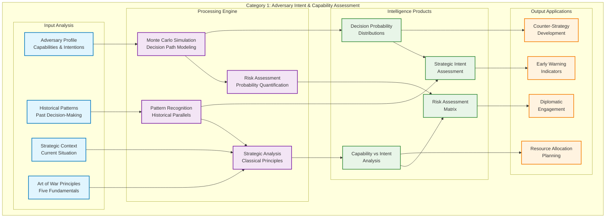
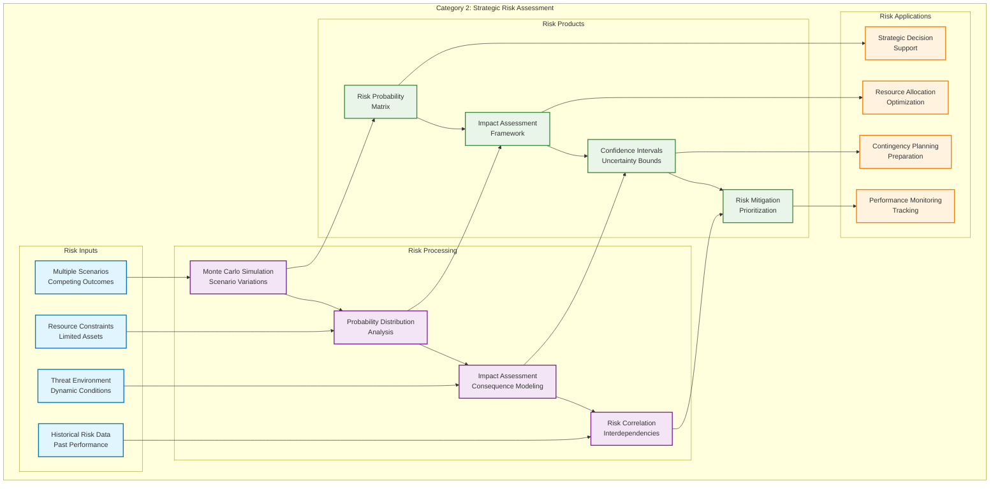
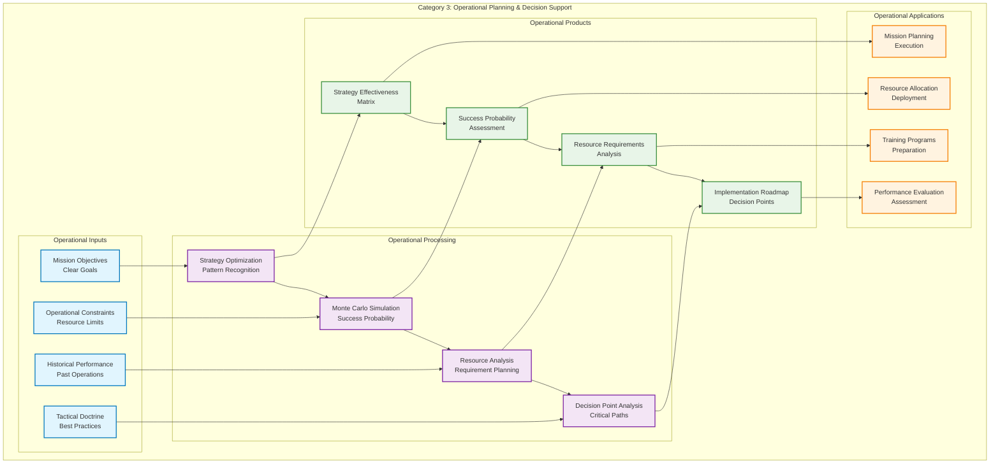
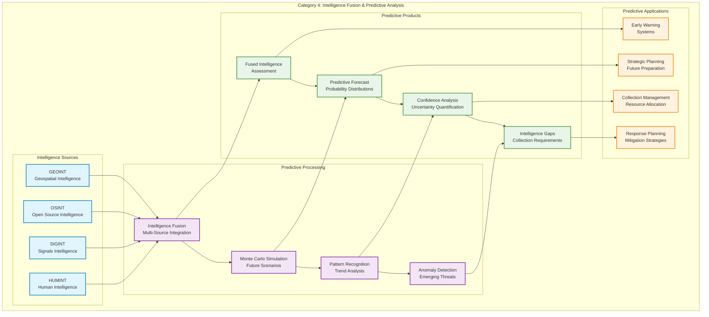
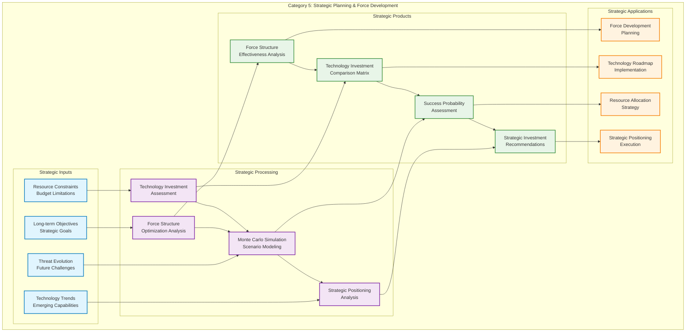

# DIA3: Decision Intelligence Agentic, Autonomous, & Adaptive
## Strategic Intelligence Framework White Paper

**Transforming Strategic Decision-Making Through Multi-Domain Intelligence Analysis**

---

## Executive Summary

In an era of unprecedented complexity and uncertainty, strategic decision-makers face challenges that demand more than traditional analytical approaches. The DIA3 (Decision Intelligence Agentic, Autonomous, & Adaptive) system represents a paradigm shift in strategic intelligence analysis, combining the timeless wisdom of classical strategic literature with cutting-edge artificial intelligence and probabilistic modeling.

This white paper presents the Strategic Intelligence Question Framework—a comprehensive methodology that transforms how intelligence analysts approach complex scenarios. Through the integration of Monte Carlo simulation, multi-agent coordination, and classical strategic principles, DIA3 provides decision-makers with actionable intelligence that quantifies uncertainty and leverages historical wisdom.

---

## The Challenge: Strategic Decision-Making in the Age of Complexity

### The Intelligence Analyst's Dilemma

Imagine an intelligence analyst facing a critical decision: assess the likelihood of a regional conflict escalating into a broader confrontation. Traditional methods—relying on linear analysis and historical precedent—often fall short in today's interconnected, rapidly evolving threat landscape. The analyst needs more than static assessments; they need dynamic, probabilistic intelligence that accounts for multiple variables, competing scenarios, and the inherent uncertainty of strategic forecasting.

This is the challenge that DIA3 was designed to solve. By combining the systematic rigor of Monte Carlo simulation with the strategic insights of classical literature like Sun Tzu's Art of War, DIA3 transforms intelligence analysis from reactive assessment to proactive strategic planning.

### The Multi-Domain Challenge

Modern strategic challenges rarely exist in isolation. A military threat assessment must consider economic factors, technological developments, political dynamics, and social trends. Traditional intelligence systems often compartmentalize these domains, leading to fragmented analysis and missed opportunities for comprehensive understanding.

DIA3's multi-domain architecture breaks down these silos, enabling analysts to explore the complex interactions between different strategic dimensions. Whether analyzing the strategic implications of emerging technologies, assessing the economic impact of geopolitical tensions, or evaluating the military effectiveness of different force structures, DIA3 provides a unified framework for comprehensive analysis.

---

## The DIA3 Solution: A Revolutionary Approach to Strategic Intelligence

### The Power of Agentic Intelligence

At the heart of DIA3 lies an innovative agent swarm architecture—17 specialized AI agents working in concert to analyze complex strategic scenarios. Each agent brings unique capabilities to the analysis:

- **Threat Assessment Agents** evaluate adversary capabilities and intentions
- **Predictive Analytics Agents** forecast future scenarios and trends
- **Pattern Recognition Agents** identify historical patterns and emerging threats
- **Strategic Planning Agents** develop optimal courses of action
- **Risk Assessment Agents** quantify uncertainty and potential outcomes

These agents don't work in isolation; they collaborate, question each other's assumptions, and synthesize their findings into comprehensive intelligence products. This agentic approach mirrors the collaborative nature of human intelligence analysis while leveraging the computational power and consistency of artificial intelligence.

### The Monte Carlo Revolution

Traditional intelligence analysis often relies on single-point estimates—"the most likely scenario." This approach fails to capture the inherent uncertainty of strategic forecasting and can lead to overconfidence in predictions.

DIA3's Monte Carlo simulation engine runs thousands of scenario variations, each incorporating different combinations of variables, assumptions, and outcomes. This probabilistic approach provides decision-makers with:

- **Probability distributions** for different outcomes
- **Confidence intervals** for predictions
- **Sensitivity analysis** showing which variables most affect outcomes
- **Risk quantification** in terms of probability and impact

For example, when analyzing a potential conflict scenario, DIA3 doesn't simply predict whether conflict will occur. Instead, it provides a probability distribution showing the likelihood of different escalation levels, the factors that could trigger escalation, and the potential consequences of each outcome.

### Classical Wisdom Meets Modern Analytics

DIA3's integration of classical strategic literature represents a unique innovation in intelligence analysis. By incorporating principles from Sun Tzu's Art of War, Carl von Clausewitz's On War, and other classical texts, DIA3 applies timeless strategic insights to modern challenges.

The system doesn't simply reference these texts; it actively applies their principles to contemporary analysis. When assessing an adversary's strategic thinking, DIA3 applies the Five Fundamentals (道, 天, 地, 将, 法) from the Art of War to understand the adversary's approach to strategy, timing, terrain, leadership, and methodology.

This integration of classical wisdom with modern analytics provides a depth of strategic understanding that neither approach could achieve alone.

---

## The Strategic Intelligence Question Framework: A Systematic Approach

### The Framework Philosophy

The Strategic Intelligence Question Framework is built on the principle that the quality of intelligence analysis depends fundamentally on the quality of the questions being asked. Rather than providing analysts with pre-defined analytical products, the framework gives them systematic approaches to formulating questions that leverage DIA3's full capabilities.

The framework organizes intelligence questions into five categories, each designed to address different aspects of strategic analysis:

1. **Adversary Intent & Capability Assessment**
2. **Strategic Risk Assessment**
3. **Operational Planning & Decision Support**
4. **Intelligence Fusion & Predictive Analysis**
5. **Strategic Planning & Force Development**

Each category contains specific question templates that analysts can customize for their particular scenarios, along with guidance on which DIA3 capabilities to leverage and what types of intelligence products to expect.

### Category 1: Understanding the Adversary

The first category focuses on understanding adversary decision-making processes, capabilities, and strategic thinking. This is fundamental to all strategic analysis—you cannot develop effective strategies without understanding your adversary.

**The Adversary Decision-Making Question**

Consider an analyst tasked with understanding how a regional power might respond to economic sanctions. The traditional approach might involve analyzing the adversary's economic vulnerabilities and historical responses to similar pressure.

DIA3's approach is more sophisticated. The analyst would ask: "Analyze the most likely adversary decision-making process for economic sanctions response using Monte Carlo simulation and classical strategic principles from Art of War."

This question triggers multiple DIA3 capabilities:

- **Monte Carlo simulation** models thousands of possible decision paths
- **Art of War principles** analyze the adversary's strategic thinking patterns
- **Pattern recognition** identifies historical parallels and decision-making patterns
- **Risk assessment** quantifies the probability of different responses

The result is not a single prediction but a comprehensive analysis showing:
- Probability distributions for different response types
- Strategic intent assessment based on classical principles
- Capability vs. intent analysis
- Risk assessment matrix with confidence intervals

#### Category 1 Analysis Flow

**Diagram Description**: This diagram illustrates the comprehensive flow of Category 1 analysis. The process begins with four key inputs: adversary profiling, historical pattern analysis, strategic context assessment, and Art of War principles application. These inputs feed into the processing engine where Monte Carlo simulation models decision paths, pattern recognition identifies historical parallels, strategic analysis applies classical principles, and risk assessment quantifies probabilities. The processing generates four key intelligence products: decision probability distributions, strategic intent assessment, capability vs. intent analysis, and risk assessment matrices. These products then inform practical applications including counter-strategy development, early warning indicators, resource allocation planning, and diplomatic engagement strategies. The cross-connections show how different components interact and reinforce each other throughout the analysis process.

**The Threat Evolution Question**

Strategic threats don't remain static; they evolve based on changing circumstances, technological developments, and strategic calculations. DIA3's threat evolution modeling capabilities allow analysts to project how threats might develop over time.

An analyst might ask: "Model the evolution of cyber warfare capabilities over the next five years using Monte Carlo simulation and pattern recognition from historical conflicts."

This analysis would incorporate:
- **Historical pattern analysis** from past technological arms races
- **Monte Carlo simulation** of different development trajectories
- **Technology trend analysis** based on current developments
- **Strategic calculus** considering adversary motivations and constraints

The output provides decision-makers with early warning indicators, critical decision points, and mitigation strategy recommendations.

### Category 2: Quantifying Strategic Risk

The second category addresses one of the most challenging aspects of strategic analysis: quantifying risk in a way that supports decision-making. Traditional risk assessment often relies on qualitative assessments that are difficult to compare and prioritize.

**The Multi-Scenario Risk Question**

Strategic decision-makers often face multiple competing scenarios, each with different probabilities and potential impacts. DIA3's multi-scenario risk quantification provides a systematic approach to comparing these scenarios.

An analyst might ask: "Run Monte Carlo simulations for five specific scenarios and quantify the probability and impact of each outcome, including worst-case scenarios."

This analysis would generate:
- **Risk probability matrix** showing the likelihood of different outcomes
- **Impact assessment framework** quantifying potential consequences
- **Confidence intervals** for all predictions
- **Risk mitigation prioritization** based on probability-impact analysis

**The Resource Allocation Risk Question**

Strategic resources are always limited, and allocation decisions have profound implications for strategic effectiveness. DIA3's resource allocation risk analysis helps decision-makers understand the vulnerabilities in their current allocation strategies.

The analysis would assess:
- **Resource vulnerability** under different threat scenarios
- **Alternative allocation strategies** with their associated risks
- **Risk-adjusted performance metrics** for different approaches
- **Optimization recommendations** based on Monte Carlo simulation

#### Category 2 Analysis Flow

**Diagram Description**: This diagram shows the systematic approach to strategic risk assessment in Category 2. The process begins with four critical risk inputs: multiple competing scenarios, resource constraints, dynamic threat environment, and historical risk data. These inputs are processed through Monte Carlo simulation for scenario variations, probability distribution analysis, impact assessment modeling, and risk correlation analysis. The processing generates four key risk products: risk probability matrices, impact assessment frameworks, confidence intervals with uncertainty bounds, and risk mitigation prioritization. These products enable practical applications including strategic decision support, resource allocation optimization, contingency planning, and performance monitoring. The cross-connections demonstrate how risk factors interact and how different risk assessments inform each other, creating a comprehensive risk management framework.

### Category 3: Supporting Operational Decisions

The third category bridges the gap between strategic analysis and operational execution. While strategic analysis provides the big picture, operational planning requires detailed, actionable intelligence.

**The Optimal Strategy Question**

Operational planners need to identify the most effective strategies for achieving their objectives within given constraints. DIA3's optimal strategy identification combines pattern recognition with Monte Carlo simulation to evaluate different approaches.

An analyst might ask: "Use pattern recognition and Monte Carlo simulation to identify the optimal strategy for a specific operation given constraints and objectives."

This analysis would provide:
- **Strategy effectiveness matrix** comparing different approaches
- **Success probability assessment** for each strategy
- **Resource requirement analysis** for implementation
- **Implementation roadmap** with critical decision points

**The Tactical Effectiveness Question**

Tactical decisions often have strategic implications, and understanding tactical effectiveness is crucial for operational planning. DIA3's tactical effectiveness assessment compares proposed tactics against historical outcomes and classical principles.

The analysis would evaluate:
- **Tactical effectiveness metrics** based on historical data
- **Historical performance comparison** with similar operations
- **Improvement recommendations** based on pattern analysis
- **Training and doctrine implications** for future operations

#### Category 3 Analysis Flow

**Diagram Description**: This diagram illustrates the operational planning and decision support process in Category 3. The analysis begins with four operational inputs: mission objectives, operational constraints, historical performance data, and tactical doctrine. These inputs are processed through strategy optimization using pattern recognition, Monte Carlo simulation for success probability assessment, resource analysis for requirement planning, and decision point analysis for critical path identification. The processing generates four key operational products: strategy effectiveness matrices, success probability assessments, resource requirement analyses, and implementation roadmaps with decision points. These products directly support operational applications including mission planning and execution, resource allocation and deployment, training program development, and performance evaluation. The cross-connections show how operational factors interact and how different aspects of operational planning inform each other throughout the process.

### Category 4: Predictive Intelligence

The fourth category represents DIA3's most advanced capabilities—predictive intelligence that anticipates future developments rather than simply analyzing current conditions.

**The Intelligence Fusion Question**

Modern intelligence analysis must integrate information from multiple sources—human intelligence, signals intelligence, open-source intelligence, and more. DIA3's intelligence fusion capabilities combine these sources with Monte Carlo simulation to generate predictive intelligence.

An analyst might ask: "Fuse intelligence from multiple sources and use Monte Carlo simulation to generate predictive intelligence for the next six months with confidence intervals."

This analysis would provide:
- **Fused intelligence assessment** combining multiple sources
- **Predictive intelligence forecast** with probability distributions
- **Confidence level analysis** for all predictions
- **Intelligence gap identification** highlighting areas needing additional collection

**The Emerging Threat Detection Question**

One of the most valuable capabilities of predictive intelligence is identifying emerging threats before they fully materialize. DIA3's emerging threat detection combines pattern recognition with anomaly detection to identify potential threats in their early stages.

The analysis would identify:
- **Emerging threat indicators** from multiple data sources
- **Early warning systems** for threat detection
- **Probability of threat materialization** based on Monte Carlo simulation
- **Response timeline recommendations** for effective mitigation

#### Category 4 Analysis Flow

**Diagram Description**: This diagram shows the predictive intelligence process in Category 4, which represents DIA3's most advanced capabilities. The process begins with four primary intelligence sources: HUMINT (human intelligence), SIGINT (signals intelligence), OSINT (open source intelligence), and GEOINT (geospatial intelligence). These sources are fused through multi-source integration, then processed through Monte Carlo simulation for future scenario modeling, pattern recognition for trend analysis, and anomaly detection for emerging threat identification. The processing generates four key predictive products: fused intelligence assessments, predictive forecasts with probability distributions, confidence analysis with uncertainty quantification, and intelligence gap identification for collection requirements. These products enable advanced applications including early warning systems, strategic planning for future preparation, collection management for resource allocation, and response planning for mitigation strategies. The cross-connections demonstrate how different intelligence sources and analytical methods work together to create comprehensive predictive intelligence.

### Category 5: Strategic Planning and Force Development

The fifth category addresses the long-term strategic planning challenges that organizations face in developing their capabilities and positioning themselves for future challenges.

**The Force Structure Optimization Question**

Military and security organizations must constantly evaluate and optimize their force structures to meet evolving threats. DIA3's force structure optimization capabilities help decision-makers understand the effectiveness of different force compositions.

An analyst might ask: "Use Monte Carlo simulation to optimize force structure for specific scenarios and assess the probability of success for different force compositions."

This analysis would provide:
- **Force structure effectiveness analysis** comparing different compositions
- **Optimal composition recommendations** based on scenario analysis
- **Success probability assessment** for different force structures
- **Resource allocation optimization** for maximum effectiveness

**The Technology Investment Assessment Question**

Strategic technology investments have long-term implications for organizational capabilities. DIA3's technology investment assessment helps decision-makers understand the strategic value of different technology investments.

The analysis would evaluate:
- **Technology value assessment** based on strategic factors
- **Investment comparison matrix** for different technologies
- **Risk-adjusted return analysis** incorporating uncertainty
- **Strategic investment recommendations** with implementation timelines

#### Category 5 Analysis Flow

**Diagram Description**: This diagram illustrates the strategic planning and force development process in Category 5, which addresses long-term organizational planning challenges. The process begins with four strategic inputs: long-term objectives and strategic goals, resource constraints and budget limitations, threat evolution and future challenges, and technology trends and emerging capabilities. These inputs are processed through force structure optimization analysis, technology investment assessment, Monte Carlo simulation for scenario modeling, and strategic positioning analysis. The processing generates four key strategic products: force structure effectiveness analysis, technology investment comparison matrices, success probability assessments, and strategic investment recommendations. These products enable strategic applications including force development planning, technology roadmap implementation, resource allocation strategy, and strategic positioning execution. The cross-connections demonstrate how different strategic factors interact and how force structure decisions inform technology investments and vice versa, creating a comprehensive strategic planning framework.

---

## The DIA3 System Architecture: Enabling Advanced Intelligence Analysis

### The Multi-Layer Architecture

DIA3's system architecture is designed to support the complex requirements of strategic intelligence analysis while maintaining the flexibility and scalability needed for real-world applications.

**The Client Layer**

At the top of the architecture, multiple client interfaces provide access to DIA3's capabilities:

- **Web UI**: Interactive interface for analysts and decision-makers
- **API Client**: Programmatic access for integration with existing systems
- **MCP Client**: Model Context Protocol interface for AI agent integration

This multi-interface approach ensures that DIA3 can integrate seamlessly with existing intelligence workflows while providing intuitive access for human analysts.

**The API Gateway Layer**

The API Gateway Layer serves as the primary interface between clients and DIA3's core capabilities:

- **FastAPI Server**: High-performance REST API for synchronous operations
- **MCP Server**: Model Context Protocol server for AI agent communication
- **Orchestrator**: Central coordination system for multi-agent operations

This layer provides the scalability and reliability needed for production intelligence analysis while maintaining the flexibility to support different types of clients and use cases.

**The Agent Swarm Layer**

The heart of DIA3's analytical capabilities lies in its agent swarm—17 specialized AI agents working in concert to provide comprehensive intelligence analysis:

- **Text Analysis Agents**: Process and analyze textual intelligence
- **Vision Agents**: Analyze imagery and video intelligence
- **Audio Agents**: Process audio intelligence and communications
- **Web Agents**: Collect and analyze open-source intelligence
- **Knowledge Graph Agents**: Build and query knowledge networks
- **Pattern Recognition Agents**: Identify patterns and anomalies
- **Predictive Analytics Agents**: Forecast future scenarios
- **Risk Assessment Agents**: Quantify uncertainty and risk
- **Decision Support Agents**: Provide actionable recommendations

Each agent brings specialized capabilities to the analysis, and the orchestrator coordinates their activities to ensure comprehensive, coherent results.

**The Core Analytics Layer**

Beneath the agent swarm, DIA3's core analytics layer provides the computational foundation for advanced intelligence analysis:

- **Monte Carlo Simulation Engine**: Runs thousands of scenario variations
- **Pattern Recognition System**: Identifies patterns across multiple dimensions
- **Predictive Analytics Engine**: Forecasts future developments
- **Risk Assessment Framework**: Quantifies uncertainty and risk
- **Knowledge Graph Engine**: Manages complex relationship networks

This layer provides the analytical horsepower needed for sophisticated intelligence analysis while maintaining the flexibility to adapt to new requirements and data sources.

**The Data Layer**

At the foundation of the architecture, the data layer manages the vast amounts of information that DIA3 processes:

- **Vector Database**: Stores and retrieves semantic representations of intelligence data
- **Knowledge Graph Database**: Manages complex relationship networks
- **Cache System**: Provides high-speed access to frequently used data
- **File Storage**: Manages documents, images, and other intelligence materials

This layer ensures that DIA3 can efficiently process and analyze the diverse types of intelligence data that modern analysis requires.

### The Data Flow Architecture

DIA3's data flow architecture ensures that information moves efficiently through the system while maintaining security and data integrity.

**Request Processing Flow**

When an analyst submits a question to DIA3, the system follows a structured process:

1. **Client Request**: The analyst submits a question through the web UI, API, or MCP interface
2. **API Gateway**: The request is routed through the appropriate interface
3. **Orchestrator**: The orchestrator analyzes the request and determines which agents to engage
4. **Agent Coordination**: The orchestrator coordinates the activities of multiple agents
5. **Data Processing**: Agents access and process relevant data from the data layer
6. **Analysis Synthesis**: Results from multiple agents are synthesized into a comprehensive analysis
7. **Response Generation**: The final intelligence product is formatted and returned to the client

This flow ensures that each request receives comprehensive analysis while maintaining the efficiency needed for real-time intelligence operations.

**Multi-Modal Processing Flow**

DIA3's ability to process multiple types of intelligence data—text, audio, video, images, and documents—requires a sophisticated multi-modal processing architecture:

1. **Input Validation**: The system validates and preprocesses input data
2. **Feature Extraction**: Relevant features are extracted from each data type
3. **Model Inference**: AI models analyze the extracted features
4. **Result Processing**: Results are processed and formatted for integration
5. **Cross-Modal Synthesis**: Results from different modalities are combined
6. **Intelligence Product Generation**: Final intelligence products are generated

This architecture enables DIA3 to provide comprehensive analysis regardless of the type of intelligence data being processed.

---

## Real-World Applications: Transforming Strategic Intelligence

### Case Study 1: Pacific Conflict Force Structure Optimization

In 2024, a defense analyst was tasked with optimizing force structure for potential Pacific conflict scenarios. Traditional analysis methods provided static assessments based on current capabilities, but the analyst needed to understand how different force compositions would perform across multiple scenarios with varying conditions.

Using DIA3's Strategic Intelligence Question Framework, the analyst asked: "Use Monte Carlo simulation to optimize force structure for Pacific conflict scenarios and assess the probability of success for different force compositions."

The analysis incorporated:
- **Five force compositions**: Carrier Strike Group, Amphibious Ready Group, Surface Action Group, Submarine Strike Group, and Air Combat Element
- **Four conflict scenarios**: South China Sea, Taiwan Strait, East China Sea, and Pacific Island Chain Defense
- **10,000 Monte Carlo simulations** per force composition-scenario combination
- **Comprehensive modeling** of platform capabilities, adversary capabilities, and environmental factors

The results provided unprecedented insights:
- **Success probability distributions** for each force composition across all scenarios
- **Risk assessment heatmaps** showing vulnerability patterns
- **Cost-effectiveness analysis** comparing performance to resource requirements
- **Capability radar charts** highlighting strengths and weaknesses

The analysis revealed that while Carrier Strike Groups provided the highest overall success probability, Submarine Strike Groups offered the best cost-effectiveness ratio for certain scenarios. This insight led to significant changes in force planning and resource allocation.

### Case Study 2: Agentic AI Investment Analysis

A technology investment committee needed to assess the strategic value of investing in Agentic AI compared to other emerging technologies. Traditional investment analysis focused on financial returns, but the committee needed to understand the strategic implications for national security and intelligence capabilities.

Using DIA3, the committee asked: "Assess the strategic value of Agentic AI investment using Monte Carlo simulation and compare against alternative investments for the next decade."

The analysis evaluated:
- **Six technology categories**: Agentic AI, Conventional AI/ML, Cybersecurity, Quantum Computing, Space Technology, and Biotechnology
- **Strategic value factors**: Intelligence advantage, operational efficiency, threat detection, decision support, cost savings, and competitive advantage
- **DoD/IC impact assessment**: Specific benefits for Department of Defense and Intelligence Community applications
- **Risk-adjusted return analysis**: Incorporating uncertainty and strategic factors

The results demonstrated that Agentic AI provided the highest strategic value across multiple dimensions, with particular advantages in intelligence fusion, decision support, and operational efficiency. This analysis supported a significant investment decision and influenced broader technology strategy.

### Case Study 3: Intelligence Gap Analysis

An intelligence organization needed to identify gaps in their understanding of a specific adversary's capabilities and prioritize collection requirements. Traditional gap analysis often relied on subjective assessments, making it difficult to justify resource allocation decisions.

Using DIA3, the analyst asked: "Identify intelligence gaps in our understanding of the adversary's cyber capabilities and prioritize collection requirements using Monte Carlo simulation for impact assessment."

The analysis incorporated:
- **Ten intelligence domains**: Military, cyber, economic, political, technological, strategic doctrine, operational tactics, leadership decision making, resource allocation, and alliance relationships
- **Ten collection methods**: HUMINT, SIGINT, OSINT, GEOINT, IMINT, MASINT, TECHINT, FININT, CYBERINT, and SOCMINT
- **Monte Carlo simulation** for probabilistic impact assessment
- **Priority scoring algorithm** based on knowledge gap, strategic importance, time criticality, collection difficulty, and adversary awareness

The results provided:
- **Intelligence gap matrix** with quantified assessments
- **Collection priority ranking** with confidence intervals
- **Impact assessment** for each gap with probability distributions
- **Collection strategy recommendations** with resource requirements

This analysis led to significant reallocation of collection resources and improved the organization's understanding of adversary capabilities.

---

## The Future of Strategic Intelligence: DIA3's Roadmap

### Continuous Innovation

DIA3 represents not just a current capability but a platform for continuous innovation in strategic intelligence analysis. The system's modular architecture and agent-based design enable rapid integration of new capabilities and analytical methods.

**Advanced Analytics Integration**

Future versions of DIA3 will incorporate advanced analytics capabilities including:
- **Causal analysis** to understand cause-and-effect relationships in complex systems
- **Network analysis** to map and analyze relationship networks
- **Temporal analysis** to understand how patterns evolve over time
- **Spatial analysis** to incorporate geographic and spatial factors

**Enhanced Predictive Capabilities**

DIA3's predictive capabilities will continue to evolve with:
- **Multi-horizon forecasting** for short, medium, and long-term predictions
- **Scenario tree analysis** to map complex decision trees
- **Early warning systems** with automated threat detection
- **Trend analysis** to identify emerging patterns and developments

**Improved Human-AI Collaboration**

The future of strategic intelligence lies in effective human-AI collaboration, and DIA3 will continue to enhance this partnership through:
- **Explainable AI** that provides clear reasoning for analytical conclusions
- **Interactive analysis** that allows human analysts to guide AI exploration
- **Collaborative decision-making** that combines human judgment with AI insights
- **Learning systems** that improve based on human feedback and outcomes

### Expanding Applications

While DIA3 was initially developed for defense and intelligence applications, its capabilities are increasingly relevant to other domains facing complex strategic challenges.

**Business Intelligence**

DIA3's analytical capabilities can be applied to business intelligence challenges including:
- **Competitive analysis** to understand competitor strategies and capabilities
- **Market forecasting** to predict market developments and opportunities
- **Risk assessment** to identify and quantify business risks
- **Strategic planning** to develop optimal business strategies

**Policy Analysis**

Government and policy organizations can leverage DIA3 for:
- **Policy impact assessment** to understand the consequences of policy decisions
- **Stakeholder analysis** to map and understand stakeholder relationships
- **Scenario planning** to prepare for different policy outcomes
- **Risk management** to identify and mitigate policy risks

**Academic Research**

Academic researchers can use DIA3 for:
- **Complex systems analysis** to understand the behavior of complex systems
- **Historical analysis** to apply modern analytical methods to historical data
- **Comparative studies** to analyze patterns across different contexts
- **Predictive modeling** to develop and test predictive models

---

## Conclusion: Transforming Strategic Intelligence for the 21st Century

The DIA3 Strategic Intelligence Question Framework represents a fundamental transformation in how organizations approach strategic intelligence analysis. By combining the systematic rigor of Monte Carlo simulation with the strategic insights of classical literature and the analytical power of artificial intelligence, DIA3 provides decision-makers with intelligence products that are not just comprehensive but actionable.

The framework's systematic approach to question formulation ensures that analysts can leverage DIA3's full capabilities while maintaining the flexibility to address specific intelligence requirements. The five categories of questions provide a comprehensive framework for addressing the full spectrum of strategic intelligence challenges, from adversary assessment to force development.

DIA3's multi-agent architecture and advanced analytics capabilities enable analysis that would be impossible with traditional methods. The system's ability to process multiple types of intelligence data, run thousands of scenario variations, and provide probabilistic assessments gives decision-makers unprecedented insights into complex strategic challenges.

As the strategic environment continues to evolve, DIA3 provides a platform for continuous innovation and adaptation. The system's modular architecture and agent-based design enable rapid integration of new capabilities and analytical methods, ensuring that DIA3 remains at the forefront of strategic intelligence analysis.

The future of strategic intelligence lies in systems that can handle the complexity and uncertainty of modern strategic challenges while providing clear, actionable insights to decision-makers. DIA3 represents a significant step toward that future, combining the best of human analytical thinking with the power of artificial intelligence to transform how organizations understand and respond to strategic challenges.

For intelligence analysts, DIA3 provides the tools they need to provide better intelligence products. For decision-makers, DIA3 provides the insights they need to make better decisions. For organizations, DIA3 provides the capabilities they need to navigate an increasingly complex and uncertain strategic environment.

The Strategic Intelligence Question Framework is not just a methodology; it's a roadmap for transforming strategic intelligence analysis in the 21st century. By following this framework, organizations can leverage the full power of DIA3 to provide the intelligence they need to succeed in an increasingly complex world.

---

**About DIA3**

DIA3 (Decision Intelligence Agentic, Autonomous, & Adaptive) is a comprehensive strategic intelligence analysis system that combines Monte Carlo simulation, multi-agent coordination, and classical strategic principles to provide actionable intelligence for complex strategic challenges.

**For More Information**

To learn more about DIA3 and the Strategic Intelligence Question Framework, visit our documentation or contact our team for demonstrations and consultations.

---

*This white paper represents the current state of DIA3's capabilities and strategic intelligence framework. The system continues to evolve with new features and capabilities being added regularly.*
